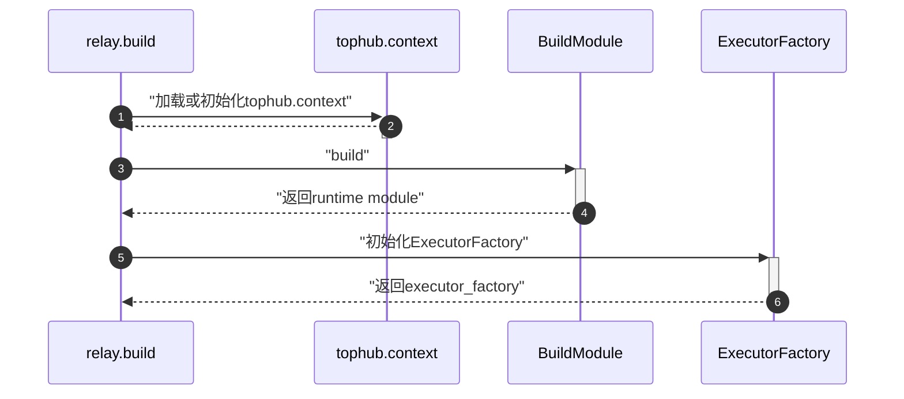
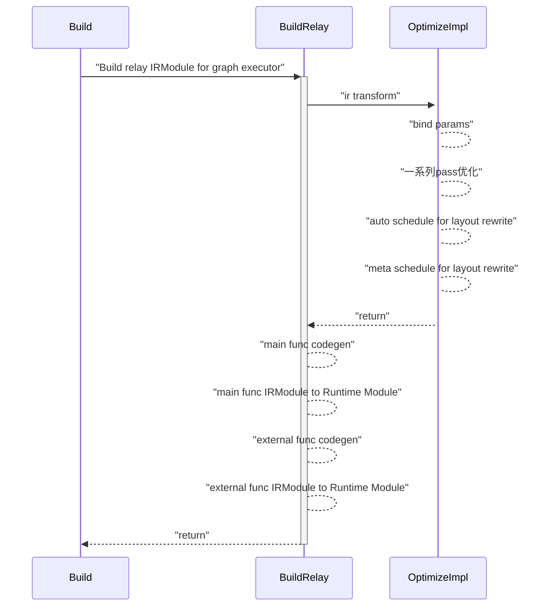

## 获取模型

从transformers中获取bert模型，并导出onnx格式；

```python
from pathlib import Path
from transformers import BertTokenizer, BertModel
import torch
from transformers.onnx import FeaturesManager
import transformers

tokenizer = BertTokenizer.from_pretrained("bert-base-uncased")
model = BertModel.from_pretrained("bert-base-uncased")
feature = "sequence-classification"

model_kind, model_onnx_config = FeaturesManager.check_supported_model_or_raise(model, feature=feature)
onnx_config = model_onnx_config(model.config)

# inputs = tokenizer("Hello, my dog is cute", return_tensors="pt")
# outputs = model(**inputs)
# print(outputs)

onnx_inputs, onnx_outputs = transformers.onnx.export(
    preprocessor=tokenizer,
    model=model,
    config=onnx_config,
    opset=13,
    output=Path("trfs-model.onnx"))
```


## onnxruntime trt 性能


## 使用tvm推理

---

### tvm基本使用流程

以下示例代码来自官方文档[[2](https://tvm.apache.org/docs/tutorial/autotvm_relay_x86.html)]。

- 准备模型和数据
```bash
wget https://github.com/onnx/models/raw/main/vision/classification/resnet/model/resnet50-v2-7.onnx
wget https://s3.amazonaws.com/model-server/inputs/kitten.jpg
```

```python
from PIL import Image
import numpy as np
import onnx
import tvm.relay as relay
import tvm
from tvm.contrib import graph_executor

np.random.seed(0)

resized_image = Image.open('./kitten.jpg').resize((224, 224))
img_data = np.asarray(resized_image).astype('float32')

img_data = np.transpose(img_data, (2, 0, 1))
imagenet_mean = np.array([0.485, 0.456, 0.406]).reshape((3, 1, 1))
imagenet_stddev = np.array([0.229, 0.224, 0.225]).reshape((3, 1, 1))
norm_img_data = (img_data / 255 - imagenet_mean) / imagenet_stddev
img_data = np.expand_dims(norm_img_data, axis=0)

onnx_model = onnx.load('./resnet50-v2-7.onnx')

input_name = "data"
shape_dict = {input_name: [1, 3, 224, 224]}

mod, params = relay.frontend.from_onnx(onnx_model, shape_dict)

target = 'llvm'
with tvm.transform.PassContext(opt_level=3):
    lib = relay.build(mod, target=target, params=params)

dev = tvm.device(str(target), 0)
module = graph_executor.GraphModule(lib['default'](dev))

dtype = 'float32'
module.set_input(input_name, img_data)
module.run()
output_shape = (1, 1000)
tvm_output = module.get_output(0, tvm.nd.empty(output_shape)).numpy()
print(tvm_output.shape)
```

解析 tvm 中的 Pass，TODO。


## relay.build过程

relay.build 具体实现在`build_module.py`中的`build`函数，整体编译过程如下图所示：



首先是对输入参数`IRModule`和`Target`的检查；TODO
```python
if not isinstance(ir_mod, (IRModule, _function.Function)):
    raise ValueError("Type of input parameter mod must be tvm.IRModule")

if isinstance(ir_mod, _function.Function):
    if params:
        ir_mod = bind_params_by_name(ir_mod, params)
    ir_mod = IRModule.from_expr(ir_mod)
    warnings.warn(
        "Please use input parameter mod (tvm.IRModule) "
        "instead of deprecated parameter mod (tvm.relay.function.Function)",
        DeprecationWarning,
    )

raw_targets = Target.canon_multi_target_and_host(Target.target_or_current(target), target_host)
assert len(raw_targets) > 0
target_host = raw_targets[0].host

```
接下来加载或初始化`tophub_context`，`tophub_context`是autotvm调优中的概念，此处先跳过；
```python
# If current dispatch context is fallback context (the default root context),
# then load pre-tuned parameters from TopHub
if isinstance(autotvm.DispatchContext.current, autotvm.FallbackContext):
    tophub_context = autotvm.tophub.context(list(raw_targets))
else:
    tophub_context = autotvm.utils.EmptyContext()
```

接下来就是`BuildModule`模块，是此函数的核心，主要目的是将IR Module编译成runtime module，可由TVM图执行器执行，TODO。
```python
with tophub_context:
    bld_mod = BuildModule()
    graph_json, runtime_mod, params = bld_mod.build(
        mod=ir_mod,
        target=raw_targets,
        params=params,
        executor=executor,
        runtime=runtime,
        workspace_memory_pools=workspace_memory_pools,
        constant_memory_pools=constant_memory_pools,
        mod_name=mod_name,
    )
    func_metadata = bld_mod.get_function_metadata()
    devices = bld_mod.get_devices()
    lowered_ir_mods = bld_mod.get_irmodule()
    executor_codegen_metadata = bld_mod.get_executor_codegen_metadata()
```

`BuildModule`类，定义如下，其所有方法实现均来自`self.mod=_build_module._BuildModule()`；
```python
class BuildModule(object):
    """Build an IR module to run on TVM graph executor. This class is used
    to expose the `RelayBuildModule` APIs implemented in C++.
    """

    def __init__(self):
        self.mod = _build_module._BuildModule()
        self._get_graph_json = self.mod["get_graph_json"]
        self._get_module = self.mod["get_module"]
        self._build = self.mod["build"]
        self._optimize = self.mod["optimize"]
        self._set_params_func = self.mod["set_params"]
        self._get_params_func = self.mod["get_params"]
        self._get_function_metadata = self.mod["get_function_metadata"]
        self._get_executor_codegen_metadata = self.mod["get_executor_codegen_metadata"]
        self._get_devices = self.mod["get_devices"]
        self._get_irmodule = self.mod["get_irmodule"]

    def build(...):
        # ...
        self._build(...)
        # ...
    
    def optimize(...):
        # ...
        self._optimize(...)
        # ...
```

`_build_module._BuildModule`是tvm通过packedfunc ffi将`build_module.cc`中的`RelayBuildModule`C++实现导出到python，packedfunc ffi机制在[TODO]()中有介绍；
```c++
runtime::Module RelayBuildCreate() {
  auto exec = make_object<RelayBuildModule>();
  return runtime::Module(exec);
}

TVM_REGISTER_GLOBAL("relay.build_module._BuildModule").set_body([](TVMArgs args, TVMRetValue* rv) {
  *rv = RelayBuildCreate();
});
```

`RelayBuildModule`继承自`runtime::ModuleNode`，其先把 relay IRModule lower 到底层 IRModule，在经历一系列 Pass 优化后，执行代码生成操作，最终得到 runtime Module 的数据结构（此处只列出大概流程，后面说到模块时在详细介绍）；



经过的一系列的 Pass 优化在下表所示：

|PassName|Level|功能|
|-|-|-|
|RemoveUnusedFunctions|||
|ToBasicBlockNormalForm|||
|transform::Legalize|||
|SimplifyInference|||
|transform::EtaExpand|||
|EliminateCommonSubexpr|||
|CombineParallelConv2D|||
|CombineParallelDense|||
|CombineParallelBatchMatmul|||
|FoldConstant|||
|FoldScaleAxis|||
|SimplifyExpr|||
|CanonicalizeCast|||
|CanonicalizeOps|||
|FlattenAtrousConv|||
|InferType|||
|AlterOpLayout|||
|FastMath|||
|SplitArgs|||
|PlanDevices|||
|FuseOps|||
|Inline|||
|LabelOps|||
|AnnotateMemoryScope|||

`relay.build`的最后一步是得到一个`executor_factory`，可以保存、加载编译好的模型、ir和权重等，部署时省去编译的过程，这个组件后面会详细介绍；

```python
if executor.name == "aot":
    executor_factory = _executor_factory.AOTExecutorFactoryModule(
        ir_mod,
        lowered_ir_mods,
        raw_targets,
        executor,
        runtime,
        runtime_mod,
        mod_name,
        params,
        func_metadata,
        executor_codegen_metadata,
        devices,
    )
elif executor.name == "graph":
    executor_factory = _executor_factory.GraphExecutorFactoryModule(
        ir_mod,
        raw_targets,
        executor,
        graph_json,
        runtime_mod,
        mod_name,
        params,
        func_metadata,
    )
else:
    assert False, "Executor " + executor + " not supported"

return executor_factory
```

以上就是`relay.build`的流程：加载Relay IR -> 优化 -> lower IR -> AutoSchedule && AutoTVM -> codegen -> runtime module.

## References

[1] https://huggingface.co/blog/convert-transformers-to-onnx

[2] https://tvm.apache.org/docs/tutorial/autotvm_relay_x86.html