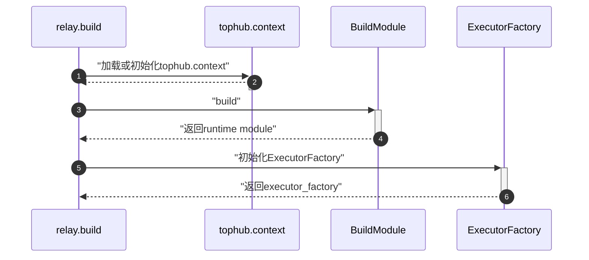
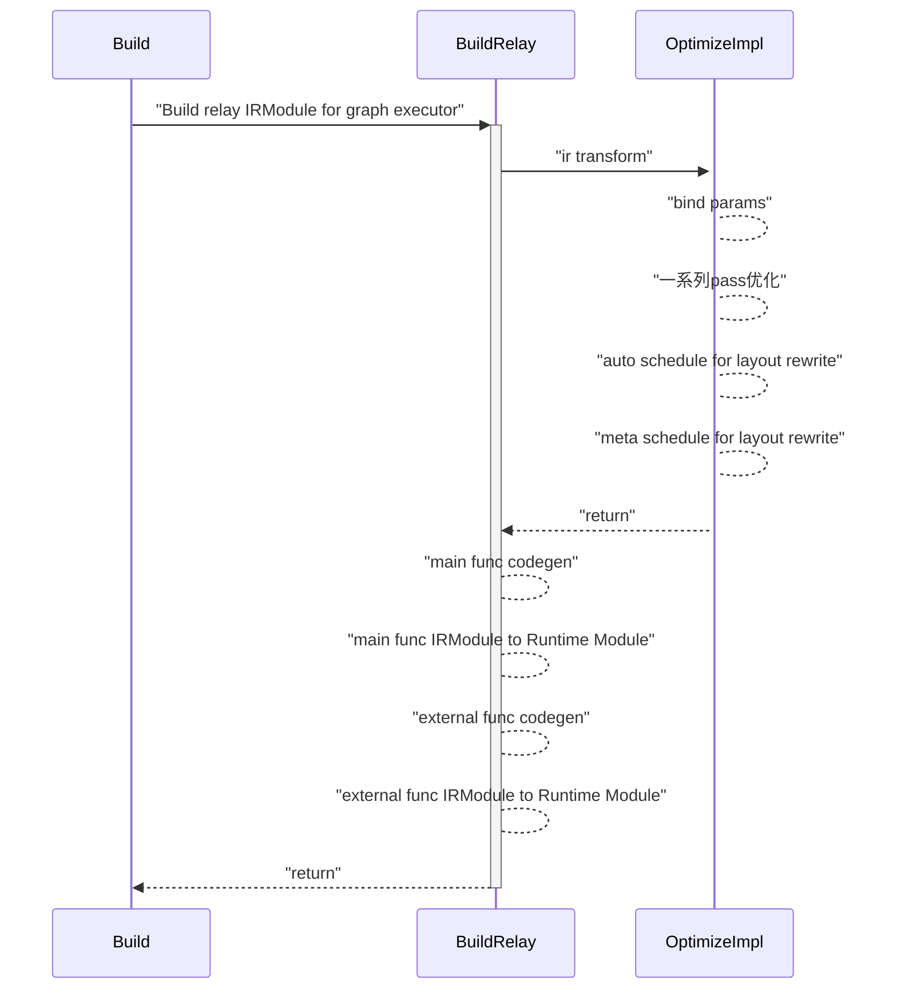

## 获取模型

从transformers中获取bert模型，并导出onnx格式；

```python
from pathlib import Path
from transformers import BertTokenizer, BertModel
import torch
from transformers.onnx import FeaturesManager
import transformers

tokenizer = BertTokenizer.from_pretrained("bert-base-uncased")
model = BertModel.from_pretrained("bert-base-uncased")
feature = "sequence-classification"

model_kind, model_onnx_config = FeaturesManager.check_supported_model_or_raise(model, feature=feature)
onnx_config = model_onnx_config(model.config)

# inputs = tokenizer("Hello, my dog is cute", return_tensors="pt")
# outputs = model(**inputs)
# print(outputs)

onnx_inputs, onnx_outputs = transformers.onnx.export(
    preprocessor=tokenizer,
    model=model,
    config=onnx_config,
    opset=13,
    output=Path("trfs-model.onnx"))
```


## onnxruntime trt 性能


## 使用tvm推理

---

### tvm基本使用流程

以下示例代码来自官方文档[[2](https://tvm.apache.org/docs/tutorial/autotvm_relay_x86.html)]。

- 准备模型和数据
```bash
wget https://github.com/onnx/models/raw/main/vision/classification/resnet/model/resnet50-v2-7.onnx
wget https://s3.amazonaws.com/model-server/inputs/kitten.jpg
```

```python
from PIL import Image
import numpy as np
import onnx
import tvm.relay as relay
import tvm
from tvm.contrib import graph_executor

np.random.seed(0)

resized_image = Image.open('./kitten.jpg').resize((224, 224))
img_data = np.asarray(resized_image).astype('float32')

img_data = np.transpose(img_data, (2, 0, 1))
imagenet_mean = np.array([0.485, 0.456, 0.406]).reshape((3, 1, 1))
imagenet_stddev = np.array([0.229, 0.224, 0.225]).reshape((3, 1, 1))
norm_img_data = (img_data / 255 - imagenet_mean) / imagenet_stddev
img_data = np.expand_dims(norm_img_data, axis=0)

onnx_model = onnx.load('./resnet50-v2-7.onnx')

input_name = "data"
shape_dict = {input_name: [1, 3, 224, 224]}

mod, params = relay.frontend.from_onnx(onnx_model, shape_dict)

target = 'llvm'
with tvm.transform.PassContext(opt_level=3):
    lib = relay.build(mod, target=target, params=params)

dev = tvm.device(str(target), 0)
module = graph_executor.GraphModule(lib['default'](dev))

dtype = 'float32'
module.set_input(input_name, img_data)
module.run()
output_shape = (1, 1000)
tvm_output = module.get_output(0, tvm.nd.empty(output_shape)).numpy()
print(tvm_output.shape)
```

解析 tvm 中的 Pass，TODO。


## relay.build过程

relay.build 具体实现在`build_module.py`中的`build`函数，整体编译过程如下图所示：



首先是对输入参数`IRModule`和`Target`的检查；TODO
```python
if not isinstance(ir_mod, (IRModule, _function.Function)):
    raise ValueError("Type of input parameter mod must be tvm.IRModule")

if isinstance(ir_mod, _function.Function):
    if params:
        ir_mod = bind_params_by_name(ir_mod, params)
    ir_mod = IRModule.from_expr(ir_mod)
    warnings.warn(
        "Please use input parameter mod (tvm.IRModule) "
        "instead of deprecated parameter mod (tvm.relay.function.Function)",
        DeprecationWarning,
    )

raw_targets = Target.canon_multi_target_and_host(Target.target_or_current(target), target_host)
assert len(raw_targets) > 0
target_host = raw_targets[0].host

```
接下来加载或初始化`tophub_context`，`tophub_context`是autotvm调优中的概念，此处先跳过；
```python
# If current dispatch context is fallback context (the default root context),
# then load pre-tuned parameters from TopHub
if isinstance(autotvm.DispatchContext.current, autotvm.FallbackContext):
    tophub_context = autotvm.tophub.context(list(raw_targets))
else:
    tophub_context = autotvm.utils.EmptyContext()
```

接下来就是`BuildModule`模块，是此函数的核心，主要目的是将IR Module编译成runtime module，可由TVM图执行器执行，TODO。
```python
with tophub_context:
    bld_mod = BuildModule()
    graph_json, runtime_mod, params = bld_mod.build(
        mod=ir_mod,
        target=raw_targets,
        params=params,
        executor=executor,
        runtime=runtime,
        workspace_memory_pools=workspace_memory_pools,
        constant_memory_pools=constant_memory_pools,
        mod_name=mod_name,
    )
    func_metadata = bld_mod.get_function_metadata()
    devices = bld_mod.get_devices()
    lowered_ir_mods = bld_mod.get_irmodule()
    executor_codegen_metadata = bld_mod.get_executor_codegen_metadata()
```

`BuildModule`类，定义如下，其所有方法实现均来自`self.mod=_build_module._BuildModule()`；
```python
class BuildModule(object):
    """Build an IR module to run on TVM graph executor. This class is used
    to expose the `RelayBuildModule` APIs implemented in C++.
    """

    def __init__(self):
        self.mod = _build_module._BuildModule()
        self._get_graph_json = self.mod["get_graph_json"]
        self._get_module = self.mod["get_module"]
        self._build = self.mod["build"]
        self._optimize = self.mod["optimize"]
        self._set_params_func = self.mod["set_params"]
        self._get_params_func = self.mod["get_params"]
        self._get_function_metadata = self.mod["get_function_metadata"]
        self._get_executor_codegen_metadata = self.mod["get_executor_codegen_metadata"]
        self._get_devices = self.mod["get_devices"]
        self._get_irmodule = self.mod["get_irmodule"]

    def build(...):
        # ...
        self._build(...)
        # ...
    
    def optimize(...):
        # ...
        self._optimize(...)
        # ...
```

`_build_module._BuildModule`是tvm通过packedfunc ffi将`build_module.cc`中的`RelayBuildModule`C++实现导出到python，packedfunc ffi机制在[TODO]()中有介绍；
```c++
runtime::Module RelayBuildCreate() {
  auto exec = make_object<RelayBuildModule>();
  return runtime::Module(exec);
}

TVM_REGISTER_GLOBAL("relay.build_module._BuildModule").set_body([](TVMArgs args, TVMRetValue* rv) {
  *rv = RelayBuildCreate();
});
```

`RelayBuildModule`继承自`runtime::ModuleNode`，其先把 relay IRModule lower 到底层 IRModule，在经历一系列 Pass 优化后，执行代码生成操作，最终得到 runtime Module 的数据结构（此处只列出大概流程，后面说到模块时在详细介绍）；



经过的一系列的 Pass 优化在下表所示：

|PassName|Level|功能|
|-|-|-|
|RemoveUnusedFunctions|||
|ToBasicBlockNormalForm|||
|transform::Legalize|||
|SimplifyInference|||
|transform::EtaExpand|||
|EliminateCommonSubexpr|||
|CombineParallelConv2D|||
|CombineParallelDense|||
|CombineParallelBatchMatmul|||
|FoldConstant|||
|FoldScaleAxis|||
|SimplifyExpr|||
|CanonicalizeCast|||
|CanonicalizeOps|||
|FlattenAtrousConv|||
|InferType|||
|AlterOpLayout|||
|FastMath|||
|SplitArgs|||
|PlanDevices|||
|FuseOps|||
|Inline|||
|LabelOps|||
|AnnotateMemoryScope|||

`relay.build`的最后一步是得到一个`executor_factory`，可以保存、加载编译好的模型、ir和权重等，部署时省去编译的过程，这个组件后面会详细介绍；

```python
if executor.name == "aot":
    executor_factory = _executor_factory.AOTExecutorFactoryModule(
        ir_mod,
        lowered_ir_mods,
        raw_targets,
        executor,
        runtime,
        runtime_mod,
        mod_name,
        params,
        func_metadata,
        executor_codegen_metadata,
        devices,
    )
elif executor.name == "graph":
    executor_factory = _executor_factory.GraphExecutorFactoryModule(
        ir_mod,
        raw_targets,
        executor,
        graph_json,
        runtime_mod,
        mod_name,
        params,
        func_metadata,
    )
else:
    assert False, "Executor " + executor + " not supported"

return executor_factory
```

以上就是`relay.build`的流程：加载Relay IR -> 优化 -> lower IR -> AutoSchedule && AutoTVM -> codegen -> runtime module.

### tvm pass

### tvm codegen

---

## TE compute过程

以下代码为例，介绍tvm内的运行流程。

```python
import tvm
import tvm.te as te

tgt = tvm.target.Target(target="llvm", host="llvm")
n = te.var("n")
A = te.placeholder((n,), name="A")
B = te.placeholder((n,), name="B")
C = te.compute(A.shape, lambda i: A[i] + B[i], name="C")
s = te.create_schedule(C.op)
print(tvm.lower(s, [A, B, C], simple_mode=True))
fadd = tvm.build(s, [A, B, C], tgt, name="myadd")
```

`te.var`底层实际上是`tir.Var`，如下代码所示；
```python
def var(name="tindex", dtype="int32", span=None):
    """Create a new variable with specified name and dtype

    Parameters
    ----------
    name : str
        The name

    dtype : str
        The data type

    span : Optional[Span]
        The location of this variable in the source.

    Returns
    -------
    var : Var
        The result symbolic variable.
    """
    return tvm.tir.Var(name, dtype, span)
```

`tir.Var`是tvm通过packed func ffi机制从`tir/var.h`中导出的`VarNode`节点；这里`register_object`和`__init_hanlde_by_constructor`的主要作用是TODO。
```python
@tvm._ffi.register_object("tir.Var")
class Var(PrimExprWithOp):
    """Symbolic variable.

    Parameters
    ----------
    name : str
        The name

    dtype : Union[str, tvm.irType]
        The data type

    span : Optional[Span]
        The location of this itervar in the source code.
    """

    def __init__(self, name: str, dtype: Union[str, ir.Type], span: Optional[Span] = None):
        self.__init_handle_by_constructor__(_ffi_api.Var, name, dtype, span)  # type: ignore
```

`VarNode`节点继承自`PrimExprNode`，其主要有三个字段分别是`name`,`dtype`和`span`；可认为`tri.Var`表征一个具有dtype信息的简单变量；除了`VarNode`，tvm内部还定义了`SizeVarNode`和`IterVarNode`；

`SizeVarNode`一般表示tensor的索引（非负值），与`VarNode`基本类似；

`IterVarNode`一般表示沿着某一维度遍历的索引，其根据type可分为多类（如下代码所示），每类表示的含义不同，后面用到时在具体介绍，其主要包括五个字段：`dom`（索引遍历的范围，是一个range），`Var`，`IterVarType`，`tharead_tag`, `span`；

```c++
/*!
 * \brief Type of iteration variable.
 *  Each IterVar have a specific type.
 *
 *  The type of iter var can be overriden via
 *  stage.iter_var_attrs given they are compatible.
 */
enum IterVarType : int {
  /*!
   * \brief Data parallel iteration.
   *  This normally corresponds to axis of Tensor.
   *  Allow all IterVar manipulations.
   *
   * \note This does not mean the loop
   *  have to be executed in parallel fashion.
   */
  kDataPar = 0,
  /*!
   * \brief The IterVar itself is a thread-index
   *  of a fixed thread launching group.
   *  Note that this is already assumed to be parallelized.
   *
   *  Disallow: split/fuse/vectorize/parallel
   */
  kThreadIndex = 1,
  /*!
   * \brief Communicative reduction.
   *  Cannot be directly parallelized.
   *
   *  Disallow: parallel/vectorize
   */
  kCommReduce = 2,
  /*!
   * \brief Serial loops with loop carry dependency,
   *  the iteration must execute in order.
   *  Cannot be re-ordered.
   *
   *  Disallow: reorder/parallel/vectorize
   */
  kOrdered = 3,
  /*!
   * \brief IterVar is opaque,
   *
   *  May not corresponds to any generated loop
   *  Disallow all IterVar manipulations and compute_at
   *
   * \note This is usually used to implement composite op
   *  or external op, where the
   */
  kOpaque = 4,
  // The following are possible additional
  // types that are provided during schedule
  /*!
   * \brief The execution is unrolled.
   */
  kUnrolled = 5,
  /*!
   * \brief The loop is vectorized.
   */
  kVectorized = 6,
  /*!
   * \brief The loop is parallelized.
   */
  kParallelized = 7,
  /*!
   * \brief Marks boundary of tensorization intrinsic.
   */
  kTensorized = 8
};
```

`te.placeholder`是tvm通过ffi从`te/operation.h`中导出的`PlaceholderOpNode`节点，其继承自`OperationNode`类，`OperationNode`类定义了一系列接口，`PlaceholderOpNode`实现了这些接口；`placeholder`的概念同tf静态图中的placeholder，用于计算的符号表示；

```c++
/*!
 * \brief Base class of all operation nodes
 */
class TVM_DLL OperationNode : public Object {
 public:
  /*! \brief optional name of the operation */
  std::string name;
  /*! \brief optional tag of the operation */
  std::string tag;
  /*! \brief additional attributes of the operation*/
  Map<String, ObjectRef> attrs;
  // virtual destructor.
  virtual ~OperationNode() {}
  /*! \return number of outputs */
  virtual int num_outputs() const = 0;
  /*!
   * \return The list of iteration variable at root
   * \note root_iter_vars decides the shape of the outputs.
   */
  virtual Array<IterVar> root_iter_vars() const = 0;
  /*!
   * \brief Get data type. i-th output tensor.
   * \param i The output index.
   * \return type of i-th output.
   */
  virtual DataType output_dtype(size_t i) const = 0;
  /*!
   * \brief Get shape of i-th output tensor.
   * \param i The output index.
   * \return shape of i-th output.
   */
  virtual Array<PrimExpr> output_shape(size_t i) const = 0;

  // ......
```

`te.compute`定义了下标计算，其基本实现如下所示，主要是构造了`IterVar`和下标计算规则`body`，通过ffi机制初始化`te/operation.h`中的`ComputeOpNode`。

```python
def compute(shape, fcompute, name="compute", tag="", attrs=None, varargs_names=None):
    """Construct a new tensor by computing over the shape domain.

    The compute rule is result[axis] = fcompute(axis)

    Parameters
    ----------
    shape: Tuple of Expr
        The shape of the tensor

    fcompute: lambda function of indices-> value
        Specifies the input source expression

    name: str, optional
        The name hint of the tensor

    tag: str, optional
        Additional tag information about the compute.

    attrs: dict, optional
        The additional auxiliary attributes about the compute.

    varargs_names: list, optional
        The names to use for each of the varargs. If not supplied, the varargs
        will be called i1, i2, ...

    Returns
    -------
    tensor: Tensor
        The created tensor
    """
    # tag 操作 ...
    shape = (shape,) if isinstance(shape, tvm.tir.PrimExpr) else shape
    # for python3
    shape = tuple([int(s) if isinstance(s, float) else s for s in shape])
    out_ndim = len(shape)

    # 简化
    argspec = inspect.getfullargspec(fcompute)
    arg_names = argspec.args
    # if there are fewer args than out dimensions, the remaining dimensions
    # are implicitly broadcast
    out_ndim = len(arg_names)

    dim_var = [tvm.tir.IterVar((0, s), x, 0) for x, s in zip(arg_names, shape[:out_ndim])]
    body = fcompute(*[v.var for v in dim_var])

    if isinstance(body, _tensor.TensorIntrinCall):
        for i, s in enumerate(shape[out_ndim:]):
            var_name = "ax" + str(i)
            dim_var.append(tvm.tir.IterVar((0, s), var_name, 4))
        op_node = _ffi_api.TensorComputeOp(
            name,
            tag,
            dim_var,
            body.reduce_axis,
            out_ndim,
            body.intrin,
            body.tensors,
            body.regions,
            body.scalar_inputs,
        )
    else:
        if not isinstance(body, (list, tuple)):
            body = [body]
        body = convert(body)
        op_node = _ffi_api.ComputeOp(name, tag, attrs, dim_var, body)

    num = op_node.num_outputs
    outputs = tuple(op_node.output(i) for i in range(num))
    return outputs[0] if num == 1 else outputs
```

`ComputeOpNode`主要包含了`Array<IterVar> axis`和`Array<PrimExpr> body`字段，用于表示计算过程和计算下标范围；
```c++
class TVM_DLL BaseComputeOpNode : public OperationNode {
 public:
  /*! \brief IterVar on each axis */
  Array<IterVar> axis;
  /*! \brief IterVar on each reduction axis, if the body is a Reduce */
  Array<IterVar> reduce_axis;

  // ......
}
/*!
 * \brief A Compute op that compute a tensor on certain domain.
 */
class TVM_DLL ComputeOpNode : public BaseComputeOpNode {
 public:
  /*! \brief the compute expression */
  Array<PrimExpr> body;
  
  // ......
```

`te.create_schedule`通过ffi从`te/schedule/schedule_lang.cc`中，针对所有的op初始化了`schedule`，代码逻辑为：首先根据op列表构造`ReadGraph`，`ReadGraph`是一个map，可直接获取其输入tensor序列即`using ReadGraph = Map<Operation, Array<Tensor>>;`；通过后续dfs遍历的方式得到`ReadGraph`的访问顺序，根据该序依次构造`stage`（后面介绍schedule的时候详细介绍）

```c++
Schedule::Schedule(Array<Operation> ops) {
  auto n = make_object<ScheduleNode>();
  data_ = n;
  n->outputs = ops;
  auto g = te::CreateReadGraph(n->outputs);
  Array<Operation> post_order = te::PostDFSOrder(n->outputs, g);
  // output set.
  std::unordered_set<Operation> output_set;
  for (Operation x : ops) {
    output_set.insert(x);
  }
  for (Operation op : post_order) {
    Stage stage(op);
    stage->is_output = output_set.count(op) != 0;
    n->stages.push_back(stage);
    n->stage_map.Set(op, stage);
    // mark scan updates.
    // ......
  }
}
```

## References

[1] https://huggingface.co/blog/convert-transformers-to-onnx

[2] https://tvm.apache.org/docs/tutorial/autotvm_relay_x86.html

[3] graph_executor https://zhuanlan.zhihu.com/p/457515395