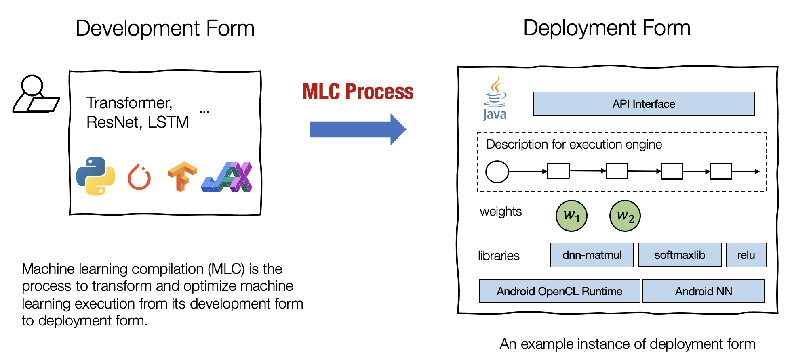

前段时间学习了 mlc.ai 提供的机器学习编译的相关课程，本文简单做个总结，回顾下机器学习编译的基本思想。

# 机器学习编译基本思想

## 什么是机器学习编译

mlc.ai 中对机器学习编译的定义如下：

> 机器学习编译 (machine learning compilation, MLC) 是指，将机器学习算法从开发阶段，通过变换和优化算法，使其变成部署状态。
>
> 开发形式是指我们在开发机器学习模型时使用的形式。典型的开发形式包括用 Paddle、PyTorch、TensorFlow 或 JAX 等通用框架编写的模型描述，以及与之相关的权重。
>
> 部署形式是指执行机器学习应用程序所需的形式。它通常涉及机器学习模型的每个步骤的支撑代码、管理资源（例如内存）的控制器，以及与应用程序开发环境的接口（例如用于 android 应用程序的 java API）。

（以上内容摘抄自 mlc 课件）

机器学习编译的目的：

> 集成与最小化依赖 部署过程通常涉及集成 (Integration)，即将必要的元素组合在一起以用于部署应用程序。 例如，如果我们想启用一个安卓相机应用程序来检测猫，我们将需要图像分类模型的必要代码，但不需要模型无关的其他部分（例如，我们不需要包括用于 NLP 应用程序的embedding table）。代码集成、最小化依赖项的能力能够减小应用的大小，并且可以使应用程序部署到的更多的环境。
>
> 利用硬件加速 每个部署环境都有自己的一套原生加速技术，并且其中许多是专门为机器学习开发的。机器学习编译的一个目标就是是利用硬件本身的特性进行加速。 我们可以通过构建调用原生加速库的部署代码或生成利用原生指令（如 TensorCore）的代码来做到这一点。
>
> 通用优化 有许多等效的方法可以运行相同的模型执行。 MLC 的通用优化形式是不同形式的优化，以最小化内存使用或提高执行效率的方式转换模型执行。

## TVM中的一些概念

### IRModule 和 runtime::Module

### Relax/Relay IR 和  TensorIR

### relay::Function 和 tir::PrimFunc

### 算子编译 和 模型编译

## 

## References

1. https://mlc.ai/