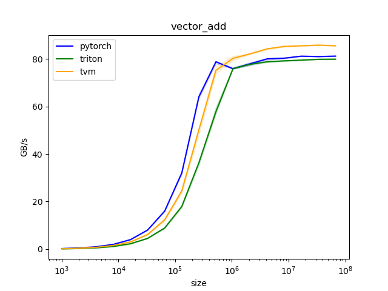
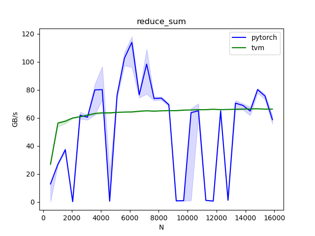
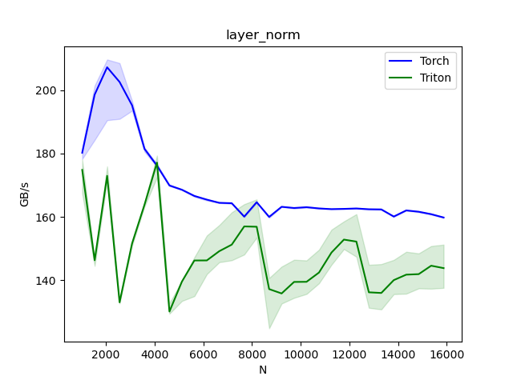

---
layout: post
title:  "编译器算子性能"
date:   2023-01-13 17:30:00 +0800
description: tvm
categories: tvm
tags: [tvm]
location: Beijing,China
--- 

# 编译器算子性能

随着深度学习编译器技术的发展，衍生出了大量的开源库可供使用，如 TVM, XLA, Triton 等。编译器技术可通过算子自动融合 + 代码自动生成两个方面对机器学习模型进行优化。tvm 的算子自动融合实现可参考 https://zhuanlan.zhihu.com/p/589619468 。

此处，我们想要了解下编译器生成算子的性能，以及与传统深度学习框架提供的手工优化算子的性能对比，鉴于此原因，我们写测试代码进行了性能实验。

测试环境：

- 显卡：T4
- TVM: v0.10.0
- Triton: 2.0目前还没有稳定的Tag，使用master分支(4167b6281bb2b790ed0e18a9816b1a63a873a7e3)
- torch: 1.13.1

## vector addition

测试源码见：https://github.com/jiweibo/MMA/blob/main/bench/vector_add.py

测试结果如图所示：

pytorch 的手写 kernel 和 tvm 或 triton 生成的 kernel 性能接近，但看 TVM 生成的 TIR 代码，生成的 kernel 其实并没有优化，需进一步分析。

## reduce_sum

测试源码见：https://github.com/jiweibo/MMA/blob/main/bench/reduce_sum.py
TODO，补充triton的测试结果

测试结果如图所示：

tvm 生成的代码性能比 pytorch 的手写 kernel 要差，且性能稳定在60GB/s，观察了TVM生成的TensorIR，发现 AutoSchedule 搜索到的是相同的程序，均是比较 naive 的实现，后面了解 AutoSchedule 后再来深入分析。

## layer_norm

测试源码见：https://github.com/jiweibo/MMA/blob/main/bench/layer_norm.py
TODO，补充TVM的测试结果。

测试结果如图所示：

triton 生成的代码比 pytorch 的手写 kernel 要慢，目前对 triton 的内部代码不了解，没有分析原因。

## matmul

TODO

# 总结

因时间问题，目前只比对了几个简单的算子（且还没测完），后面会继续补充测试和分析结果，完善这篇文档。

# References

- https://triton-lang.org/master/index.html