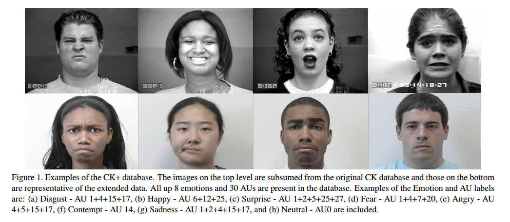
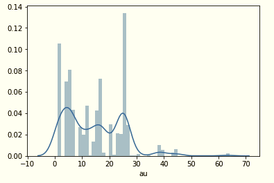
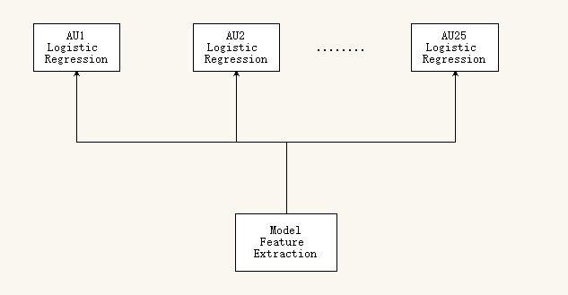
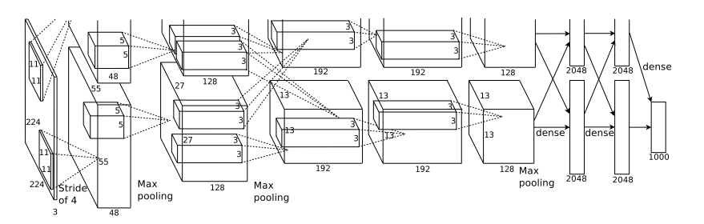
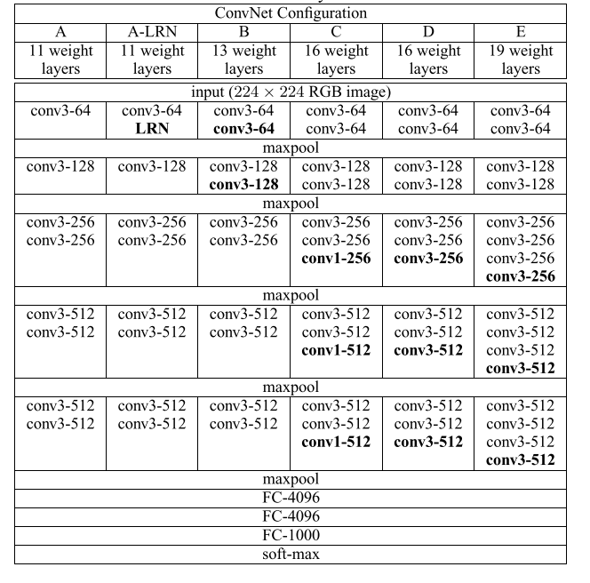
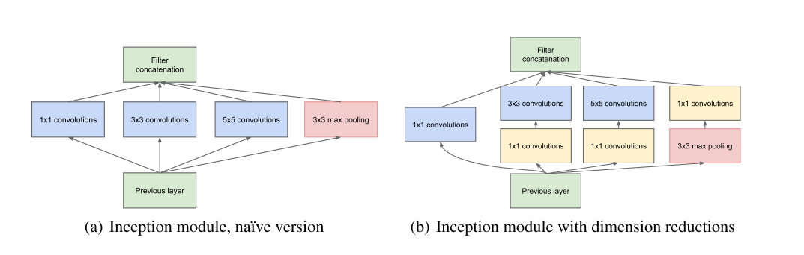
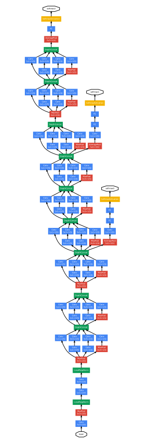
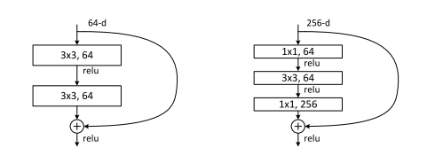
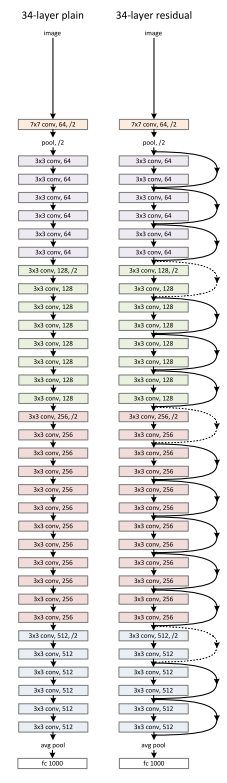

# AU识别


## 概述

面部表情是个体之间交互的最自然的非语言交际媒体之一。表情能够表达情感，明确和强调所说的内容，并且表达理解、分歧和意图。机器对面部表情的理解将为描述个体的情绪状态和心理模式提供有力的信息。由于社交机器人，情感在线辅导环境，智能人机交互（HCI）等多种应用领域的巨大潜力，自动表情识别技术近来备受关注，成为热门话题[1]。

本文运用深度学习中迁移学习的技术对AU图像进行分类，达到了相对较好的结果。所有代码见[code](https://github.com/jiweibo/AU_Recognition)

## CK+数据库

这个数据库是在 Cohn-Kanade Dataset 的基础上扩展来的，发布于2010年。这个数据库可以免费获取，包含表情的label和Action Units 的label。

这个数据库包括123个subjects, 593 个 image sequence，每个image sequence的最后一张 Frame 都有action units 的label，而在这593个image sequence中，有327个sequence 有 emotion的 label。这个数据库是人脸表情识别中比较流行的一个数据库，很多文章都会用到这个数据做测试。具体介绍可以参考文献[2]



现介绍对AU图像的预处理操作(代码见[take_a_look.ipynb](https://github.com/jiweibo/AU_Recognition/blob/master/take_a_look.ipynb))。

### Preprocess

#### Label

本文用到了593个image sequence的最后一张图像做为数据集。首先观察标签的分布，看是否均匀。统计结果如下，
```
AU1: 177
AU2: 117
AU4: 194
AU5: 102
AU6: 123
AU7: 121
AU9: 75
AU10: 21
AU11: 34
AU12: 131
AU13: 2
AU14: 37
AU15: 94
AU16: 24
AU17: 202
AU18: 9
AU20: 79
AU21: 3
AU22: 4
AU23: 60
AU24: 58
AU25: 324
AU26: 50
AU27: 81
AU28: 1
AU29: 2
AU30: 2
AU31: 3
AU34: 1
AU38: 29
AU39: 16
AU43: 9
AU44: 1
AU45: 17
AU54: 2
AU61: 1
AU62: 2
AU63: 2
AU64: 4
```


数据和图中皆反映出AU分布非常不均匀，在此，只选择数量大于90的AU作为数据集。

最终，要识别的AU有：1, 2, 4, 5, 6, 7, 12, 15, 17, 25

还需要对label进行One-hot处理,在此不做介绍。

#### Image data

CKPlus中的数据集为灰度图，此外，根据landmark将脸部附近区域提取出来，之后需要resize成网络模型需要的大小，最后转为RGB图。


## 模型架构

使用alexnet、vgg、resnet和inception网络架构作为特征提取器， 最终并接上10个逻辑回归单元对上述提到的每个AU进行分类。

总体模型架构如图所示


### AlexNet



### VGG



### Inception

inception基本单元





### ResNet

Resnet基本单元






## 实验结果

<table>
    <tr>
        <th width="10%">Model</th>
        <th width="10%">AU1</th>
        <th width="10%">AU2</th>
        <th width="10%">AU4</th>
        <th width="10%">AU5</th>
        <th width="10%">AU6</th>
        <th width="10%">AU7</th>
        <th width="10%">AU12</th>
        <th width="10%">AU15</th>
        <th width="10%">AU17</th>
        <th width="10%">AU25</th>
    </tr>
    <tr>
        <th>AlexNet</th>
        <th>0.83</th>
        <th>0.88</th>
        <th>0.8</th>
        <th>0.72</th>
        <th>0.74</th>
        <th>0.63</th>
        <th>0.86</th>
        <th>0.64</th>
        <th>0.88</th>
        <th>0.92</th>
    </tr>
    <tr>
        <th>VGG16</th>
        <th>0.81</th>
        <th>0.83</th>
        <th>0.71</th>
        <th>0.64</th>
        <th>0.69</th>
        <th>0.5</th>
        <th>0.76</th>
        <th>0.52</th>
        <th>0.83</th>
        <th>0.88</th>
    </tr>
    <tr>
        <th>VGG16_BN</th>
        <th>0.78</th>
        <th>0.86</th>
        <th>0.75</th>
        <th>0.71</th>
        <th>0.7</th>
        <th>0.55</th>
        <th>0.78</th>
        <th>0.52</th>
        <th>0.79</th>
        <th>0.89</th>
    </tr>
    <tr>
        <th>Res18</th>
        <th>0.69</th>
        <th>0.79</th>
        <th>0.52</th>
        <th>0.71</th>
        <th>0.62</th>
        <th>0.48</th>
        <th>0.66</th>
        <th>0.24</th>
        <th>0.57</th>
        <th>0.8</th>
    </tr>
    <tr>
        <th>Res50</th>
        <th>0.73</th>
        <th>0.84</th>
        <th>0.62</th>
        <th>0.67</th>
        <th>0.59</th>
        <th>0.52</th>
        <th>0.66</th>
        <th>0.45</th>
        <th>0.66</th>
        <th>0.83</th>
    </tr>
    <tr>
        <th>Res101</th>
        <th>0.69</th>
        <th>0.78</th>
        <th>0.65</th>
        <th>0.7</th>
        <th>0.5</th>
        <th>0.5</th>
        <th>0.64</th>
        <th>0.33</th>
        <th>0.68</th>
        <th>0.8</th>
    </tr>
    <tr>
        <th>inception</th>
        <th>0.45</th>
        <th>0.45</th>
        <th>0.31</th>
        <th>0.22</th>
        <th>0.12</th>
        <th>0.11</th>
        <th>0.17</th>
        <th>0</th>
        <th>0.26</th>
        <th>0.7</th>
    </tr>
</table>


AlexNet is OK

VGG overfeat

Inception and Resnet should reconsider the classifier layer and hyper parameters.

## 引用和致谢

[1] Facial action unit recognition under incomplete data based on multi-label learning with missing labels

[2] The Extended Cohn-Kanade Dataset (CK+): A complete dataset for action unit and emotion-specified expression

[3] ImageNet Classification with Deep Convolutional Neural Networks

[4] VERY DEEP CONVOLUTIONAL NETWORKS FOR LARGE-SCALE IMAGE RECOGNITION

[5] Deep Residual Learning for Image Recognition

[6] Going deeper with convolutions
