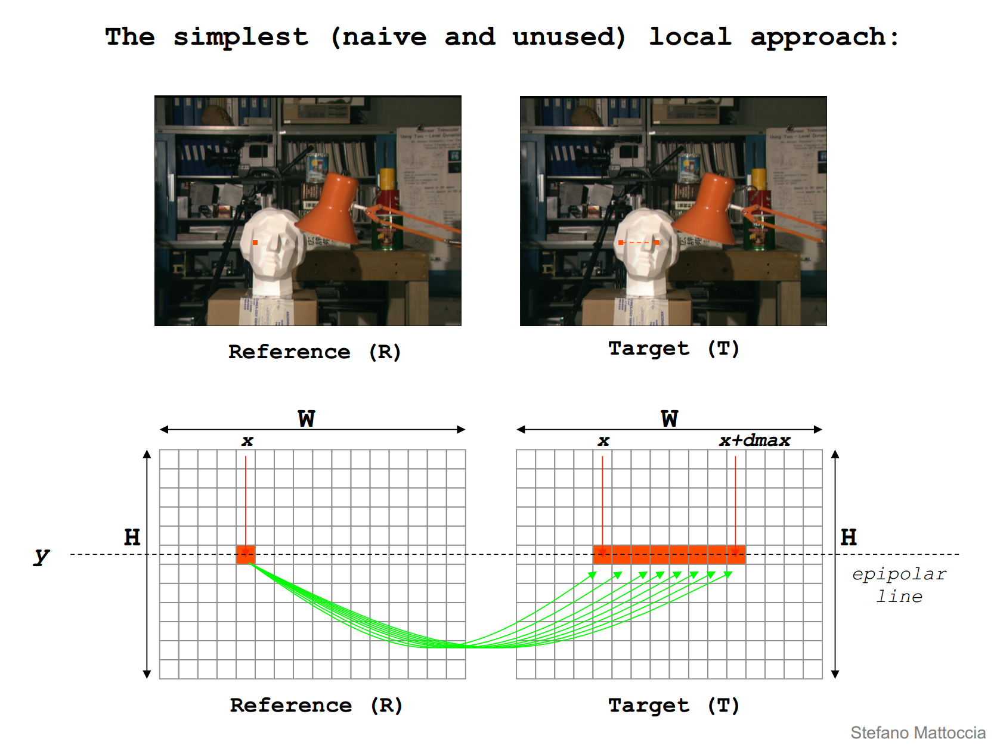
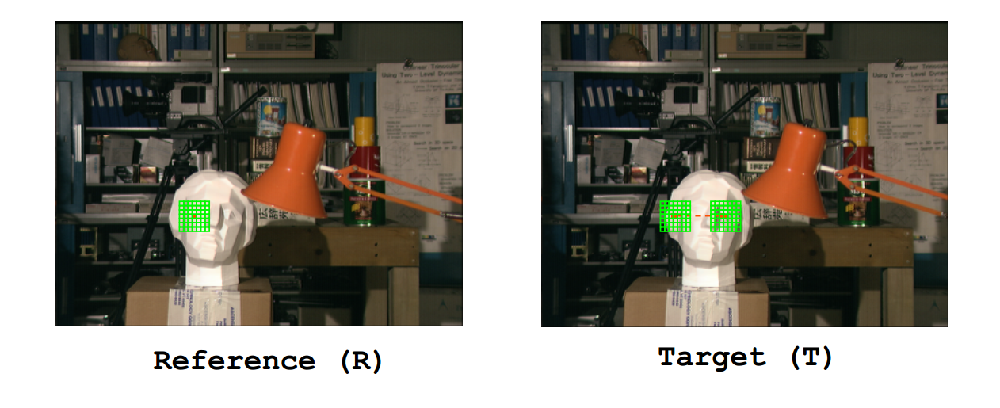
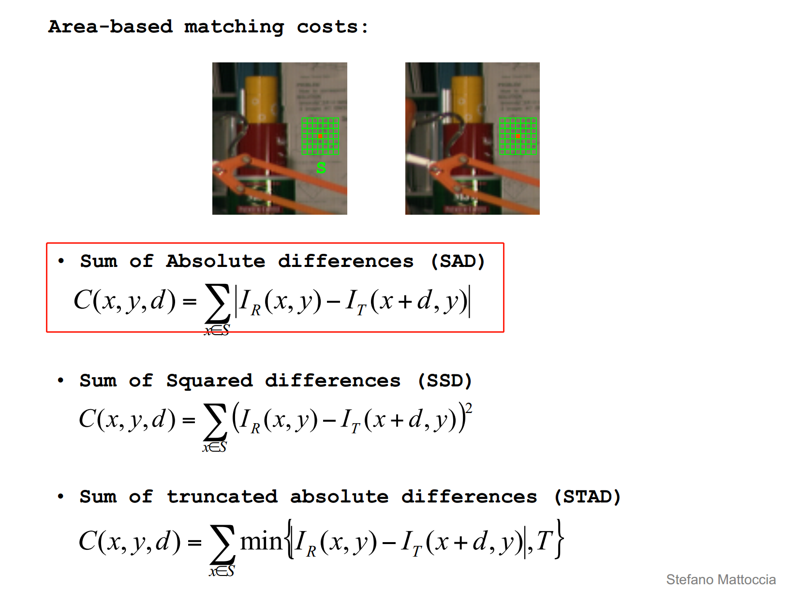
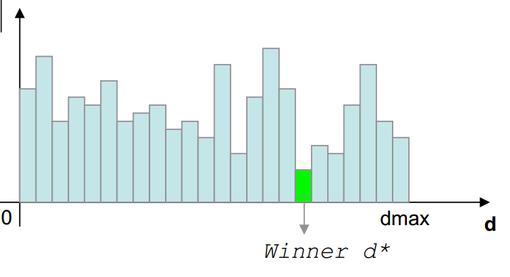
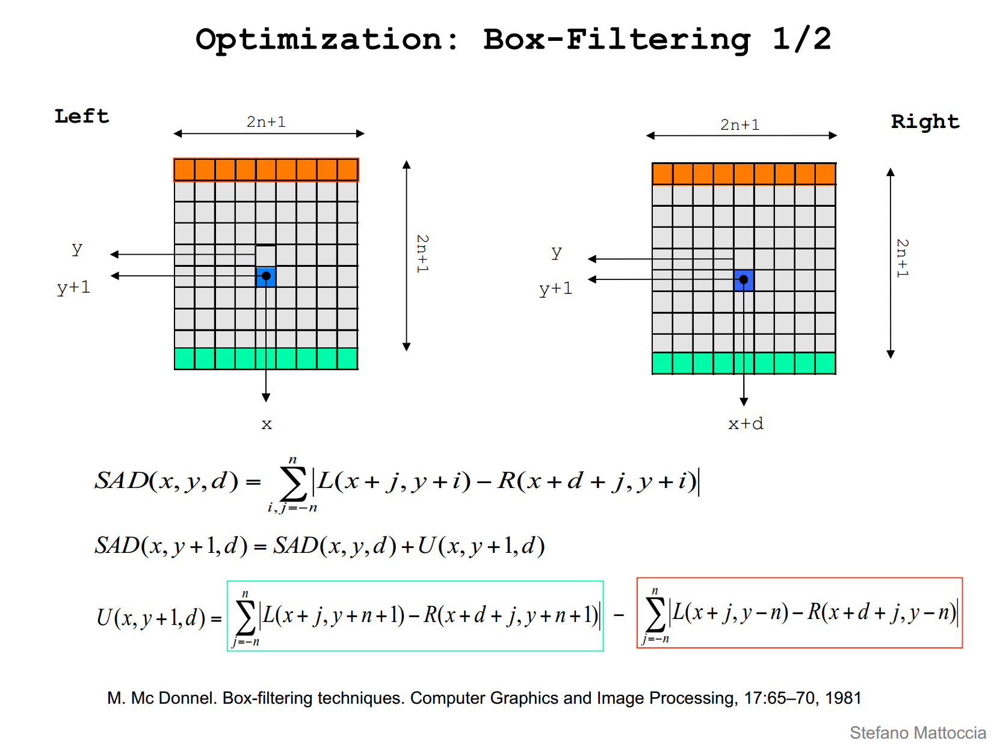
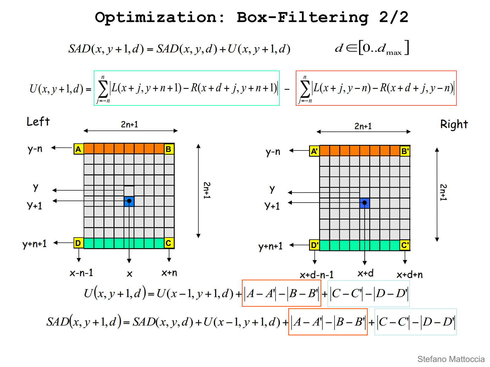

# 立体匹配-BM算法

## 立体匹配相关算法

### 常见立体匹配算法流程

常见的立体匹配算法主要包括以下四步

1. 匹配代价计算
2. 代价聚合
3. 视差计算或优化
4. 视差改良

匹配代价计算常采用sad等方法，根据左右两幅图像上匹配点的像素之差的绝对值。

代价聚合常采用一个固定窗口，计算窗口内部的所有视差之和。

视差的计算最直观的方式是采用WTA(Winner Takes All)的方式，直接选取使得聚合代价最小的视差值。

未完。。。。待续。。。

内容详见论文[1].

## BM算法概括

简单的理解立体匹配，在行对准的两幅图像中找到同一个点,或Reference图像中给定一点，在Target图像中搜索对应的点，如下图所示。



实际上，直接对一点来进行匹配，百分百会出现各种各样的问题，这个时候我们选择用一个固定窗口来替代一点，如下图所示。



Warning,这样做就隐含了一个假设，认为窗口内部视差值相同，但是，显然的，这种假设太过想当然，也使得算法实际效果不好。

BM算法，也常称为SAD(Sum of Absolute Differences)算法，是双目立体匹配中最基本的算法。

下面简要介绍该算法的原理、直观算法实现、opencv接口介绍以及opencv源码的实现。

### SAD基本理论

强烈推荐，文献[2]，本文可以说是对文献2的几页ppt进行了翻译。

SAD算法由3步构成。

1. 匹配代价计算
2. 代价聚合
3. 视差计算

是不是很熟悉？实际上很多双目算法都可以这样划分。

#### Matching Cost Computation

SAD的匹配代价计算比较简单，Reference图像和Target图像像素直接相减加绝对值，即$\|I_R(x,y)-I_T(x+d,y)\|$。

视差空间(DSI)是一个三维矩阵，定义 

$$c(x,y,d)=|I_R(x,y)-I_T(x+d,y)|$$

可以理解为Reference图像$(x,y)$点，在搜索视差为$d$时的代价。

#### Cost Aggeration

SAD的代价聚合就是将固定窗口FW(Fixed Window)内代价求和，直观理解如下图所示。



计算FW内视差视差为d时的聚合代价

$$C(x,y,d)=\sum_{x\in S}\|I_R(x,y)-I_T(x+d,y)\|$$

#### Disparity Computation

SAD的视差计算非常简单，采用WTA原则，对于给定的$(x,y)$，找使得$C(x,y,d)$最小的d，此d即可认为时该点的视差。



### 直观算法实现

好，大概理论说完了，现在说一下直观算法实现，本节主要参考了文献[3]和[4]。

代码很好理解，直接从两幅图像取两个Rect相减，求绝对值，循环遍历找到使其最小的视差，代码简单，运算速度很慢。

```
#include <iostream>
#include "opencv2/opencv.hpp"

using namespace std;
using namespace cv;

class SAD
{
public:
	SAD() :winSize(7), DSR(30) {}
	SAD(int _winSize, int _DSR) : winSize(_winSize), DSR(_DSR) {}
	Mat computerSAD(Mat &L, Mat&R);

private:
	int winSize;	//卷积核尺寸
	int DSR;		//视差搜索范围
};

Mat SAD::computerSAD(Mat&L, Mat& R)
{
	int height = L.rows;
	int width = L.cols;
	Mat kernel_L(Size(winSize, winSize), CV_8U, Scalar::all(0));
	Mat kernel_R(Size(winSize, winSize), CV_8U, Scalar::all(0));
	Mat disparity(height, width, CV_8U, Scalar::all(0));
	
	for (size_t i = 0; i < width - winSize; i++)
	{
		for (size_t j = 0; j < height - winSize; j++)
		{
			kernel_L = L(Rect(i, j, winSize, winSize));
			Mat MM(1, DSR, CV_32F, Scalar(0));

			for (size_t k = 0; k < DSR; k++)
			{
				if (i >= k)
				{
					kernel_R = R(Rect(i - k, j, winSize, winSize));
					Mat Dif;
					absdiff(kernel_L, kernel_R, Dif);
					Scalar ADD = sum(Dif);
					MM.at<float>(k) = ADD[0];
				}
			}

			Point minLoc;
			minMaxLoc(MM, NULL, NULL, &minLoc, NULL);

			int loc = minLoc.x;
			disparity.at<char>(j, i) = loc * 16;
		}
	}
	return disparity;
}
```

这里还有一篇SAD的实现见[4]。相比上一篇多了一个Left-Right Consistency，代码很好理解，直接贴上来。

```
#pragma once

#include "opencv2/opencv.hpp"
#include <vector>
#include <iostream>
#include <string>

using namespace std;
using namespace cv;


float sadvalue(const Mat& src1, const Mat& src2)
{
	Mat matdiff = cv::abs(src1 - src2);
	int saddiff = cv::sum(matdiff)[0];
	return saddiff;
}

float GetMinSadIndex(vector<float>& sad)
{
	float minsad = sad[0];
	int index = 0;
	int len = sad.size();
	for (size_t i = 1; i < len; i++)
	{
		if (sad[i] < minsad)
		{
			minsad = sad[i];
			index = i;
		}
	}
	return index;
}

void MatDataNormal(const Mat& src, Mat& dst)
{
	normalize(src, dst, 255, 0, NORM_MINMAX);
	dst.convertTo(dst, CV_8UC1);
}

void GetPointDepthRight(Mat& disparity, Mat& leftimg, Mat& rightimg, const int MaxDisparity, const int winsize)
{
	int row = leftimg.rows;
	int col = leftimg.cols;
	if (leftimg.channels() == 3 && rightimg.channels() == 3)
	{
		cvtColor(leftimg, leftimg, CV_BGR2GRAY);
		cvtColor(rightimg, rightimg, CV_BGR2GRAY);
	}

	int w = winsize;
	int rowrange = row - w;
	int colrange = col - w - MaxDisparity;

	for (size_t i = w; i < rowrange; i++)
	{
		int *ptr = disparity.ptr<int>(i);
		for (size_t j = w; j < colrange; j++)
		{
			Mat rightwin = rightimg(Range(i - w, i + w + 1), Range(j - w, j + w + 1));
			vector<float> sad(MaxDisparity);
			for (size_t d = j; d < j + MaxDisparity; d++)
			{
				Mat leftwin = leftimg(Range(i - w, i + w + 1), Range(d - w, d + w + 1));
				sad[d - j] = sadvalue(leftwin, rightwin);
			}
			*(ptr + j) = GetMinSadIndex(sad);
		}
	}
}

void GetPointDepthLeft(Mat& disparity, Mat& leftimg, Mat& rightimg, const int MaxDisparity, const int winsize)
{
	int row = leftimg.rows;
	int col = leftimg.cols;
	if (leftimg.channels() == 3 && rightimg.channels() == 3)
	{
		cvtColor(leftimg, leftimg, CV_BGR2GRAY);
		cvtColor(rightimg, rightimg, CV_BGR2GRAY);
	}

	int w = winsize;
	int rowrange = row - w;
	int colrange = col - w - MaxDisparity;

	for (size_t i = w; i < rowrange; i++)
	{
		int *ptr = disparity.ptr<int>(i);
		for (size_t j = MaxDisparity + w; j < colrange; j++)
		{
			Mat leftwin = leftimg(Range(i - w, i + w + 1), Range(j - w, j + w + 1));
			vector<float> sad(MaxDisparity);
			for (size_t d = j; d > j - MaxDisparity; d--)
			{
				Mat rightwin = rightimg(Range(i - w, i + w + 1), Range(d - w, d + w + 1));
				sad[j - d] = sadvalue(leftwin, rightwin);
			}
			*(ptr + j) = GetMinSadIndex(sad);
		}
	}
}


// Left-Right Consistency 
void CrossCheckDisparity(const Mat& leftdisp, const Mat& rightdisp, Mat& lastdisp, const int MaxDisparity, const int winsize)
{
	int row = leftdisp.rows;
	int col = rightdisp.cols;
	int w = winsize;
	int rowrange = row - w;
	int colrange = col - MaxDisparity - w;
	int diffthreshold = 2;
	for (size_t i = w; i < row - w; i++)
	{
		const int *ptrleft = leftdisp.ptr<int>(i);
		const int *ptrright = rightdisp.ptr<int>(i);
		int *ptrdisp = lastdisp.ptr<int>(i);
		for (size_t j = MaxDisparity + w; j < col - MaxDisparity - w; j++)
		{
			int leftvalue = *(ptrleft + j);
			int rightvalue = *(ptrright + j);
			int diff = abs(leftvalue - rightvalue);
			if (diff>diffthreshold)
			{
				*(ptrdisp + j) = 0;
			}
			else
			{
				*(ptrdisp + j) = leftvalue;
			}
		}
	}
}

int main(int argc, char* argv[])
{
	Mat img_L = imread("0.png", IMREAD_GRAYSCALE);
	Mat img_R = imread("4.png", IMREAD_GRAYSCALE);
	//Mat img_L = imread("aloeL.jpg", IMREAD_GRAYSCALE);
	//Mat img_R = imread("aloeR.jpg", IMREAD_GRAYSCALE);
	if (img_L.empty() || img_R.empty())
	{
		exit(-1);
	}
	Mat disparity;

	/***************************************************************************/
	// SAD简易实现版本+LRC
	/***************************************************************************/
	int row = img_L.rows;
	int col = img_L.cols;
	Mat depthleft = Mat::zeros(row, col, CV_32S);
	Mat depthright = Mat::zeros(row, col, CV_32S);
	Mat lastdisp = Mat::zeros(row, col, CV_32S);
	int MaxDisparity = 64;
	int winsize = 15;
	GetPointDepthLeft(depthleft, img_L, img_R, MaxDisparity, winsize);
	GetPointDepthRight(depthright, img_L, img_R, MaxDisparity, winsize);
	CrossCheckDisparity(depthleft, depthright, lastdisp, MaxDisparity, winsize);
	
	MatDataNormal(depthleft, depthleft);
	MatDataNormal(depthright, depthright);
	MatDataNormal(lastdisp, lastdisp);
	namedWindow("left", 0);
	namedWindow("right", 0);
	namedWindow("depthleft", 0);
	namedWindow("depthright", 0);
	namedWindow("lastdisp", 0);
	imshow("left", img_L);
	imshow("right", img_R);
	imshow("depthleft", depthleft);
	imshow("depthright", depthright);
	imshow("lastdisp", lastdisp);
	waitKey(0);
```

### OpenCV-BM源码

opencv的bm源码进行了优化，主要是采用了Box-Filter的方法，处理速度大幅度提高，见下图。





理解了这个方法再来看这段源码，就十分好理解了。

opencv的bm源码主要包括

1. 参数检查
2. 图像预处理(prefilterNorm和prefilterXSobel)
3. 计算视差图(findStereoCorrespondenceBM)：这部分当中还加入了唯一性约束
```
if (uniquenessRatio > 0)
{
	int thresh = minsad + (minsad * uniquenessRatio / 100);
	for (d = 0; d < ndisp; d++)
	{
		if ((d < mind - 1 || d > mind + 1) && sad[d] <= thresh)
			break;
	}
	if (d < ndisp)
	{
		dptr[y*dstep] = FILTERED;
		continue;
	}
}
```
以及对视差不连续情况的处理
```
int p = sad[mind + 1], n = sad[mind - 1];
d = p + n - 2 * sad[mind] + std::abs(p - n);
dptr[y*dstep] = (mType)(((ndisp - mind - 1 + mindisp) * 256 + (d != 0 ? (p - n) * 256 / d : 0) + 15) >> (DISPARITY_SHIFT_32S - disp_shift));
costptr[y*coststep] = sad[mind];
```

但是该算法实际在使用的时候速度足够但效果不好。

## Code

代码先还没发布，等这一系列写完再推送到我的[github](https://github.com/jiweibo/StereoVision)上。


## 引用

[1] D. Scharstein and R. Szeliski. A taxonomy and evaluation of dense two-frame stereo correspondence algorithms.
International Journal of Computer Vision, 47(1/2/3):7-42, April-June 2002.

[2] [http://vision.deis.unibo.it/~smatt/Seminars/StereoVision.pdf](http://vision.deis.unibo.it/~smatt/Seminars/StereoVision.pdf_)

[3] [https://blog.csdn.net/lwx309025167/article/details/78387879?locationNum=9&fps=1](https://blog.csdn.net/lwx309025167/article/details/78387879?locationNum=9&fps=1)

[4] [http://www.cnblogs.com/adong7639/p/4267326.html](http://www.cnblogs.com/adong7639/p/4267326.html)