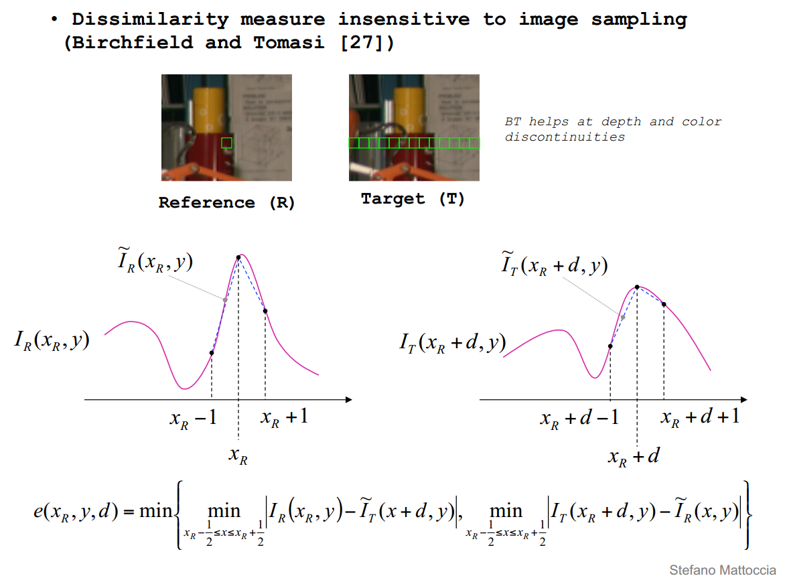
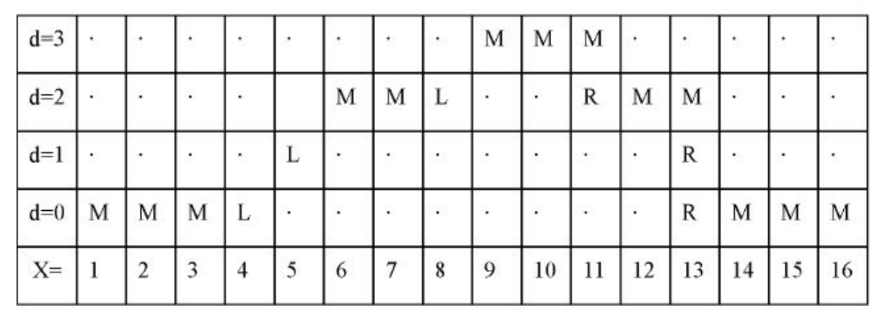
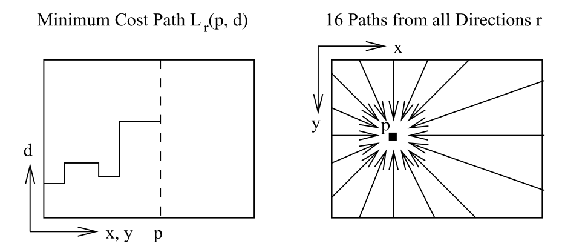

# 立体匹配-SGBM算法

## 立体匹配相关算法

[bm](https://jiweibo.github.io/StereoBM/)

[sgbm](https://jiweibo.github.io/StereoSGBM/)

### 常见立体匹配算法流程

常见的立体匹配算法主要包括以下四步

1. 匹配代价计算
2. 代价聚合
3. 视差计算或优化
4. 视差改良

内容详见论文[1].

## SGBM算法概括

采用代价函数最小化的方式搜索视差。

### SGBM基本理论

强烈推荐，文献[2].

#### Matching Cost Computation

OpenCV源码中代价的计算是采用的BT方法，如下图所示，能够在深度不连续区域相比灰度值相减的方式有较好的效果，具体细节见论文[3]。



OpenCV中这部分源码如下，我已经加了部分注释

```
/*
For each pixel row1[x], max(maxD, 0) <= minX <= x < maxX <= width - max(0, -minD),
and for each disparity minD<=d<maxD the function
computes the cost (cost[(x-minX)*(maxD - minD) + (d - minD)]), depending on the difference between
row1[x] and row2[x-d]. The subpixel algorithm from
"Depth Discontinuities by Pixel-to-Pixel Stereo" by Stan Birchfield and C. Tomasi
is used, hence the suffix BT.

the temporary buffer should contain width2*2 elements
*/
static void calcPixelCostBT(const Mat& img1, const Mat& img2, int y,
	int minD, int maxD, CostType* cost,
	PixType* buffer, const PixType* tab,
	int tabOfs, int, int xrange_min = 0, int xrange_max = DEFAULT_RIGHT_BORDER)
{
	// 初始化部分，声明定义后续用到的变量
	int x, c, width = img1.cols, cn = img1.channels();
	// minX1 maxX1计算图像第y行的x坐标范围
	int minX1 = std::max(maxD, 0), maxX1 = width + std::min(minD, 0);
	// D为视差搜索范围
	int D = maxD - minD, width1 = maxX1 - minX1;
	//This minX1 & maxX2 correction is defining which part of calculatable line must be calculated
	//That is needs of parallel algorithm
	xrange_min = (xrange_min < 0) ? 0 : xrange_min;
	xrange_max = (xrange_max == DEFAULT_RIGHT_BORDER) || (xrange_max > width1) ? width1 : xrange_max;
	maxX1 = minX1 + xrange_max;
	minX1 += xrange_min;
	width1 = maxX1 - minX1;
	int minX2 = std::max(minX1 - maxD, 0), maxX2 = std::min(maxX1 - minD, width);
	int width2 = maxX2 - minX2;
	const PixType *row1 = img1.ptr<PixType>(y), *row2 = img2.ptr<PixType>(y);
	PixType *prow1 = buffer + width2 * 2, *prow2 = prow1 + width*cn * 2;

	tab += tabOfs;
	// 边界初始化
	for (c = 0; c < cn * 2; c++)
	{
		prow1[width*c] = prow1[width*c + width - 1] =
			prow2[width*c] = prow2[width*c + width - 1] = tab[0];
	}
	// 像素向上向下移动的偏移量
	int n1 = y > 0 ? -(int)img1.step : 0, s1 = y < img1.rows - 1 ? (int)img1.step : 0;
	int n2 = y > 0 ? -(int)img2.step : 0, s2 = y < img2.rows - 1 ? (int)img2.step : 0;
	// 预处理，实则为水平方向sobel算子，检测竖直方向边缘，注意prow1顺序存储，prow2逆序存储，方便最后cost代价存储
	int minX_cmn = std::min(minX1, minX2) - 1;
	int maxX_cmn = std::max(maxX1, maxX2) + 1;
	minX_cmn = std::max(minX_cmn, 1);
	maxX_cmn = std::min(maxX_cmn, width - 1);
	if (cn == 1)
	{
		for (x = minX_cmn; x < maxX_cmn; x++)
		{
			prow1[x] = tab[(row1[x + 1] - row1[x - 1]) * 2 + row1[x + n1 + 1] - row1[x + n1 - 1] + row1[x + s1 + 1] - row1[x + s1 - 1]];
			prow2[width - 1 - x] = tab[(row2[x + 1] - row2[x - 1]) * 2 + row2[x + n2 + 1] - row2[x + n2 - 1] + row2[x + s2 + 1] - row2[x + s2 - 1]];

			prow1[x + width] = row1[x];
			prow2[width - 1 - x + width] = row2[x];
		}
	}
	else
	{
		for (x = minX_cmn; x < maxX_cmn; x++)
		{
			prow1[x] = tab[(row1[x * 3 + 3] - row1[x * 3 - 3]) * 2 + row1[x * 3 + n1 + 3] - row1[x * 3 + n1 - 3] + row1[x * 3 + s1 + 3] - row1[x * 3 + s1 - 3]];
			prow1[x + width] = tab[(row1[x * 3 + 4] - row1[x * 3 - 2]) * 2 + row1[x * 3 + n1 + 4] - row1[x * 3 + n1 - 2] + row1[x * 3 + s1 + 4] - row1[x * 3 + s1 - 2]];
			prow1[x + width * 2] = tab[(row1[x * 3 + 5] - row1[x * 3 - 1]) * 2 + row1[x * 3 + n1 + 5] - row1[x * 3 + n1 - 1] + row1[x * 3 + s1 + 5] - row1[x * 3 + s1 - 1]];

			prow2[width - 1 - x] = tab[(row2[x * 3 + 3] - row2[x * 3 - 3]) * 2 + row2[x * 3 + n2 + 3] - row2[x * 3 + n2 - 3] + row2[x * 3 + s2 + 3] - row2[x * 3 + s2 - 3]];
			prow2[width - 1 - x + width] = tab[(row2[x * 3 + 4] - row2[x * 3 - 2]) * 2 + row2[x * 3 + n2 + 4] - row2[x * 3 + n2 - 2] + row2[x * 3 + s2 + 4] - row2[x * 3 + s2 - 2]];
			prow2[width - 1 - x + width * 2] = tab[(row2[x * 3 + 5] - row2[x * 3 - 1]) * 2 + row2[x * 3 + n2 + 5] - row2[x * 3 + n2 - 1] + row2[x * 3 + s2 + 5] - row2[x * 3 + s2 - 1]];

			prow1[x + width * 3] = row1[x * 3];
			prow1[x + width * 4] = row1[x * 3 + 1];
			prow1[x + width * 5] = row1[x * 3 + 2];

			prow2[width - 1 - x + width * 3] = row2[x * 3];
			prow2[width - 1 - x + width * 4] = row2[x * 3 + 1];
			prow2[width - 1 - x + width * 5] = row2[x * 3 + 2];
		}
	}
	// cost区域清零
	memset(cost + xrange_min*D, 0, width1*D * sizeof(cost[0]));

	buffer -= width - 1 - maxX2;
	cost -= (minX1 - xrange_min)*D + minD; // simplify the cost indices inside the loop
	// 开始计算cost
	for (c = 0; c < cn * 2; c++, prow1 += width, prow2 += width)
	{
		int diff_scale = c < cn ? 0 : 2;

		// precompute
		//   v0 = min(row2[x-1/2], row2[x], row2[x+1/2]) and
		//   v1 = max(row2[x-1/2], row2[x], row2[x+1/2]) and
		for (x = width - 1 - maxX2; x < width - 1 - minX2; x++)
		{
			int v = prow2[x];
			int vl = x > 0 ? (v + prow2[x - 1]) / 2 : v;
			int vr = x < width - 1 ? (v + prow2[x + 1]) / 2 : v;
			int v0 = std::min(vl, vr); v0 = std::min(v0, v);
			int v1 = std::max(vl, vr); v1 = std::max(v1, v);
			buffer[x] = (PixType)v0;
			buffer[x + width2] = (PixType)v1;
		}
		// BT论文中提到的计算代价的方法
		for (x = minX1; x < maxX1; x++)
		{
			int u = prow1[x];
			int ul = x > 0 ? (u + prow1[x - 1]) / 2 : u;
			int ur = x < width - 1 ? (u + prow1[x + 1]) / 2 : u;
			int u0 = std::min(ul, ur); u0 = std::min(u0, u);
			int u1 = std::max(ul, ur); u1 = std::max(u1, u);

			for (int d = minD; d < maxD; d++)
			{
				int v = prow2[width - x - 1 + d];
				int v0 = buffer[width - x - 1 + d];
				int v1 = buffer[width - x - 1 + d + width2];
				int c0 = std::max(0, u - v1); c0 = std::max(c0, v0 - u);
				int c1 = std::max(0, v - u1); c1 = std::max(c1, u0 - v);
				// 累加存储代价
				cost[x*D + d] = (CostType)(cost[x*D + d] + (std::min(c0, c1) >> diff_scale));
			}
		}
	}
}
```

#### Cost Aggeration

常用的聚合方式包括，SSD的直接求和、DP搜索等等。SGBM用到的就是多方向DP搜索方法。

先简单介绍最简单的单方向DP搜索，详情可见论文[4]的3.2节。

对于图像的一行来说，我们想要得到该行上每个像素点的视差值，这样就可以类推得到整个图像的视差。

那么如何计算图像中一行的视差值那？DP方法是得到使得Cost Function最小的一条路径，得到路径之后，每一像素的视差便确定了。

Cost Function可以表示为

$$E(D)=E(data)+E(smooth)$$

$$E(D)=\sum_p{C(p,D_p)}+\sum_{q \in N_p}{P_1|T[|D_p-D_q|=1]}+\sum_{q \in N_p}{P_2|T[|D_p-D_q|>1]}$$

其中$E(data)$为像素之间的相似性，也可以说是之前的Matching Cost；$E(smooth)$是相邻像素间的平滑约束，相邻像素视差差值为1时，代价为$P_1$，视差大于1时，代价为$P_2$

通过DP的方法，可以得到使得上述代价最小的一条路径，路径上的每个点对应的视差即为图像该行上像素点对应的视差，论文中的图片如下，显示了一条路径，通过DP的方式可以找到使得代价函数最小的最优路径。



以上是单方向的DP方法，速度够快，但所得视差图存在条纹缺陷，自然的想到了多方向搜索，也是SGM论文中采用的方式，具体细节可参考代码。



OpenCV中SGBM算法的MODE_SGBM模式，实现了4（或5）方向搜索，这部分的代码，我已加了部分注释，可结合OpenCV源码对照观看，如下所示。

还有其它MODE_HH、MODE_SGBM_3WAY、MODE_HH4模式，这部分以后更新

```
/*
computes disparity for "roi" in img1 w.r.t. img2 and write it to disp1buf.
that is, disp1buf(x, y)=d means that img1(x+roi.x, y+roi.y) ~ img2(x+roi.x-d, y+roi.y).
minD <= d < maxD.
disp2full is the reverse disparity map, that is:
disp2full(x+roi.x,y+roi.y)=d means that img2(x+roi.x, y+roi.y) ~ img1(x+roi.x+d, y+roi.y)

note that disp1buf will have the same size as the roi and
disp2full will have the same size as img1 (or img2).
On exit disp2buf is not the final disparity, it is an intermediate result that becomes
final after all the tiles are processed.

the disparity in disp1buf is written with sub-pixel accuracy
(4 fractional bits, see StereoSGBM::DISP_SCALE),
using quadratic interpolation, while the disparity in disp2buf
is written as is, without interpolation.

disp2cost also has the same size as img1 (or img2).
It contains the minimum current cost, used to find the best disparity, corresponding to the minimal cost.
*/
static void computeDisparitySGBM(const Mat& img1, const Mat& img2,
	Mat& disp1, const StereoSGBMParams& params, Mat& buffer)
{
	const int ALIGN = 16;
	const int DISP_SHIFT = StereoMatcherImpl::DISP_SHIFT;
	const int DISP_SCALE = (1 << DISP_SHIFT);
	const CostType MAX_COST = SHRT_MAX;

	int minD = params.minDisparity, maxD = minD + params.numDisparities;
	Size SADWindowSize;
	SADWindowSize.width = SADWindowSize.height = params.SADWindowSize > 0 ? params.SADWindowSize : 5;
	int ftzero = std::max(params.preFilterCap, 15) | 1;
	int uniquenessRatio = params.uniquenessRatio >= 0 ? params.uniquenessRatio : 10;
	int disp12MaxDiff = params.disp12MaxDiff > 0 ? params.disp12MaxDiff : 1;
	int P1 = params.P1 > 0 ? params.P1 : 2, P2 = std::max(params.P2 > 0 ? params.P2 : 5, P1 + 1);
	int k, width = disp1.cols, height = disp1.rows;
	int minX1 = std::max(maxD, 0), maxX1 = width + std::min(minD, 0);
	int D = maxD - minD, width1 = maxX1 - minX1;
	int INVALID_DISP = minD - 1, INVALID_DISP_SCALED = INVALID_DISP*DISP_SCALE;
	int SW2 = SADWindowSize.width / 2, SH2 = SADWindowSize.height / 2;
	bool fullDP = params.mode == StereoSGBMAlgo::MODE_HH;
	int npasses = fullDP ? 2 : 1;
	const int TAB_OFS = 256 * 4, TAB_SIZE = 256 + TAB_OFS * 2;
	PixType clipTab[TAB_SIZE];

	for (k = 0; k < TAB_SIZE; k++)
		clipTab[k] = (PixType)(std::min(std::max(k - TAB_OFS, -ftzero), ftzero) + ftzero);

	if (minX1 >= maxX1)
	{
		disp1 = Scalar::all(INVALID_DISP_SCALED);
		return;
	}

	CV_Assert(D % 16 == 0);

	// NR - the number of directions. the loop on x below that computes Lr assumes that NR == 8.
	// if you change NR, please, modify the loop as well.
	int D2 = D + 16, NRD2 = NR2*D2;

	// the number of L_r(.,.) and min_k L_r(.,.) lines in the buffer:
	// for 8-way dynamic programming we need the current row and
	// the previous row, i.e. 2 rows in total
	const int NLR = 2;
	const int LrBorder = NLR - 1;

	// for each possible stereo match (img1(x,y) <=> img2(x-d,y))
	// we keep pixel difference cost (C) and the summary cost over NR directions (S).
	// we also keep all the partial costs for the previous line L_r(x,d) and also min_k L_r(x, k)
	size_t costBufSize = width1*D;
	size_t CSBufSize = costBufSize*(fullDP ? height : 1);
	size_t minLrSize = (width1 + LrBorder * 2)*NR2, LrSize = minLrSize*D2;
	int hsumBufNRows = SH2 * 2 + 2;
	size_t totalBufSize = (LrSize + minLrSize)*NLR * sizeof(CostType) + // minLr[] and Lr[]
		costBufSize*(hsumBufNRows + 1) * sizeof(CostType) + // hsumBuf, pixdiff
		CSBufSize * 2 * sizeof(CostType) + // C, S
		width * 16 * img1.channels() * sizeof(PixType) + // temp buffer for computing per-pixel cost
		width*(sizeof(CostType) + sizeof(DispType)) + 1024; // disp2cost + disp2ptr

	if (buffer.empty() || !buffer.isContinuous() ||
		buffer.cols*buffer.rows*buffer.elemSize() < totalBufSize)
		buffer.reserveBuffer(totalBufSize);

	// summary cost over different (nDirs) directions
	CostType* Cbuf = (CostType*)alignPtr(buffer.ptr(), ALIGN);
	CostType* Sbuf = Cbuf + CSBufSize;
	CostType* hsumBuf = Sbuf + CSBufSize;
	CostType* pixDiff = hsumBuf + costBufSize*hsumBufNRows;

	CostType* disp2cost = pixDiff + costBufSize + (LrSize + minLrSize)*NLR;
	DispType* disp2ptr = (DispType*)(disp2cost + width);
	PixType* tempBuf = (PixType*)(disp2ptr + width);

	// add P2 to every C(x,y). it saves a few operations in the inner loops
	for (k = 0; k < (int)CSBufSize; k++)
		Cbuf[k] = (CostType)P2;

	for (int pass = 1; pass <= npasses; pass++)
	{
		int x1, y1, x2, y2, dx, dy;

		if (pass == 1)
		{
			y1 = 0; y2 = height; dy = 1;
			x1 = 0; x2 = width1; dx = 1;
		}
		else
		{
			y1 = height - 1; y2 = -1; dy = -1;
			x1 = width1 - 1; x2 = -1; dx = -1;
		}

		CostType *Lr[NLR] = { 0 }, *minLr[NLR] = { 0 };

		for (k = 0; k < NLR; k++)
		{
			// shift Lr[k] and minLr[k] pointers, because we allocated them with the borders,
			// and will occasionally use negative indices with the arrays
			// we need to shift Lr[k] pointers by 1, to give the space for d=-1.
			// however, then the alignment will be imperfect, i.e. bad for SSE,
			// thus we shift the pointers by 8 (8*sizeof(short) == 16 - ideal alignment)
			Lr[k] = pixDiff + costBufSize + LrSize*k + NRD2*LrBorder + 8;
			memset(Lr[k] - LrBorder*NRD2 - 8, 0, LrSize * sizeof(CostType));
			minLr[k] = pixDiff + costBufSize + LrSize*NLR + minLrSize*k + NR2*LrBorder;
			memset(minLr[k] - LrBorder*NR2, 0, minLrSize * sizeof(CostType));
		}

		for (int y = y1; y != y2; y += dy)
		{
			int x, d;
			DispType* disp1ptr = disp1.ptr<DispType>(y);
			CostType* C = Cbuf + (!fullDP ? 0 : y*costBufSize);
			CostType* S = Sbuf + (!fullDP ? 0 : y*costBufSize);

			if (pass == 1) // compute C on the first pass, and reuse it on the second pass, if any.
			{
				int dy1 = y == 0 ? 0 : y + SH2, dy2 = y == 0 ? SH2 : dy1;

				for (k = dy1; k <= dy2; k++)
				{
					CostType* hsumAdd = hsumBuf + (std::min(k, height - 1) % hsumBufNRows)*costBufSize;

					if (k < height)
					{
						calcPixelCostBT(img1, img2, k, minD, maxD, pixDiff, tempBuf, clipTab, TAB_OFS, ftzero);

						memset(hsumAdd, 0, D * sizeof(CostType));
						for (x = 0; x <= SW2*D; x += D)
						{
							int scale = x == 0 ? SW2 + 1 : 1;
							for (d = 0; d < D; d++)
								hsumAdd[d] = (CostType)(hsumAdd[d] + pixDiff[x + d] * scale);
						}

						if (y > 0)
						{
							const CostType* hsumSub = hsumBuf + (std::max(y - SH2 - 1, 0) % hsumBufNRows)*costBufSize;
							const CostType* Cprev = !fullDP || y == 0 ? C : C - costBufSize;

							for (x = D; x < width1*D; x += D)
							{
								const CostType* pixAdd = pixDiff + std::min(x + SW2*D, (width1 - 1)*D);
								const CostType* pixSub = pixDiff + std::max(x - (SW2 + 1)*D, 0);

								for (d = 0; d < D; d++)
								{
									int hv = hsumAdd[x + d] = (CostType)(hsumAdd[x - D + d] + pixAdd[d] - pixSub[d]);
									C[x + d] = (CostType)(Cprev[x + d] + hv - hsumSub[x + d]);
								}
							}
						}
						else
						{
							for (x = D; x < width1*D; x += D)
							{
								const CostType* pixAdd = pixDiff + std::min(x + SW2*D, (width1 - 1)*D);
								const CostType* pixSub = pixDiff + std::max(x - (SW2 + 1)*D, 0);

								for (d = 0; d < D; d++)
									hsumAdd[x + d] = (CostType)(hsumAdd[x - D + d] + pixAdd[d] - pixSub[d]);
							}
						}
					}

					if (y == 0)
					{
						int scale = k == 0 ? SH2 + 1 : 1;
						for (x = 0; x < width1*D; x++)
							C[x] = (CostType)(C[x] + hsumAdd[x] * scale);
					}
				}

				// also, clear the S buffer
				for (k = 0; k < width1*D; k++)
					S[k] = 0;
			}

			// clear the left and the right borders
			memset(Lr[0] - NRD2*LrBorder - 8, 0, NRD2*LrBorder * sizeof(CostType));
			memset(Lr[0] + width1*NRD2 - 8, 0, NRD2*LrBorder * sizeof(CostType));
			memset(minLr[0] - NR2*LrBorder, 0, NR2*LrBorder * sizeof(CostType));
			memset(minLr[0] + width1*NR2, 0, NR2*LrBorder * sizeof(CostType));

			/*
			[formula 13 in the paper]
			compute L_r(p, d) = C(p, d) +
			min(L_r(p-r, d),
			L_r(p-r, d-1) + P1,
			L_r(p-r, d+1) + P1,
			min_k L_r(p-r, k) + P2) - min_k L_r(p-r, k)
			where p = (x,y), r is one of the directions.
			we process all the directions at once:
			0: r=(-dx, 0)
			1: r=(-1, -dy)
			2: r=(0, -dy)
			3: r=(1, -dy)
			4: r=(-2, -dy)
			5: r=(-1, -dy*2)
			6: r=(1, -dy*2)
			7: r=(2, -dy)
			*/

			for (x = x1; x != x2; x += dx)
			{
				int xm = x*NR2, xd = xm*D2;
				// minLr[0] Lr[0]存储当前行数据
				// minLr[1] Lr[1]存储上一行数据
				// delta0存储当前行，上一个像素，0方向D个视差的代价最小值
				// delta1存储上一行，上一个像素，1方向D个视差的代价最小值
				// delta2存储上一行，当前像素，2方向D个视差的代价最小值
				// delta3存储上一行，下一个像素，3方向D个视差的代价最小值
				int delta0 = minLr[0][xm - dx*NR2] + P2, delta1 = minLr[1][xm - NR2 + 1] + P2;
				int delta2 = minLr[1][xm + 2] + P2, delta3 = minLr[1][xm + NR2 + 3] + P2;

				// Lr_p0存储当前行，上一个像素，0方向D个视差的代价
				// Lr_p1存储上一行，上一个像素，1方向D个视差的代价
				// Lr_p2存储上一行，当前像素，2方向D个视差的代价
				// Lr_p3存储上一行，下一个像素，3方向D个视差的代价
				CostType* Lr_p0 = Lr[0] + xd - dx*NRD2;
				CostType* Lr_p1 = Lr[1] + xd - NRD2 + D2;
				CostType* Lr_p2 = Lr[1] + xd + D2 * 2;
				CostType* Lr_p3 = Lr[1] + xd + NRD2 + D2 * 3;

				// 左右边界赋值
				Lr_p0[-1] = Lr_p0[D] = Lr_p1[-1] = Lr_p1[D] =
					Lr_p2[-1] = Lr_p2[D] = Lr_p3[-1] = Lr_p3[D] = MAX_COST;

				// 当前像素点
				CostType* Lr_p = Lr[0] + xd;
				const CostType* Cp = C + x*D;
				CostType* Sp = S + x*D;

				int minL0 = MAX_COST, minL1 = MAX_COST, minL2 = MAX_COST, minL3 = MAX_COST;

				for (d = 0; d < D; d++)
				{
					int Cpd = Cp[d], L0, L1, L2, L3;
					// 计算0、1、2、3方向的Lr_pd
					L0 = Cpd + std::min((int)Lr_p0[d], std::min(Lr_p0[d - 1] + P1, std::min(Lr_p0[d + 1] + P1, delta0))) - delta0;
					L1 = Cpd + std::min((int)Lr_p1[d], std::min(Lr_p1[d - 1] + P1, std::min(Lr_p1[d + 1] + P1, delta1))) - delta1;
					L2 = Cpd + std::min((int)Lr_p2[d], std::min(Lr_p2[d - 1] + P1, std::min(Lr_p2[d + 1] + P1, delta2))) - delta2;
					L3 = Cpd + std::min((int)Lr_p3[d], std::min(Lr_p3[d - 1] + P1, std::min(Lr_p3[d + 1] + P1, delta3))) - delta3;
					// 0方向的Lr_pd，以及0方向的最小代价
					Lr_p[d] = (CostType)L0;
					minL0 = std::min(minL0, L0);
					// 1方向的Lr_pd，以及1方向的最小代价
					Lr_p[d + D2] = (CostType)L1;
					minL1 = std::min(minL1, L1);
					// 2
					Lr_p[d + D2 * 2] = (CostType)L2;
					minL2 = std::min(minL2, L2);
					// 3
					Lr_p[d + D2 * 3] = (CostType)L3;
					minL3 = std::min(minL3, L3);
					// 代价聚合
					// 这里去掉L1到L3，保留L0就成了一维DP搜索，可以发现视差图条纹很明显
					Sp[d] = saturate_cast<CostType>(Sp[d] + L0 + L1 + L2 + L3);
				}
				// 存储4个方向的最小代价
				minLr[0][xm] = (CostType)minL0;
				minLr[0][xm + 1] = (CostType)minL1;
				minLr[0][xm + 2] = (CostType)minL2;
				minLr[0][xm + 3] = (CostType)minL3;
			}

			if (pass == npasses)
			{
				// 图像该行视差初始化
				for (x = 0; x < width; x++)
				{
					disp1ptr[x] = disp2ptr[x] = (DispType)INVALID_DISP_SCALED;
					disp2cost[x] = MAX_COST;
				}

				for (x = width1 - 1; x >= 0; x--)
				{
					CostType* Sp = S + x*D;
					int minS = MAX_COST, bestDisp = -1;

					if (npasses == 1)
					{
						// 更新0方向Lr_pd，实际是计算4方向Lr_pd    不理解为什么这么做
						int xm = x*NR2, xd = xm*D2;

						int minL0 = MAX_COST;
						int delta0 = minLr[0][xm + NR2] + P2;
						CostType* Lr_p0 = Lr[0] + xd + NRD2;
						Lr_p0[-1] = Lr_p0[D] = MAX_COST;
						CostType* Lr_p = Lr[0] + xd;

						const CostType* Cp = C + x*D;

						for (d = 0; d < D; d++)
						{
							int L0 = Cp[d] + std::min((int)Lr_p0[d], std::min(Lr_p0[d - 1] + P1, std::min(Lr_p0[d + 1] + P1, delta0))) - delta0;

							Lr_p[d] = (CostType)L0;
							minL0 = std::min(minL0, L0);

							int Sval = Sp[d] = saturate_cast<CostType>(Sp[d] + L0);
							if (Sval < minS)
							{
								minS = Sval;
								bestDisp = d;
							}
						}
						minLr[0][xm] = (CostType)minL0;
					}
					else
					{
						// 选择视差
						for (d = 0; d < D; d++)
						{
							int Sval = Sp[d];
							if (Sval < minS)
							{
								minS = Sval;
								bestDisp = d;
							}
						}
					}
					// 唯一性约束
					for (d = 0; d < D; d++)
					{
						if (Sp[d] * (100 - uniquenessRatio) < minS * 100 && std::abs(bestDisp - d) > 1)
							break;
					}
					if (d < D)
						continue;
					d = bestDisp;

					// update disp2ptr & disp2cost
					int _x2 = x + minX1 - d - minD;
					if (disp2cost[_x2] > minS)
					{
						disp2cost[_x2] = (CostType)minS;
						disp2ptr[_x2] = (DispType)(d + minD);
					}

					// disparity refine
					if (0 < d && d < D - 1)
					{
						// do subpixel quadratic interpolation:
						//   fit parabola into (x1=d-1, y1=Sp[d-1]), (x2=d, y2=Sp[d]), (x3=d+1, y3=Sp[d+1])
						//   then find minimum of the parabola.
						int denom2 = std::max(Sp[d - 1] + Sp[d + 1] - 2 * Sp[d], 1);
						d = d*DISP_SCALE + ((Sp[d - 1] - Sp[d + 1])*DISP_SCALE + denom2) / (denom2 * 2);
					}
					else
						d *= DISP_SCALE;
					disp1ptr[x + minX1] = (DispType)(d + minD*DISP_SCALE);
				}

				// LR Check
				for (x = minX1; x < maxX1; x++)
				{
					// we round the computed disparity both towards -inf and +inf and check
					// if either of the corresponding disparities in disp2 is consistent.
					// This is to give the computed disparity a chance to look valid if it is.
					int d1 = disp1ptr[x];
					if (d1 == INVALID_DISP_SCALED)
						continue;
					int _d = d1 >> DISP_SHIFT;
					int d_ = (d1 + DISP_SCALE - 1) >> DISP_SHIFT;
					int _x = x - _d, x_ = x - d_;
					if (0 <= _x && _x < width && disp2ptr[_x] >= minD && std::abs(disp2ptr[_x] - _d) > disp12MaxDiff &&
						0 <= x_ && x_ < width && disp2ptr[x_] >= minD && std::abs(disp2ptr[x_] - d_) > disp12MaxDiff)
						disp1ptr[x] = (DispType)INVALID_DISP_SCALED;
				}
			}

			// now shift the cyclic buffers
			std::swap(Lr[0], Lr[1]);
			std::swap(minLr[0], minLr[1]);
		}
	}
}
```

#### Disparity Computation

sgbm算法中关于视差的选择，一般是直接选择使得聚合代价最小的视差，这部分可参考上面代码中是如何选择bestDisp

## Code

代码还没发布，等这一系列写完再推送到我的[github](https://github.com/jiweibo/StereoVision)上。


## 引用

[1] D. Scharstein and R. Szeliski. A taxonomy and evaluation of dense two-frame stereo correspondence algorithms.
International Journal of Computer Vision, 47(1/2/3):7-42, April-June 2002.

[2] [http://vision.deis.unibo.it/~smatt/Seminars/StereoVision.pdf](http://vision.deis.unibo.it/~smatt/Seminars/StereoVision.pdf_)

[3] S. Birchfield and C. Tomasi, “Depth discontinuities by pixel-to-pixel stereo,” in Proceedings of the Sixth IEEE International Conference on Computer Vision, Mumbai, India, January 1998, pp. 1073–1080.

[4] 龚文.基于动态规划的立体匹配算法研究[D].南昌航空大学,2015.
