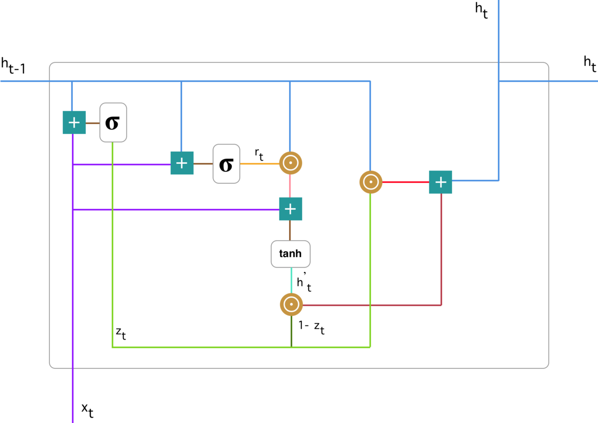

LSTM和GRU相对于RNN来说多出了`gate`，能够有效的避免`Short-term Memory`的问题。

LSTM有三个门：`forget gate`, `input gate` 和 `output gate`, 还有一个 `cell state`

# GRU

简要记录下GRU的基本计算过程，gru算子的理解可以参考最后的References

GRU有两个门：`reset gate` 和 `update gate`

update gate计算

$$u_t=act_g(W_{ux}x_t + W_{uh}h_{t-1})$$

reset gate计算

$$r_t=act_g(W_{rx}x_t + W_{rh}h_{t-1})$$

current memeory content计算

$$h^{'}_{t}=act_c(W_{cx}x_t+W_{ch}(r_t \odot h_{t-1}))$$

output memory content

$$h_t=u_t \odot h_{t-1} + (1-u_t) \odot h^{'}_{t}$$

### References

- [Understanding GRU Networks](https://towardsdatascience.com/understanding-gru-networks-2ef37df6c9be)
- [Illustrated Guide to LSTM's and GRU's: A step by step explanation](https://towardsdatascience.com/illustrated-guide-to-lstms-and-gru-s-a-step-by-step-explanation-44e9eb85bf21)

