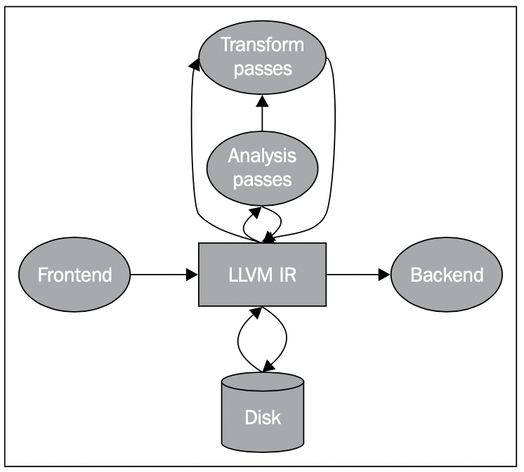

# Getting Started with LLVM Core Libraries

## Clang

clang的基本用法和gcc基本一致，但也有自己独特的地方，例如

查看完整编译链接信息：
```bash
clang hello.c -###
```


```c
// hello.c
#inlcude <stdio.h>

int main(){
  printf("hello, world\n");
  return 0;
}
```

clang也可以看为一系列[libraries](http://clang.llvm.org/doxygen/group__CINDEX.html)，使用libclang能完成词法分析，语法分析，语义分析等基本功能。接下来以[diagnostics](https://github.com/jiweibo/Scripts/blob/master/llvm/clang/diagnostics.cc)示例来看下使用libclang来进行代码诊断，将输出类似编译器语法错误的报错信息。

```bash
./diagnostics hello.c
```

```c
// hello.c
int main() {
  printf("hello, world!\n")
}
```

### 词法分析 Lexical Analysis

基于libclang能实现基础的词法分析，得到所有的token，代码示例见[lexer.cc](https://github.com/jiweibo/Scripts/blob/master/llvm/clang/lexer.cc)，此外也可以直接使用clang的选项，查看词法分析结果。

```bash
clang -cc1 -dump-tokens hello.c
```

预处理Preprocessing也是在该步完成，使用clang -E选项，得到预处理之后的代码。

```c++
// clang -E pp.c -o pp2.c && cat pp2.c

// pp.c
#define EXIT_SUCCESS 0
int main() {
  return EXIT_SUCCESS;
}
```

使用pp-trace工具，能够查看编译器所有的宏定义。


### 语法分析 Syntactic Analysis

词法分析得到token后，clang根据token得到AST，使用clang进行语法分析的指令如下：

`clang -fsyntax-only -Xclang -ast-dump hello.c`

`clang -fsyntax-only -Xclang -ast-view hello.c`

基于libclang能够遍历AST，示例[syntax.cc](https://github.com/jiweibo/Scripts/blob/master/llvm/clang/syntax.cc)能够打印C的函数或C++的方法

### 语义分析 Semantic Analysis

clang在生成AST的时候进行了类型检查，通过编译AST能够找到声明(以下指令在10.0中无效)

`clang -fsyntax-only -Xclang -print-decl-contexts hello.c`

---

以上均基于libclang完成的分析，也可以基于clang内部的c++ class完成以上工作，示例代码见[all.cc](https://github.com/jiweibo/Scripts/blob/master/llvm/clang/all.cc)


## LLVM IR

LLVM IR是连接frontends和backends的重要骨干backbone，使得LLVM能够处理多种语言并且生成多种target的code。frontend产生IR，backend使用IR，利用IR，也可以完成设备无关的优化。




llvm ir有三种表示形式：

1. in-memory 上的表示
2. on-disk的bitcode文件
3. on-disk的assembly文件

这三种表示形式是等价的，

### clang生成llvm ir

sum.c源代码如下：

```c
int sum(int a, int b) {
	return a + b;
}
```

生成bitcode：

```bash
clang sum.c -emit-llvm -c -o sum.bc	
```

生成assembly representation:

```bash
clang sum.c -emit-llvm -S -c -o sum.ll
```

根据assembly 生成 bitcode

```bash
llvm-as sum.ll -o sum.bc
```

根据bitcode生成assembly

```bash
llvm-dis sum.bc -o sum.ll
```

可以使用llvm-extract工具从IR Modules中抽取IR Function, global等

```bash
llvm-extract -func=sum sum.bc -o sum-fn.bc
```


### LLVM IR Syntax

llvm完整语法见[LangRef](https://llvm.org/docs/LangRef.html).

llvm ir语法的三个基本属性：

1. static single assignment(SSA). 每个变量只定义时赋值一次。
2. 三地址指令。
3. 无限寄存器。


llvm自顶向下的层次结构为：

- Module. Module::iterator可访问Module下的Function.
- Function. Function::iterator可访问Function下的BasicBlock.
- BasicBlock.
- Instruction. IR中的基本计算单元


LLVM提供了`User`和`Value`接口，其中`Value`表示能够被其它地方使用的实体，`User`表示使用一个或多个`Value`。`Function`和`Instruction`是`Value`也是`User`的子类，`BasicBlock`是`Value`的子类。

根据`User`和`Value`之间的关系可以引出def-use链和use-def链的概念。use-def链指的是某个User使用的Value列表；def-use链指的是某个Value的User列表。


### LLVM IR生成

llvm提供了IR的构建接口，[demo](https://github.com/jiweibo/Scripts/blob/master/llvm/llvm-ir/generator.cc)提供了一个使用这些接口生成一个最简单的IR，一个sum函数，计算两个输入的和。使用llvm-dis反汇编观察生成的ir。

```llvm
ModuleID = 'sum.bc'
source_filename = "sum"

define i32 @sum(i32 %x, i32 %y) {
EntryBlock:
  %0 = add i32 %x, %y
  ret i32 %0
}
```


### IR优化

llvm ir的主要作用就是进行一系列的设备无关优化。LLVM提供了`opt`工具，专门进行ir优化。

clang和opt都支持一系列的优化选项：

- -O0：不优化，生成与源代码最接近的code.
- -O2：适当的优化.
- -Os：O2加上一系列减少code size的优化.
- -Oz：类似于Os，进一步的减小code size.
- -O3：在O2基础上进一步的优化，通常以花费时间较长，code size较大的代价，换取运行效率的提升.
- -O4：开启链接时优化.
- -O1：介于O0和O2之间.


使用opt优化

```bash
# O3
opt -O3 sum.bc -o sum-O3.bc
# standard compile-time optimizations
opt -std-compile-opts sum.bc -o sum-stdc.bc
# standard link-time optimizations
llvm-link file1.bc file2.bc file3.bc -o=all.bc
opt -std-link-opts all.bc -o all-stdl.bc
# opt指定pass
opt sum.bc -mem2reg -instcount -o sum-tmp.bc -stats
opt sum.bc -time-passes -domtree -instcount -o sum-tmp.bc
# 观察哪些pass起到了优化作用
clang -Xclang -print-stats -emit-llvm -O1 sum.c -c -o sum-O1.bc
```


使用opt可以加载自定义pass来进行优化，提供一个最简单的[demo](https://github.com/jiweibo/Scripts/blob/master/llvm/llvm-ir/FnArgCnt.cc)，输出函数名称及参数个数。

```bash
opt -load=./FnArgCnt.so -fnargcnt sum.bc
# 输出：FnArgCnt --- sum: 2
```

