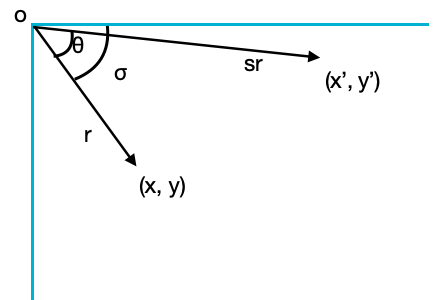

# 几何变换

在阅读yolov3数据集处理图像增强代码时，发现了一段有意思的[实现](https://github.com/ultralytics/yolov3/blob/v9.0/utils/datasets.py#L727)，写下博客记录下几种几何变换推导及利用opencv来可视化效果。

从网络上摘抄下仿射变换和透视变换来强化下印象：

## 仿射变换

仿射变换是二维坐标到二维坐标的线性变换，保持了二维图形的"平直性"（直线经过变换后仍是直线）和"平行性"（二维图形之间的相对位置关系保持不变，平行线依然是平行线，且直线上点的位置顺序不变）。任意的仿射变换都能表示为

$$\begin{bmatrix}x' \\y' \\ 1\end{bmatrix}=\begin{bmatrix}m11& m12& m13 \\ m21 & m22 & m23 \\ 0 & 0 & 1 \end{bmatrix} \begin{bmatrix}x\\y\\1\end{bmatrix}$$


从公示中可以看出有6个未知变量，可用不在同一条直线上的三个点来求出。				


### 平移变换

平移变换可表示为

$$\begin{bmatrix}x' \\y' \\ 1\end{bmatrix}=\begin{bmatrix}1& 0& m1 \\ 0 & 1 & m2 \\ 0 & 0 & 1 \end{bmatrix} \begin{bmatrix}x\\y\\1\end{bmatrix}$$

该示例将图片中心平移到原点

```python
import cv2
import numpy as np
import matplotlib.pyplot as plt

img = cv2.imread('demo.jpg')
h, w = img.shape[0], img.shape[1]

# translate
T = np.eye(3)
T[0, 2] = -img.shape[1] / 2
T[1, 2] = -img.shape[0] / 2

M = T
img2 = cv2.warpAffine(img, M[:2], dsize=(w, h), borderValue=(114, 114, 114))

ax = plt.subplots(1, 2, figsize=(12, 8))[1].ravel()
ax[0].imshow(img[:, :, ::-1])
ax[1].imshow(img2[:, :, ::-1])

plt.show()
```


### 旋转及缩放

opencv获取旋转矩阵的[公示](https://docs.opencv.org/master/da/d54/group__imgproc__transform.html#gafbbc470ce83812914a70abfb604f4326)，简单的进行下推导，一般角度逆时针旋转为正，旋转角为θ，scale=s，示意图如图所示，设初始坐标点为(x, y)，变换后的坐标点为(x', y')，旋转及缩放变换可表示为



$$x = rcos(\sigma)\ \ \ y = rsin(\sigma)$$

$$x'=s*r*cos(\sigma-\theta)=s*r*cos(\sigma)cos(\theta)+s*r*sin(\sigma)sin(\theta)=x*s*cos(\theta)+y*s*sin(\theta)$$

$$y'=s*r*sin(\sigma-\theta)=s*r*sin(\sigma)cos(\theta)-s*r*cos(\sigma)sin(\theta)=y*s*cos(\theta)-x*s*sin(\theta)$$

假设绕指定点旋转(cx, cy)，则可表示为平移+旋转缩放+平移，即

$$\begin{bmatrix}x' \\y' \\ 1\end{bmatrix}=\begin{bmatrix}1& 0& cx \\ 0 & 1 & cy \\ 0 & 0 & 1 \end{bmatrix} \begin{bmatrix}s*cos(\theta)&s*sin(\theta)&0 \\-s*sin(\theta)&s*cos(\theta)&0 \\ 0&0&1 \end{bmatrix} \begin{bmatrix}1& 0& -cx \\ 0 & 1 & -cy \\ 0 & 0 & 1\end{bmatrix}  \begin{bmatrix}x\\y\\1\end{bmatrix} = \begin{bmatrix}s*cos(\theta)&s*sin(\theta)&(1-s*cos(\theta))cx - s*sin(\theta)*cy\\-s*sin(\theta)&s*cos(\theta)&s*sin(\theta)*cx+(1-s*cos(\theta))cy\\0&0&1\end{bmatrix} \begin{bmatrix}x\\y\\1\end{bmatrix}$$

该示例为旋转缩放

```python
import random
import math
import cv2
import numpy as np
import matplotlib.pyplot as plt

img = cv2.imread('demo.jpg')
h, w = img.shape[0], img.shape[1]

# rotation
degrees=10
scale = 0.1
R = np.eye(3)
a = random.uniform(-degrees, degrees)
s = random.uniform(1 - scale, 1 + scale)
R[:2] = cv2.getRotationMatrix2D(angle=a, center=(10, 10), scale=s)

M = R
img2 = cv2.warpAffine(img, M[:2], dsize=(w, h), borderValue=(114, 114, 114))
#img2 = cv2.warpPerspective(img, M, dsize=(w, h), borderValue=(114, 114, 114))

ax = plt.subplots(1, 2, figsize=(12, 8))[1].ravel()
ax[0].imshow(img[:, :, ::-1])
ax[1].imshow(img2[:, :, ::-1])
ax[0].axis('off')
ax[1].axis('off')
plt.show()
```


### 剪切变换

剪切变换可表示为

$$\begin{bmatrix}x' \\y' \\ 1\end{bmatrix}=\begin{bmatrix}1& c& 0 \\ d & 1 & 0 \\ 0 & 0 & 1 \end{bmatrix} \begin{bmatrix}x\\y\\1\end{bmatrix}$$

一个剪切变换的例子

```python
import random
import math
import cv2
import numpy as np
import matplotlib.pyplot as plt

img = cv2.imread('demo.jpg')
h, w = img.shape[0], img.shape[1]

# shear
S = np.eye(3)
shear = 10
S[0, 1] = math.tanh(random.uniform(-shear, shear) * math.pi / 180)
S[1, 0] = math.tanh(random.uniform(-shear, shear) * math.pi / 180)

M = S
img2 = cv2.warpAffine(img, M[:2], dsize=(w, h), borderValue=(114, 114, 114))
#img2 = cv2.warpPerspective(img, M, dsize=(w, h), borderValue=(114, 114, 114))

ax = plt.subplots(1, 2, figsize=(12, 8))[1].ravel()
ax[0].imshow(img[:, :, ::-1])
ax[1].imshow(img2[:, :, ::-1])
ax[0].axis('off')
ax[1].axis('off')
plt.show()
```


## 透视变换

透视变换是将图片投影到一个新的视平面，它是二维（x, y）到三维（X, Y, Z）再到另一个二维(x', y')的映射。相对于仿射变换，它将一个四边形区域映射到另一个四边形区域（不一定是平行四边形）。任意的透视变换都能表示为

$$\begin{bmatrix}X \\Y \\ Z\end{bmatrix}=\begin{bmatrix}m11& m12& m13 \\ m21 & m22 & m23 \\ m31 & m32 & m33 \end{bmatrix} \begin{bmatrix}x\\y\\1\end{bmatrix}$$

$$x'=\frac{X}{Z} \ \ \ \ \   y'=\frac{Y}{Z}$$

透视变换一般用于已知4组点，求解出变换矩阵M，在相机标定及双目视觉中较为常用。

一个简单的例子

```python
import random
import math
import cv2
import numpy as np
import matplotlib.pyplot as plt

img = cv2.imread('demo.jpg')
h, w = img.shape[0], img.shape[1]

# translate
T = np.eye(3)
T[0, 2] = -img.shape[1] / 2
T[1, 2] = -img.shape[0] / 2

# rotation
degrees=10
scale = 0.1
R = np.eye(3)
a = random.uniform(-degrees, degrees)
s = random.uniform(1 - scale, 1 + scale)
R[:2] = cv2.getRotationMatrix2D(angle=a, center=(0, 0), scale=s)

# shear
S = np.eye(3)
shear = 10
S[0, 1] = math.tanh(random.uniform(-shear, shear) * math.pi / 180)
S[1, 0] = math.tanh(random.uniform(-shear, shear) * math.pi / 180)

# perspective
perspective = 0.001
P = np.eye(3)
P[2, 0] = random.uniform(-perspective, perspective)  # x perspective (about y)
P[2, 1] = random.uniform(-perspective, perspective)  # y perspective (about x)

#M = T @ S @ R @ P
M = P
#img2 = cv2.warpAffine(img, M[:2], dsize=(w, h), borderValue=(114, 114, 114))
img2 = cv2.warpPerspective(img, M, dsize=(w, h), borderValue=(114, 114, 114))

ax = plt.subplots(1, 2, figsize=(12, 8))[1].ravel()
ax[0].imshow(img[:, :, ::-1])
ax[1].imshow(img2[:, :, ::-1])
ax[0].axis('off')
ax[1].axis('off')
plt.show()
```


## References

- https://blog.csdn.net/flyyufenfei/article/details/80208361