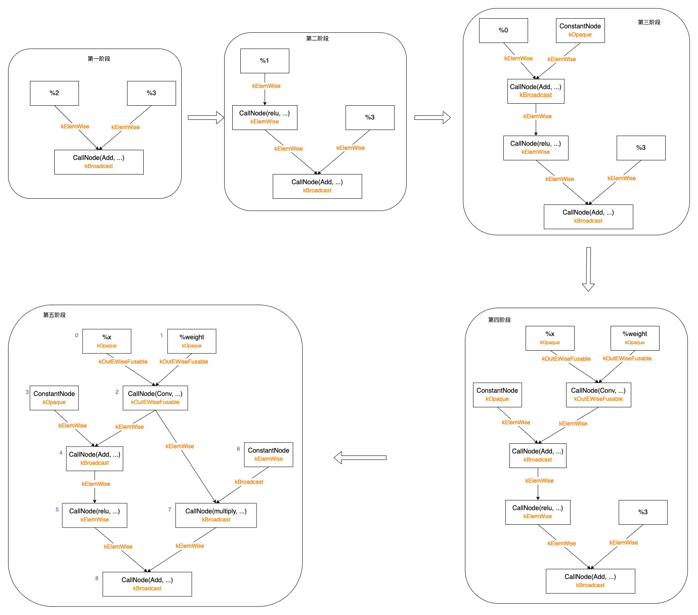
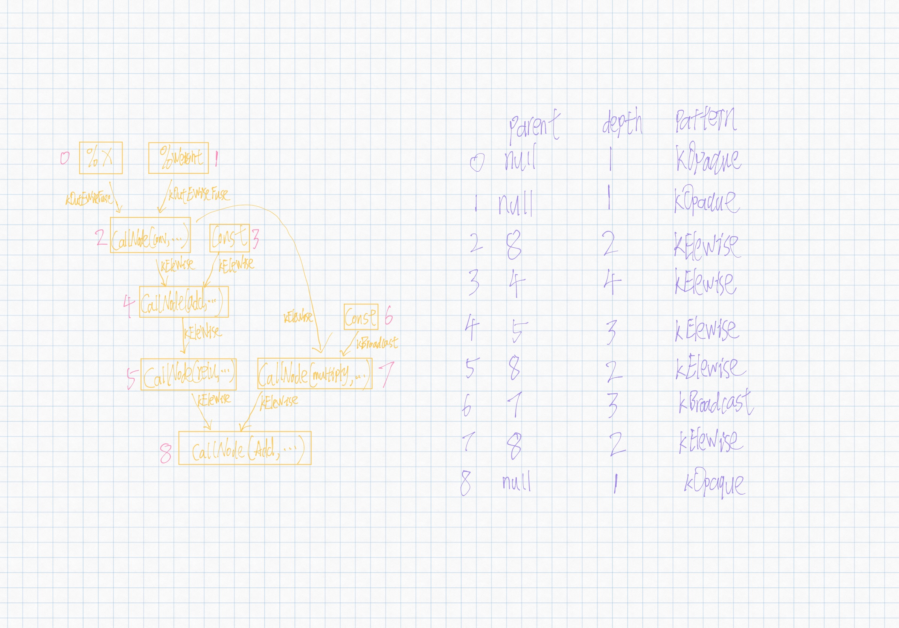
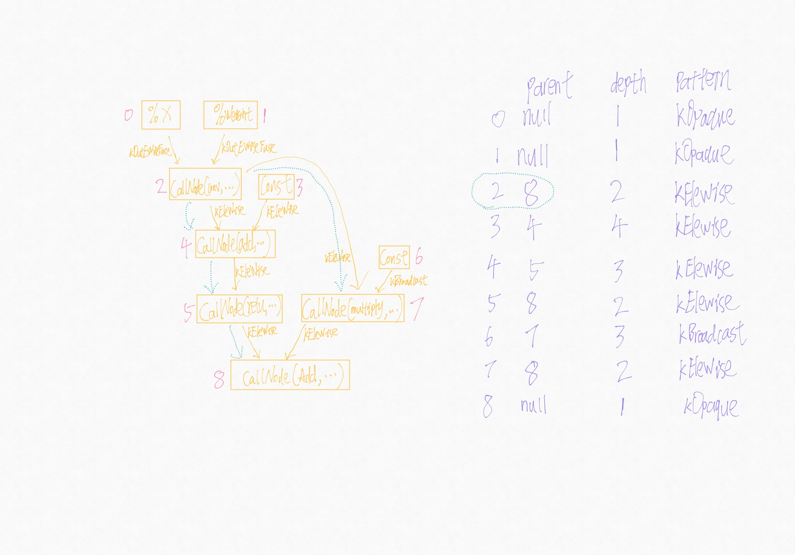

---
layout: post
title:  "FuseOps for tvm"
date:   2022-11-27 12:00:00 +0800
description: tvm
categories: tvm
tags: [tvm]
location: Beijing,China
--- 
# 概述

在深度学习领域，想必大家对算子融合的概念都不陌生，算子融合通常是指将多个算子融合成单个kernel，从而避免了中间结果的访存和kernel launch的开销。本章主要介绍TVM中的算子融合，也称之为自动fusion。本文以 tvm v0.10.0 代码为例进行解读。


# 算子类型

在TVM中对算子进行了分类，代码在`op_attr_types.h`中：

```c++
/*! \brief operator pattern used in graph fusion */
enum OpPatternKind {
  // Elementwise operation
  kElemWise = 0,
  // Broadcasting operator, can always map output axis to the input in order.
  // for example :code:`out[i, ax1, j, ax2] = input[i, j]`.
  // Note that the axis need to be in order so transpose is not a bcast operator.
  kBroadcast = 1,
  // Injective operator, can always injectively map output axis to a single input axis.
  // All injective operator can still be safely fused to injective and reduction.
  kInjective = 2,
  // Communicative reduction operator.
  kCommReduce = 3,
  // Complex operation, can still fuse elemwise operations into its output.
  // but cannot chain another complex op
  kOutEWiseFusable = 4,
  // The pattern for tuple nodes. Can fuse into subsequent injective ops,
  // but treated specially
  kTuple = 7,
  // Opaque operation, cannot fuse anything.
  kOpaque = 8
};
```

目前定义了7种算子类型，

- `kElemWise`，逐元素操作的算子；
- `kBroadcast`，带有广播操作的算子；
- `kInjective`，输入输出之间具有映射关系的算子；
- `kCommReduce`，reduce计算的算子；
- `kOutEWiseFusable`，输出可与`kElemWise`进行fuse的算子，如`conv`；
- `kTuple`，操作元祖的算子，如`TupleNode`，`TupleGetItemNode`等；
- `kOpaque`，无法进行fuse的算子；

TVM 有一套算子融合的算法，能够自动融合满足特定规则的一系列算子，这个规则依赖于算子类型，后文详细介绍。

# 示例程序

我们以示例程序进行分析，跟进到代码中阅读：

```python
import tvm
from tvm import te
import tvm.relay as relay
import numpy as np


def get_relay_ir():
  shape = (1, 3, 14, 14)
  c_data = np.ones(shape).astype('float32')
  c = relay.const(c_data)

  weight = relay.var('weight', shape=(3, 3, 3, 3))
  x = relay.var('x', relay.TensorType((1, 3, 16, 16), 'float32'))
  conv = relay.nn.conv2d(x, weight)
  y = relay.add(conv, c)
  act = relay.nn.relu(y)

  mul = relay.multiply(conv, relay.const(0.5, 'float32'))
  z = act + mul
  return relay.Function([x, weight], z)


f = get_relay_ir()
mod = tvm.IRModule.from_expr(f)
print('src module:')
print(mod)

fold_const = relay.transform.FoldConstant()
mod = fold_const(mod)
print('fold_const:')
print(mod)

mod = relay.transform.FuseOps(fuse_opt_level=4)(mod)
print('fuse_ops:')
print(mod)
```

运行程序，常量折叠后的ir如下：
```
def @main(%x: Tensor[(1, 3, 16, 16), float32] /* ty=Tensor[(1, 3, 16, 16), float32] */, %weight: Tensor[(3, 3, 3, 3), float32] /* ty=Tensor[(3, 3, 3, 3), float32] */) -> Tensor[(1, 3, 14, 14), float32] {
  %0 = nn.conv2d(%x, %weight, padding=[0, 0, 0, 0]) /* ty=Tensor[(1, 3, 14, 14), float32] */;
  %1 = add(%0, meta[relay.Constant][0] /* ty=Tensor[(1, 3, 14, 14), float32] */) /* ty=Tensor[(1, 3, 14, 14), float32] */;
  %2 = nn.relu(%1) /* ty=Tensor[(1, 3, 14, 14), float32] */;
  %3 = multiply(%0, 0.5f /* ty=float32 */) /* ty=Tensor[(1, 3, 14, 14), float32] */;
  add(%2, %3) /* ty=Tensor[(1, 3, 14, 14), float32] */
}
```

算子融合后的ir如下：
```
def @main(%x: Tensor[(1, 3, 16, 16), float32] /* ty=Tensor[(1, 3, 16, 16), float32] */, %weight: Tensor[(3, 3, 3, 3), float32] /* ty=Tensor[(3, 3, 3, 3), float32] */) -> Tensor[(1, 3, 14, 14), float32] {
  %4 = fn (%p0: Tensor[(1, 3, 16, 16), float32] /* ty=Tensor[(1, 3, 16, 16), float32] */, %p1: Tensor[(3, 3, 3, 3), float32] /* ty=Tensor[(3, 3, 3, 3), float32] */, %p2: Tensor[(1, 3, 14, 14), float32] /* ty=Tensor[(1, 3, 14, 14), float32] */, Primitive=1) -> Tensor[(1, 3, 14, 14), float32] {
    %0 = nn.conv2d(%p0, %p1, padding=[0, 0, 0, 0]) /* ty=Tensor[(1, 3, 14, 14), float32] */;
    %1 = add(%0, %p2) /* ty=Tensor[(1, 3, 14, 14), float32] */;
    %2 = nn.relu(%1) /* ty=Tensor[(1, 3, 14, 14), float32] */;
    %3 = multiply(%0, 0.5f /* ty=float32 */) /* ty=Tensor[(1, 3, 14, 14), float32] */;
    add(%2, %3) /* ty=Tensor[(1, 3, 14, 14), float32] */
  } /* ty=fn (Tensor[(1, 3, 16, 16), float32], Tensor[(3, 3, 3, 3), float32], Tensor[(1, 3, 14, 14), float32]) -> Tensor[(1, 3, 14, 14), float32] */;
  %4(%x, %weight, meta[relay.Constant][0] /* ty=Tensor[(1, 3, 14, 14), float32] */) /* ty=Tensor[(1, 3, 14, 14), float32] */
}
```

对比上述两ir可知，算子融合pass后，conv，add，relu和multiply算子被融合成一个算子，在TVM中为`CallNode`。

# 算子融合调用入口

算子融合pass的python入口在[transform.py](https://github.com/apache/tvm/blob/v0.10.0/python/tvm/relay/transform/transform.py#L305)：
```python
def FuseOps(fuse_opt_level=-1):
    """Fuse operators in an expr to a larger operator according to some rules.

    Parameters
    ----------
    fuse_opt_level : int
        The level of fuse optimization. -1 indicates that the level will be
        inferred from pass context.

    Returns
    -------
    ret : tvm.transform.Pass
        The registered pass for operator fusion.
    """
    return _ffi_api.FuseOps(fuse_opt_level)
```

TVM通过 packed_func ffi 机制实现了 python 和 c++ 之间的相互调用，其 c++ 后端代码在[fuse_ops.cc](https://github.com/apache/tvm/blob/v0.10.0/src/relay/transforms/fuse_ops.cc#L1066)。

```c++
Pass FuseOps(int fuse_opt_level) {
  runtime::TypedPackedFunc<Function(Function, IRModule, PassContext)> pass_func =
      [=](Function f, IRModule m, PassContext pc) {
        bool link_params = false;
        Executor executor =
            m->GetAttr<Executor>(tvm::attr::kExecutor).value_or(NullValue<Executor>());
        link_params = executor.defined()
                          ? executor->attrs.GetAttr<Bool>("link-params").value_or(Bool(link_params))
                          : link_params;
        link_params = pc->GetConfig("relay.FuseOps.link_params", Bool(link_params)).value();
        int opt_level = fuse_opt_level == -1 ? pc->opt_level : fuse_opt_level;
        auto max_fuse_depth = pc->GetConfig("relay.FuseOps.max_depth", Integer(kMaxFusedOps));
        return Downcast<Function>(
            FuseOps(f, opt_level, max_fuse_depth.value().IntValue(), link_params, m));
      };
  return CreateFunctionPass(pass_func, 0, "FuseOps", {"InferType"});
}
```
此处目前只关注`opt_level`优化级别选项即可，可通过`PassContext`进行设置，其余参数暂未用到，使用其默认值即可。

# 自动fuse实现思想

代码注释中有提到，其实现思路如下：

- relay树ir 构建DAG，用于方便节点支配分析；
- 构造后支配树，能够快速求取任意节点的后支配点；
- 根据当前节点的后支配点信息，在两节点路径之间运行融合算法；

主体代码如下：
```c++
  Expr Transform(const Expr& body) {
    return Transform(body, fuse_opt_level_, max_fuse_depth_, link_params_);
  }

  // Run the transform
  Expr Transform(const Expr& body, int fuse_opt_level, size_t max_fuse_depth, bool link_params) {
    // setup the group map.
    auto graph = IndexedForwardGraph::Create(&arena_, body);
    auto groups = GraphPartitioner(&arena_, fuse_opt_level, max_fuse_depth).Partition(graph);
    for (size_t nid = 0; nid < graph.post_dfs_order.size(); ++nid) {
      ICHECK(graph.post_dfs_order[nid]->ref != nullptr);
      gmap_[graph.post_dfs_order[nid]->ref] = groups[nid];
    }
    // The following line can be used for debug.
    // this->DebugDumpGroup(body);
    return this->Mutate(body);
  }
```

## 构建DAG

构建DAG主要由以下代码完成：
```c++
auto graph = IndexedForwardGraph::Create(&arena_, body);
```
其中，`arena_`为内存管理模块，可以先不关心，`body`为relay的树ir，此处是一个`FunctionNode`；

`IndexedForwardGraph`类似于一般深度学习框架中Graph, Node结构的IR表示：
```c++
/*!
 * \brief Indexed data flow graph in forward direction.
 *  This is a temporary data structure used for operator fusion analysis.
 *
 *  This data structure only captures the dataflow fragment and
 *  could ignore blocks like let by simply ordering each dataflow block
 *  and mark the output node as extern_ref;
 */
class IndexedForwardGraph {
 public:
  struct Node;
  /*!
   * The forward edge in the dataflow graph.
   */
  struct Edge {
    /*! \brief The corresponding node */
    Node* node{nullptr};
    /*! \brief The respective pattern of this op */
    OpPatternKind pattern{kOpaque};
  };
  /*! \brief A node in the graph. */
  struct Node {
    /*! \brief weak reference to the corresponding edge. */
    const tvm::Object* ref{nullptr};
    /*! \brief The index of the node in topological order. */
    size_t index{0};
    /*! \brief Whether this node is referenced by external source */
    bool extern_ref{false};
    /*! \brief The general pattern in the node */
    OpPatternKind pattern{kOpaque};
    /*! \brief The outputs of the node. */
    LinkedList<Edge> outputs;
  };
  /*! \brief The node map that maps node to graph */
  std::unordered_map<const tvm::Object*, Node*> node_map;
  /*! \brief All the nodes in post DFS order */
  std::vector<Node*> post_dfs_order;
  ...
};
```

该`Node`节点存储了引用对象`ref`，拓扑序`index`，算子类型`pattern`，是否被引用`extern_ref`以及与节点输出的边`outputs`这些信息；`IndexedForwardGraph`还存储了对象和节点的映射关系`node_map`，所有节点的post-dfs遍历顺序`post_dfs_order`。
简单理解就是该类做了一个数据结构的转换，将relay树ir转为Graph node的ir，主要通过`IndexedForwardGraph::Creator`实现；

`Creator`继承自`ExprVisitor`（此处不介绍），主要对`FunctionNode`，`CallNode`，`ConstantNode`，`VarNode`等节点的遍历进行了重写；用户传入的`body`是一个`FunctionNode`，因此首先进入`FunctionNode`的处理逻辑：
```c++
  // Post order tree
  void VisitExpr_(const FunctionNode* op) final {
    // Skip the function that should be handled by external codegen.
    if (op->GetAttr<String>(attr::kCompiler).defined()) return;

    for (auto param : op->params) {
      this->Update(param, nullptr, kOpaque);
    }
    this->Update(op->body, nullptr, kOpaque);
    ExprVisitor::VisitExpr_(op);
  }
```
其逻辑首先对参数和函数体进行了`Update`，之后进入父类的`VisitExpr_`方法中进行递归遍历。`Update`过程即为`Graph`中创建或更新`Node`的操作，如果有`parent`参数，则创建`Edge`，其代码如下：
```c++
  // Update the message stored at the node.
  void Update(const Expr& node, IndexedForwardGraph::Node* parent, OpPatternKind pattern) {
    const tvm::Object* key = node.get();
    IndexedForwardGraph::Node* current;
    auto it = graph_.node_map.find(key);
    if (it != graph_.node_map.end()) {
      current = it->second;
    } else {
      current = arena_->make<IndexedForwardGraph::Node>();
      graph_.node_map[key] = current;
    }
    if (parent != nullptr) {
      auto* link = arena_->make<LinkNode<IndexedForwardGraph::Edge>>();
      link->value.node = parent;
      link->value.pattern = pattern;
      current->outputs.Push(link);
    } else {
      current->extern_ref = true;
    }
  }
```
父类的`VisieExpr_`方法首先访问`FunctionNode`的参数：`%x`和`%weight`，更新节点信息，可知，`%x`的拓扑序是0，`%weight`的拓扑序是1，且更新了`graph`的post-dfs顺序；
```c++
  void VisitExpr_(const VarNode* op) final { this->AddNode(op); }

  void AddNode(const tvm::Object* key) {
    auto it = graph_.node_map.find(key);
    ICHECK(it != graph_.node_map.end()) << "Cannot find node " << GetRef<ObjectRef>(key);
    IndexedForwardGraph::Node* node = it->second;
    ICHECK(node->ref == nullptr);
    node->ref = key;
    node->index = graph_.post_dfs_order.size();
    graph_.post_dfs_order.push_back(node);
  }
```

接下来访问`FunctionNode`的函数体`body`，它是一个`CallNode`节点，如下所示：
```
add(%2, %3)
```
因此会进入到以下代码段：
```c++
void VisitExpr_(const CallNode* call) final {
  ......
  OpPatternKind op_pattern = kOpaque;
  if (const OpNode* opnode = call->op.as<OpNode>()) {
    auto op = GetRef<Op>(opnode);
    if (IsDynamic(call->checked_type()) && IsDataDependent(call)) {
      // output of a shape func can't be fed to a data-dependent shape func
      op_pattern = kOpaque;
    } else {
      op_pattern = static_cast<OpPatternKind>(fpattern[op]);
    }
  } else {
    this->Update(call->op, node, kOpaque);
  }

  node->pattern = op_pattern;
  this->Update(call->op, nullptr, kOpaque);
  const auto* rtype = call->checked_type().as<TensorTypeNode>();
  // pass the analysis back to all the children it references.
  for (size_t i = 0; i < call->args.size(); ++i) {
    const auto* arg_type = call->args[i]->checked_type().as<TensorTypeNode>();
    // specifically check if result type is the same as arguments type
    OpPatternKind edge_pattern = op_pattern;
    if (edge_pattern == kBroadcast && arg_type != nullptr && rtype != nullptr &&
        attr_equal_(rtype->shape, arg_type->shape)) {
      edge_pattern = kElemWise;
    }
    this->Update(call->args[i], node, edge_pattern);
  }
  ExprVisitor::VisitExpr_(call);
  this->AddNode(call);
}
```
访问到`CallNode`后，其是一个`Add Op`节点，从全局注册中找到其算子类型为`kBroadcast`，并通过`Update`将`Add Op`节点添加到`graph`中；接下来处理输入args，此处有一个判断如果输入arg的Shape与返回值Shape一致，则算子类型可由`kBroadcast`转为`kElemWise`，之后更新arg节点，建立arg到`CallNode (Call(Add, ...))`的边，如下图第一阶段处理所示；接下来进入到`ExprVisitor::VisitExpr_`的CallNode节点处理函数中，依次处理参数（%2, %3）、body；
处理参数%2，如下图第二阶段；继续递归处理(post-dfs)，如下图第三阶段；%2分支被更新完，如下图第四阶段；接下来更新%3分支，直到图被更新完成，如下图第五阶段。
注意，以上遍历过程是按照post-dfs顺序遍历的，每次遍历完一个节点的所有输入后，还会进行`AddNode`操作来更新拓扑序，我们在图中标名拓扑序，至此图被更新完成。



## 构建后支配树

构建后支配树的目的主要是为了能快速找出任一节点的直接后支配点，代码如下：
```c++
auto groups = GraphPartitioner(&arena_, fuse_opt_level, max_fuse_depth).Partition(graph);

// Partition部分实现
std::vector<GraphPartitioner::Group*> GraphPartitioner::Partition(
    const IndexedForwardGraph& graph) {
  this->InitGroups(graph);
  if (opt_level_ == 0) return std::move(groups_);
  // get post dominator tree
  auto post_dom_tree = DominatorTree::PostDom(arena_, graph);
  ......
}
```

看代码可知，当`opt_level_=0`时，不做任何的融合；我们在此处主要关注支配树相关的处理：
```c++
// get post dominator tree
auto post_dom_tree = DominatorTree::PostDom(arena_, graph);
```

先看下相关的数据结构：
```c++
/*!
 * \brief Dominator tree that represent domination or
 *  post domination relation of the node.
 */
class DominatorTree {
 public:
  /*!
   * \brief A node in the dominator tree.
   */
  struct Node {
    /*! \brief The node in the tree */
    IndexedForwardGraph::Node* gnode{nullptr};
    /*! \brief parent of the tree */
    Node* parent{nullptr};
    /*! \brief current depth*/
    int depth{0};
    /*! \brief aggregated pattern to parent */
    OpPatternKind pattern{kOpaque};
  };
  // index -> node.
  std::vector<Node*> nodes;
  ......
```

此处定义的支配树包括了index到节点的映射，节点包括以下字段，填充这些数据结构即完成了`Graph`->`DominatorTree`数据结构的转换。

- gnode：相对`Graph`的节点引用；
- parent：父节点；
- depth：深度，方便计算LCA；
- pattern：算子类型；

现在看下计算得到后支配树的过程：
```c++
DominatorTree DominatorTree::PostDom(support::Arena* arena, const IndexedForwardGraph& graph) {
  DominatorTree tree;
  tree.nodes.resize(graph.post_dfs_order.size(), nullptr);
  // reverse topo order
  for (size_t i = graph.post_dfs_order.size(); i != 0; --i) {
    size_t index = i - 1;
    tree.nodes[index] = tree.GetNode(arena, graph.post_dfs_order[index]);
  }
  return tree;
}
```

根据逆向拓扑序依次处理graph中的节点，因此会依次处理上图中的拓扑序8->7->...->1->0的节点，`GetNode`逻辑如下所示：
```c++
  /*!
   * \brief Convert the Node from an IndexedForwardGraph Node into DomaintorTree Node.
   * \param arena The Arena.
   * \param gnode An IndexedForwardGraph Node.
   * \return The DominatorTree Node.
   */
  Node* GetNode(support::Arena* arena, IndexedForwardGraph::Node* gnode) {
    Node* tnode = arena->make<Node>();
    tnode->gnode = gnode;
    if (gnode->extern_ref) {
      tnode->depth = 1;
      tnode->parent = nullptr;
      tnode->pattern = kOpaque;
    } else {
      // find the LCAs of all outputs.
      OpPatternKind pattern = kElemWise;
      Node* parent = LeastCommonAncestor(gnode->outputs, &pattern);
      tnode->depth = parent ? parent->depth + 1 : 1;
      tnode->parent = parent;
      tnode->pattern = pattern;
    }
    return tnode;
  }
};
```

其中拓扑序0,1,8节点的`extern_ref`字段为`true`，其余均为`false`；在处理其余节点时，会进入`LeastCommonAncestor`逻辑。首先说下`CombinePattern`逻辑：返回两个算子类型中更不易被融合的类型。
```c++
  // Combine pattern together.
  static OpPatternKind CombinePattern(OpPatternKind lhs, OpPatternKind rhs) {
    if (lhs > rhs) return lhs;
    return rhs;
  }
```

我们此处以节点2为例，跟踪代码执行路径：
```c++
  /*!
   * \brief Find the least common ancestor of a list of nodes.
   * \param nodes the nodes.
   * \param edge_pattern
   *        The combined edge pattern across all the parents.
   * \return The least common ancestor of all nodes.
   */
  Node* LeastCommonAncestor(const LinkedList<IndexedForwardGraph::Edge>& input_nodes,
                            OpPatternKind* edge_pattern) {
    auto link = input_nodes.head;
    if (link == nullptr) {
      return nullptr;
    }
    auto get_node = [&](const IndexedForwardGraph::Edge& edge) {
      size_t oindex = edge.node->index;
      ICHECK_LT(oindex, nodes.size());
      Node* onode = nodes[oindex];
      ICHECK(onode != nullptr);
      return onode;
    };
    Node* parent = get_node(link->value);
    *edge_pattern = CombinePattern(*edge_pattern, link->value.pattern);
    link = link->next;
    for (; link != nullptr; link = link->next) {
      parent = LeastCommonAncestor(parent, get_node(link->value), edge_pattern);
      *edge_pattern = CombinePattern(*edge_pattern, link->value.pattern);
    }
    return parent;
  }
```
节点2有两条输出边，第一条边指向节点4，第二条边指向节点7，首先处理第一条边，处理完成后，`parent`为节点4，`edge_pattern`为`kEleWise`；接下来处理第二条边，进入以下代码逻辑，根据depth信息找到两节点的最近公共父节点LCA，在此过程中不断更新`edge_pattern`；处理完成后，`parent`为节点8，`edge_pattern`为`kEleWise`。
```c++
  /*!
   * \brief Find the least common ancestor of the two nodes.
   * \param lhs The left node.
   * \param rhs The right node.
   * \param edge_pattern
   *        The combined edge pattern across all the parents.
   * \return The least common ancestor of the two.
   */
  static Node* LeastCommonAncestor(Node* lhs, Node* rhs, OpPatternKind* edge_pattern) {
    while (lhs != rhs) {
      if (lhs == nullptr) return nullptr;
      if (rhs == nullptr) return nullptr;
      if (lhs->depth < rhs->depth) {
        edge_pattern[0] = CombinePattern(edge_pattern[0], rhs->pattern);
        rhs = rhs->parent;
      } else if (rhs->depth < lhs->depth) {
        edge_pattern[0] = CombinePattern(edge_pattern[0], lhs->pattern);
        lhs = lhs->parent;
      } else {
        edge_pattern[0] = CombinePattern(edge_pattern[0], lhs->pattern);
        edge_pattern[0] = CombinePattern(edge_pattern[0], rhs->pattern);
        lhs = lhs->parent;
        rhs = rhs->parent;
      }
    }
    return lhs;
  }
```

最终`DominatorTree`构建如下：



## 融合规则

接下来就是根据融合规则融合算子了，代码如下所示：
```c++
  // run fusion algorithm.
  for (int phase = 0; phase < 3; ++phase) {
    this->RunFuse(graph, post_dom_tree, phase);
  }
```

在了解`RunFuse`之前，首先看下数据结构：
```c++
class GraphPartitioner {
 public:
  explicit GraphPartitioner(support::Arena* arena, int opt_level, size_t max_fuse_depth)
      : arena_(arena), opt_level_(opt_level), max_fuse_depth_(max_fuse_depth) {}
  /*!
   * \brief Group as a union find data structure.
   */
  struct Group {
    /*! \brief The parent in the union find data structure. */
    Group* parent{nullptr};
    /*! \brief The pattern of the group */
    OpPatternKind pattern;
    /*! \brief reference to the root node. */
    const tvm::Object* root_ref{nullptr};
    /*!
     * \brief Reference to the anchor node,
     * this field is not nullptr only if pattern is kOutEWiseFusable.
     */
    const tvm::Object* anchor_ref{nullptr};
    /*!
     * \brief Find the group root, perform path compression
     * \return The root type node.
     */
    Group* FindRoot() {
      // fast path
      if (this->parent == nullptr) return this;
      // slow path with path compression.
      Group* root = this;
      while (root->parent != nullptr) {
        root = root->parent;
      }
      for (Group* p = this; p != root;) {
        Group* parent = p->parent;
        p->parent = root;
        p = parent;
      }
      return root;
    }

    /*!
     * \brief The number of nodes belonging to this group
     */
    uint32_t num_nodes{1};
  };

 private:
  /*! \brief The internal arena for temporary space. */
  support::Arena* arena_;
  /*! \brief optimization level for fuse operation. */
  int opt_level_;
  /*! \brief The maximum number of operations in one fused function */
  size_t max_fuse_depth_;
  /*! \brief The internal groups. */
  std::vector<Group*> groups_;
  /*! \brief internal field used for deduplication */
  std::unordered_set<IndexedForwardGraph::Node*> visited_;
  ......
```
`Group`是一个Union Find数据结构，可以快速的找出两个节点是否属于同一组（分组）；

在`Partion`中首先对`Group`数据结构相关变量做了初始化：每个节点对应一个group，并根据`Graph`信息填充其字段；
```c++
  // Initialize the groups.
  void InitGroups(const IndexedForwardGraph& graph) {
    groups_.resize(graph.post_dfs_order.size());
    for (size_t nid = 0; nid < groups_.size(); ++nid) {
      const auto* graph_node = graph.post_dfs_order[nid];
      auto* group_node = arena_->make<Group>();
      group_node->pattern = graph_node->pattern;
      group_node->root_ref = graph_node->ref;
      // set anchor ref if necessary.
      if (group_node->pattern == kOutEWiseFusable) {
        group_node->anchor_ref = graph_node->ref;
      }
      groups_[nid] = group_node;
    }
  }
```

现在我们开始阅读`RunFuse`相关代码，在上文代码中看到`RunFuse`分成了3个阶段，我们依次来看：
```c++
void RunFuse(const IndexedForwardGraph& graph, const DominatorTree& post_dom_tree, int phase) {
  for (size_t nid = 0; nid < groups_.size(); ++nid) {
    // 取得graph_node, dom_node和group_node；
    // the group of current node has been specified already.
    auto* graph_node = graph.post_dfs_order[nid];
    auto* dom_node = post_dom_tree.nodes[nid];
    Group* group_node = groups_[nid];
    ICHECK(group_node != nullptr);

    // 遇到不可融合算子kOpaque，直接返回
    if (group_node->pattern == kOpaque) continue;

    // 没有支配点信息的算子直接返回
    if (dom_node->parent == nullptr) continue;
    ICHECK(!graph_node->extern_ref);

    // 获取该节点后支配点graph索引
    size_t dom_parent_gindex = dom_node->parent->gnode->index;

    // 此处先省略不看
    // refuse the fusion if too many ops are going to be fused together
    if (CountFusedNodesWithNewChild(graph_node, dom_node->parent->gnode) > max_fuse_depth_)
      continue;
    
    // 第三阶段处理逻辑（见下文）
    ....

    // 当前节点已和其后支配点融合，则跳过
    // Skip if current node is already fused to the parent.
    if (groups_[dom_parent_gindex] != nullptr &&
        group_node->FindRoot() == groups_[dom_parent_gindex]->FindRoot()) {
      continue;
    }

    // 跳过tuple相关操作
    // Do not fuse into tuple for now
    if (groups_[dom_parent_gindex]->pattern == kTuple) continue;

    // 第一阶段处理kOutEltwiseFusable，见下文
    if (group_node->pattern == kOutEWiseFusable) {
      ......
    }
    // 每一阶段都会对 kEltwise 或 kBroadcast 处理，见下文
    else if (group_node->pattern <= kBroadcast) {
      ......
    }
    // 第二阶段处理 kInjective 或 kTuple，见下文
    else if (group_node->pattern == kInjective || group_node->pattern == kTuple) {
      ......
    }
    // kCommReduce相关逻辑
    else {
      // do nothing.
      ICHECK(group_node->pattern == kCommReduce);
    }
  }
}
```

我们先看下`CheckPath`函数，主要用于遍历当前节点和其后支配节点之间的所有节点，并判断其是否满足给定的`fcond`；
```c++
// Internal implelementation of CheckPath
template <typename F>
bool CheckPath_(IndexedForwardGraph::Node* src, IndexedForwardGraph::Node* sink, F fcond) {
  if (visited_.count(src)) return true;
  visited_.insert(src);
  Group* gnode = groups_[src->index];
  ICHECK(gnode != nullptr);
  gnode = gnode->FindRoot();
  if (!fcond(gnode->pattern, src == sink)) return false;
  if (src == sink) return true;
  for (auto link = src->outputs.head; link != nullptr; link = link->next) {
    if (!CheckPath_(link->value.node, sink, fcond)) return false;
  }
  return true;
}

/*!
  * \brief Check all the node and edge pattern
  *  between src and sink satisfies fcond.
  *
  * src is not checked.
  *
  * \param src The source node.
  * \param sink The termination node.
  * \param fcond The condition to be checked.
  * \tparam F the condition function, with signature
  * \note sink must be a post-dominator of src.
  */
template <typename F>
bool CheckPath(IndexedForwardGraph::Node* src, IndexedForwardGraph::Node* sink, F fcond) {
  ICHECK(!src->extern_ref);
  visited_.clear();
  ICHECK(src != sink);
  for (auto link = src->outputs.head; link != nullptr; link = link->next) {
    if (!CheckPath_(link->value.node, sink, fcond)) return false;
  }
  return true;
}
```
如果`CheckPath`返回结果为True，一般会进行`CommitFuse`过程，其逻辑如下，`CommitFuse_`主要用于遍历过程，`MergeFromTo`用于更新`Group`的`parent`，`pattern`，`num_nodes`等字段；
```c++
/*!
  * \brief Merge the child group to the parent.
  * \param child The child group.
  * \param parent The parent group.
  */
void MergeFromTo(Group* child, Group* parent) {
  child = child->FindRoot();
  parent = parent->FindRoot();
  if (child == parent) return;
  // update the number of nodes of the parent group
  parent->num_nodes += child->num_nodes;
  child->parent = parent;
  // update anchor ref and pattern
  if (child->anchor_ref != nullptr) {
    ICHECK(parent->anchor_ref == nullptr);
    parent->anchor_ref = child->anchor_ref;
    parent->pattern = CombinePattern(child->pattern, parent->pattern);
  }
}
// Internal implelementation of CommitFuse
void CommitFuse_(IndexedForwardGraph::Node* src, IndexedForwardGraph::Node* sink, Group* target) {
  if (src == sink) return;
  if (visited_.count(src)) return;
  visited_.insert(src);
  Group* gnode = groups_[src->index];
  ICHECK(gnode != nullptr);
  // merge the current group to the parent if possible.
  MergeFromTo(gnode, target);
  for (auto link = src->outputs.head; link != nullptr; link = link->next) {
    CommitFuse_(link->value.node, sink, target);
  }
}
/*!
  * \brief Commit fusion operation.
  * \param src The source node.
  * \param sink The termination node.
  * \note sink must be a post-dominator of src.
  */
void CommitFuse(IndexedForwardGraph::Node* src, IndexedForwardGraph::Node* sink) {
  Group* target = groups_[sink->index];
  visited_.clear();
  ICHECK(src != sink);
  CommitFuse_(src, sink, target);
}
```

每一阶段都会处理`kElemWise`和`kBroadcast`：当前节点与其后支配点中的任意节点都满足`patten<=kInjective`且后支配点满足`patten<=kOutEWiseFusable`则可以融合；
```c++
else if (group_node->pattern <= kBroadcast) {
  // Pre-condition: can only be fused to parent which is injective or reduction.
  if (dom_node->parent != nullptr &&
      (dom_node->pattern <= kInjective || dom_node->pattern == kCommReduce)) {
    // Check if all the intermediate ops are still broadcast.
    // The final terminal node can already be fused to a OutEWiseFusable group.
    auto fcond = [](OpPatternKind kind, bool is_sink) {
      if (!is_sink) {
        // Elemwise, broadcast, and injective ops on the parallel branches
        // are allowed be fused to the elemwise/broadcast anchor.
        return kind <= kInjective;
      } else {
        return (kind <= kBroadcast || kind == kCommReduce || kind == kInjective ||
                kind == kOutEWiseFusable);
      }
    };
    if (CheckPath(graph_node, dom_node->parent->gnode, fcond)) {
      CommitFuse(graph_node, dom_node->parent->gnode);
    }
  }
}
```

第一阶段处理了`kOutEWiseFusable`：
```c++
if (group_node->pattern == kOutEWiseFusable) {
  if (phase != 0) continue;
  // Path for OutEWiseFusable: conv2d
  // Check if the dominator relation is elemwise.
  if (dom_node->parent != nullptr && dom_node->pattern == kElemWise) {
    ICHECK(dom_node->parent->gnode != nullptr);
    // The fuse can be executed if all the intermediate ops are still broadcast.
    auto fcond = [](OpPatternKind kind, bool is_sink) { return kind <= kBroadcast; };
    if (CheckPath(graph_node, dom_node->parent->gnode, fcond)) {
      CommitFuse(graph_node, dom_node->parent->gnode);
    }
  }
}
```
当前节点为`kOutEWiseFusable`，后支配点为`kElemWise`，且两节点的路径中所有算子均满足`patten<=kBroadcast`则可以融合；

第二阶段处理了`kInjective`和`kTuple`：
```c++
else if (group_node->pattern == kInjective || group_node->pattern == kTuple) {
  // defer injective fusion to second phase.
  // so conv2d always finishes fusing.
  if (phase != 1) continue;
  // Check if all path are injective.
  auto fcond = [](OpPatternKind kind, bool is_sink) { return kind <= kInjective; };
  if (CheckPath(graph_node, dom_node->parent->gnode, fcond)) {
    CommitFuse(graph_node, dom_node->parent->gnode);
  }
}
```
当前节点为`kInjective`或`kTuple`且所有到后支配点路径的所有节点均满足`patten <= kInjective`，则可以融合；

第三阶段尝试将`patten<=kInjective`的算子融入`kTuple`中：
```c++
if (phase == 2) {
  // Fuse injective ops into intermediate tuples, if any
  if (group_node->pattern > kInjective) continue;
  Group* dom_parent_group = groups_[dom_parent_gindex];
  Group* dom_root_group = dom_parent_group->FindRoot();
  // If dom node group has a tuple as its root, we do not fuse tuple fields into it
  if (dom_root_group->pattern == kTuple) continue;
  if (dom_parent_group->pattern == kTuple && dom_root_group->pattern <= kInjective) {
    // Now we know the tuple has been fused into subsequent injective ops
    auto fcond = [](OpPatternKind kind, bool is_sink) { return kind <= kInjective; };
    // dom_root_group can also be tuple, as in inception layers
    // CheckPath is needed to avoid fusing two intermediate tuples
    if (CheckPath(graph_node, dom_node->parent->gnode, fcond)) {
      CommitFuse(graph_node, dom_node->parent->gnode);
    }
  }
  continue;
}
```
当前节点满足`pattern<=kInjective`，后支配点满足`pattern=kTuple`，且后支配点所属组的父节点满足`pattern<=kInjective`，则可以融合（目前还没有举例，后面发现case后补充）。

其实经过第一阶段的处理，我们的示例已经被完全融合了：
1. 0号节点和1号节点没有parent信息，跳过；
2. 处理2号节点时，其后支配点是8，依次遍历了4、5、8、7号节点（如下图绿色虚线部分），均满足`fcond`条件，进行了融合，此时2，4，5，7节点的`parent`均为8；8号节点的`num_nodes`为5；
3. 当遍历到3号节点（kOpaque）时，其后支配点是4，不满足`fcond`条件，不融合；
4. 当遍历到6号节点时，其后支配点是7，满足`fcond`条件，进行融合，6的`parent`被设为7节点的`parant`即8，8号节点的`num_nodes`此时为6；
5. 当遍历其余节点时，均已被fuse，直接返回；



到目前为止，所有的融合信息均已存在`Group`节点中，接下来只需根据这些信息更新IR表示即可。

# 更新 IR

更新IR过程是通过Pass完成的，遍历过程中根据上文得到的`Group`信息进行适当的调整即可。我们观察算子融合更新后的IR：插入了一个`FunctionNode`和一个对应的`CallNode`来表示融合关系，接下来我们跟进到代码中看下这是如何实现的。
```
def @main(%x: Tensor[(1, 3, 16, 16), float32] /* ty=Tensor[(1, 3, 16, 16), float32] */, %weight: Tensor[(3, 3, 3, 3), float32] /* ty=Tensor[(3, 3, 3, 3), float32] */) -> Tensor[(1, 3, 14, 14), float32] {
  %4 = fn (%p0: Tensor[(1, 3, 16, 16), float32] /* ty=Tensor[(1, 3, 16, 16), float32] */, %p1: Tensor[(3, 3, 3, 3), float32] /* ty=Tensor[(3, 3, 3, 3), float32] */, %p2: Tensor[(1, 3, 14, 14), float32] /* ty=Tensor[(1, 3, 14, 14), float32] */, Primitive=1) -> Tensor[(1, 3, 14, 14), float32] {
    %0 = nn.conv2d(%p0, %p1, padding=[0, 0, 0, 0]) /* ty=Tensor[(1, 3, 14, 14), float32] */;
    %1 = add(%0, %p2) /* ty=Tensor[(1, 3, 14, 14), float32] */;
    %2 = nn.relu(%1) /* ty=Tensor[(1, 3, 14, 14), float32] */;
    %3 = multiply(%0, 0.5f /* ty=float32 */) /* ty=Tensor[(1, 3, 14, 14), float32] */;
    add(%2, %3) /* ty=Tensor[(1, 3, 14, 14), float32] */
  } /* ty=fn (Tensor[(1, 3, 16, 16), float32], Tensor[(3, 3, 3, 3), float32], Tensor[(1, 3, 14, 14), float32]) -> Tensor[(1, 3, 14, 14), float32] */;
  %4(%x, %weight, meta[relay.Constant][0] /* ty=Tensor[(1, 3, 14, 14), float32] */) /* ty=Tensor[(1, 3, 14, 14), float32] */
}
```

`FuseMutator`继承自`MixedModelMutator`，并对 `FunctionNode`, `CallNode`等的遍历方式进行了重写；`MixedModelMuator`的遍历针对`dataflow node`（如`CallNode`,`TupleNode`等）是一个post-topolgy的遍历；
```c++
class FuseMutator : private MixedModeMutator {
 private:
  int fuse_opt_level_;
  size_t max_fuse_depth_;
  bool link_params_;
  /*! \brief The group assignment map. */
  std::unordered_map<const Object*, GraphPartitioner::Group*> gmap_;
  /* \brief Internal group information map. */
  std::unordered_map<GraphPartitioner::Group*, GroupInfo> ginfo_;
  ......
};
```

首先看下`FunctionNode`的处理方式：对于`primitive function`跳过处理，否则进入父类的处理逻辑中，即依次处理args和body；
```c++
// Skip primitive function.
Expr VisitExpr_(const FunctionNode* fn_node) {
  if (fn_node->HasNonzeroAttr(attr::kPrimitive)) {
    return GetRef<Expr>(fn_node);
  } else {
    return ExprMutator::VisitExpr_(fn_node);
  }
}
```

对于args的处理，依次处理`%x`和`%weight`，处理结果存储到其成员变量`std::unordered_map<Expr, Expr> memo_`成员变量中；
接下来处理`body`，按照post-topolgy的顺序依次遍历 `CallNode(conv, ...)` -> `ConstantNode` -> `CallNode(add, ...)` -> `CallNode(relu, ...)` -> `ConstantNode` -> `CallNode(multiply, ...)` -> `CallNode(add, ...)`;

对`ConstantNode`的处理直接继承自父类`ExprMutator::VisitExpr_(const ConstantNode* op)`，在`memo_`中存储一份引用；

对`CallNode`的处理是核心如下：
1. 找到当前Call节点所属Group；
2. 构造输入参数：当输入参数所属Group不同于当前Group，则创建形参和实参；
3. 构造对应的`CallNode`节点；
4. 如果当前节点不是Group的`root->ref`节点，则直接返回，否则根据GroupInfo中存储的形参和实参构造一个新的`FunctionNode`和`CallNode`。

部分代码如下：
```c++
// 存储每一个Group对应的实参和形参
/*! \brief Temporary information from each group. */
struct GroupInfo {
  public:
  // The parameters of the function.
  Array<Var> params;
  // The arguments to call the functions.
  Array<Expr> arguments;
  // Get a new parameter or allocate an old one
  Var GetOrAllocParam(const Expr& expr, const Type& type) {
    // run linear scan as most fused groups contain only a few inputs.
    for (size_t i = 0; i < arguments.size(); ++i) {
      if (expr.same_as(arguments[i])) return params[i];
    }
    // create a new parameter.
    std::ostringstream os;
    os << "p" << params.size();
    auto var = Var(os.str(), type);
    params.push_back(var);
    arguments.push_back(expr);
    return var;
  }
};

Array<Expr> GetNewArguments(const tvm::Array<Expr>& args,
                            GraphPartitioner::Group* current_group) {
  Array<Expr> new_args;
  for (auto arg : args) {
    auto* arg_group = gmap_.at(arg.get())->FindRoot();
    auto type = arg->checked_type();
    Expr new_arg = this->Mutate(arg);
    if (current_group != arg_group) {
      if (!link_params_ || new_arg.as<ConstantNode>() == nullptr) {
        Var param = ginfo_[current_group].GetOrAllocParam(new_arg, type);
        new_args.push_back(param);
      } else {
        new_args.push_back(new_arg);
      }
    } else {
      new_args.push_back(new_arg);
    }
  }
  return new_args;
}

Expr MakeNewFunction(GraphPartitioner::Group* group, Type ret_type, Expr body) {
  ......
  const GroupInfo& ginfo = ginfo_[group];
  auto func = Function(ginfo.params, body, ret_type, {});
  func = WithAttr(std::move(func), attr::kPrimitive, tvm::Integer(visitor.has_call));
  ......
  return Call(func, ginfo.arguments, Attrs());
}

// Transform calls.
Expr Rewrite_(const CallNode* call, const Expr& post) {
  if (call->op.as<OpNode>()) {
    ......
    // 找到其所属group
    auto* ret_group = gmap_.at(call)->FindRoot();
    // 构造输入args列表
    Array<Expr> new_args = GetNewArguments(call->args, ret_group);
    // 构造CallNode节点
    auto new_call = Call(call->op, new_args, call->attrs, call->type_args, call->span);

    if (ret_group->root_ref == call) {
      // This is the root of the group
      // create the new call node.
      // 构造FunctionNode节点和对应的CallNode节点
      return MakeNewFunction(ret_group, call->checked_type(), new_call);
    } else {
      // This is an intermediate node of a fused function
      // simply return the new call.
      return std::move(new_call);
    }
  } else {
    return ExprMutator::VisitExpr_(call);
  }
}
```

# 总结

以上则是本人阅读TVM自动Fusion相关代码记录的主要内容，如有错误，请批评指正。

# References

本文主要参考了以下资料，在此表示感谢！

1. https://arxiv.org/pdf/1802.04799.pdf
2. [【从零开始学深度学习编译器】八，TVM的算符融合以及如何使用TVM Pass Infra自定义Pass](https://mp.weixin.qq.com/s?__biz=MzA4MjY4NTk0NQ==&mid=2247495225&idx=1&sn=5819431f3b1bca6687cb171bd4243bb6&scene=21#wechat_redirect)
3. https://zhuanlan.zhihu.com/p/153098112
4. https://en.wikipedia.org/wiki/Dominator_(graph_theory)


转载请标明出处，感谢！