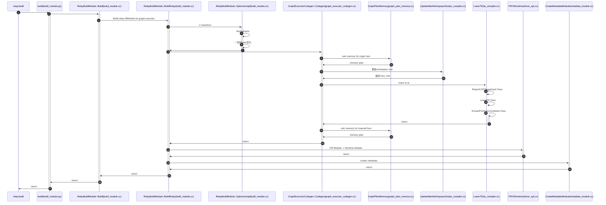
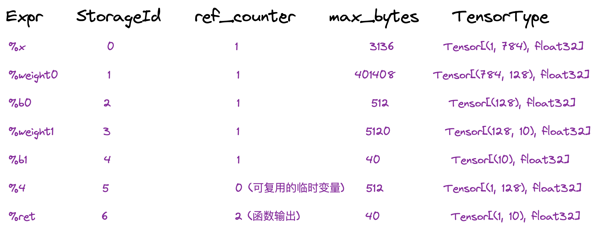
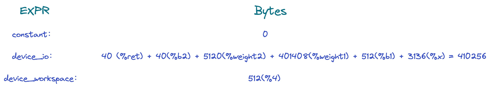

# TVM Relay 模型编译

TVM 官方文档中对[编译流程](https://tvm.apache.org/docs/arch/index.html)进行了简要的介绍，通过阅读文档，可以了解 TVM 编译的大概思路，但想深入理解其设计思想和实现细节的话，我们必须阅读源码。本文以 TVM v0.10.0 源码为基础，解读 relay 模型编译的流程和细节。

## 示例

我们以下面这个简单的例子为切入点，对模型的编译流程和细节进行阐述。

```python
def get_relay_ir():
    x = relay.var('x', relay.TensorType((1, 784), 'float32'))
    weight1 = relay.var('weight1', relay.TensorType((784, 128), "float32"))
    b1 = relay.var('b1', relay.TensorType((128,), "float32"))
    dense1 = relay.nn.matmul(x, weight1)
    z1 = relay.add(dense1, b1)
    act = relay.nn.relu(z1)
    
    weight2 = relay.var('weight2', relay.TensorType((128, 10), "float32"))
    b2 = relay.var('b2', relay.TensorType((10,), "float32"))
    dense2 = relay.nn.matmul(act, weight2)
    z2 = relay.add(dense2, b2)
    
    return relay.Function([x, weight1, b1, weight2, b2], z2)

f = get_relay_ir()
mod = tvm.IRModule.from_expr(f)
print('src module:')
print(mod)
# compile
target = tvm.target.cuda(arch="sm_75")
with tvm.transform.PassContext(opt_level=4):
    lib = relay.build(mod, target)
```

## 模型编译流程

首先画下模型编译的整体流程（代码细节），方便跟进代码过程中查阅和跳转，此处只画出了模型编译过程中涉及的关键类或方法，省略了较多的细节。




## 代码阅读

### relay.build 入口

relay.build 具体实现在`build_module.py`中的`build`函数，我们先浏览下该函数的代码实现：

首先是对输入参数`IRModule`和`Target`的检查；
```python
if not isinstance(ir_mod, (IRModule, _function.Function)):
    raise ValueError("Type of input parameter mod must be tvm.IRModule")

if isinstance(ir_mod, _function.Function):
    if params:
        ir_mod = bind_params_by_name(ir_mod, params)
    ir_mod = IRModule.from_expr(ir_mod)
    warnings.warn(
        "Please use input parameter mod (tvm.IRModule) "
        "instead of deprecated parameter mod (tvm.relay.function.Function)",
        DeprecationWarning,
    )

raw_targets = Target.canon_multi_target_and_host(Target.target_or_current(target), target_host)
assert len(raw_targets) > 0
target_host = raw_targets[0].host
```
接下来加载或初始化`tophub_context`，`tophub_context`是调优中的概念，此处先跳过；
```python
# If current dispatch context is fallback context (the default root context),
# then load pre-tuned parameters from TopHub
if isinstance(autotvm.DispatchContext.current, autotvm.FallbackContext):
    tophub_context = autotvm.tophub.context(list(raw_targets))
else:
    tophub_context = autotvm.utils.EmptyContext()
```

接下来就是`BuildModule`模块，是此函数的核心，主要目的是将高层 Relay IRModule 编译成底层 Tensor IRModule，再编译成 Runtime Module：
```python
with tophub_context:
    bld_mod = BuildModule()
    graph_json, runtime_mod, params = bld_mod.build(
        mod=ir_mod,
        target=raw_targets,
        params=params,
        executor=executor,
        runtime=runtime,
        workspace_memory_pools=workspace_memory_pools,
        constant_memory_pools=constant_memory_pools,
        mod_name=mod_name,
    )
    func_metadata = bld_mod.get_function_metadata()
    devices = bld_mod.get_devices()
    lowered_ir_mods = bld_mod.get_irmodule()
    executor_codegen_metadata = bld_mod.get_executor_codegen_metadata()
```

`relay.build`的最后一步是得到一个`executor_factory`，可以保存、加载编译好的模型、ir和权重等，部署时省去编译的过程：

```python
if executor.name == "aot":
    executor_factory = _executor_factory.AOTExecutorFactoryModule(
        ir_mod,
        lowered_ir_mods,
        raw_targets,
        executor,
        runtime,
        runtime_mod,
        mod_name,
        params,
        func_metadata,
        executor_codegen_metadata,
        devices,
    )
elif executor.name == "graph":
    executor_factory = _executor_factory.GraphExecutorFactoryModule(
        ir_mod,
        raw_targets,
        executor,
        graph_json,
        runtime_mod,
        mod_name,
        params,
        func_metadata,
    )
else:
    assert False, "Executor " + executor + " not supported"

return executor_factory
```

以上就是`relay.build`的代码流程，下面深入到代码中进行分析。

### RelayBuildModule

上述 `relay.build` 中用到了 `BuildModule` 类，其定义如下所示，所有方法实现均来自`self.mod=_build_module._BuildModule()`；
```python
class BuildModule(object):
    """Build an IR module to run on TVM graph executor. This class is used
    to expose the `RelayBuildModule` APIs implemented in C++.
    """

    def __init__(self):
        self.mod = _build_module._BuildModule()
        self._get_graph_json = self.mod["get_graph_json"]
        self._get_module = self.mod["get_module"]
        self._build = self.mod["build"]
        self._optimize = self.mod["optimize"]
        self._set_params_func = self.mod["set_params"]
        self._get_params_func = self.mod["get_params"]
        self._get_function_metadata = self.mod["get_function_metadata"]
        self._get_executor_codegen_metadata = self.mod["get_executor_codegen_metadata"]
        self._get_devices = self.mod["get_devices"]
        self._get_irmodule = self.mod["get_irmodule"]

    def build(...):
        # ...
        self._build(...)
        # ...
    
    def optimize(...):
        # ...
        self._optimize(...)
        # ...
```

`_build_module._BuildModule` 是 tvm 通过 packedfunc ffi 将 `build_module.cc` 中的 `RelayBuildModule` C++ 实现导出到 python；
```c++
runtime::Module RelayBuildCreate() {
  auto exec = make_object<RelayBuildModule>();
  return runtime::Module(exec);
}

TVM_REGISTER_GLOBAL("relay.build_module._BuildModule").set_body([](TVMArgs args, TVMRetValue* rv) {
  *rv = RelayBuildCreate();
});
```

我们看下 `RelayBuildModule` 的主入口 `Build` 函数：该函数主要对成员变量进行赋值，并调用 `BuildRelay` 成员函数；

```c++
/*!
 * \brief Build relay IRModule for graph executor
 *
 * \param mod Relay IRModule
 * \param raw_targets List of available targets for kernels.
 * \param executor Executor to target
 * \param runtime Runtime to codegen for
 * \param mod_name Name of the module
 */
void Build(IRModule mod, const Array<Target>& raw_targets, const tvm::Target& target_host,
           const Executor& executor, const Runtime& runtime,
           const WorkspaceMemoryPools& workspace_memory_pools,
           const ConstantMemoryPools& constant_memory_pools, const String mod_name) {
  VLOG_CONTEXT << "Build";
  executor_ = executor;
  runtime_ = runtime;
  workspace_memory_pools_ = workspace_memory_pools;
  constant_memory_pools_ = constant_memory_pools;
  config_ = CompilationConfig(PassContext::Current(), raw_targets);
  VLOG(1) << "Using compilation config:" << std::endl << config_;
  BuildRelay(std::move(mod), mod_name);
}
```

`BuildRelay` 成员函数是编译的主要实现代码，它调用了多个模块的复杂函数（后文中依次介绍）；

```c++
/*!
 * \brief Compile a Relay IR module to runtime module.
 *
 * \param relay_module The Relay IR module.
 * \param params The parameters.
 */
void BuildRelay(IRModule relay_module, const String& mod_name) {
  // Relay IRModule -> IRModule optimizations.
  IRModule module = WithAttrs(
      relay_module, {{tvm::attr::kExecutor, executor_}, {tvm::attr::kRuntime, runtime_}});
  relay_module = OptimizeImpl(std::move(module));

  // Get the updated function and new IRModule to build.
  // Instead of recreating the IRModule, we should look at the differences between this and the
  // incoming IRModule to see if we can just pass (IRModule, Function) to the code generator.
  Function func = Downcast<Function>(relay_module->Lookup("main"));
  IRModule func_module = WithAttrs(IRModule::FromExpr(func),
                                    {{tvm::attr::kExecutor, executor_},
                                    {tvm::attr::kRuntime, runtime_},
                                    {tvm::attr::kWorkspaceMemoryPools, workspace_memory_pools_},
                                    {tvm::attr::kConstantMemoryPools, constant_memory_pools_}});

  // Generate code for the updated function.
  executor_codegen_ = MakeExecutorCodegen(executor_->name);
  executor_codegen_->Init(nullptr, config_->primitive_targets);
  executor_codegen_->Codegen(func_module, func, mod_name);
  ......
  ret_.mod = tvm::TIRToRuntime(lowered_funcs, host_target);
  ......
  auto ext_mods = executor_codegen_->GetExternalModules();
  ret_.mod = tvm::codegen::CreateMetadataModule(ret_.params, ret_.mod, ext_mods, host_target,
                                                runtime_, executor_,
                                                executor_codegen_->GetExecutorCodegenMetadata());
  ......
}
```

`BuildRelay` 函数的第一步工作就是 `OptimizeImpl`，即对 Relay IR 进行优化：

```c++
IRModule OptimizeImpl(IRModule relay_module) {
  ICHECK(relay_module.defined()) << "The IRModule must be defined for the Relay compiler.";

  backend::BindParamsInModule(relay_module, params_);

  Array<Pass> pass_seqs =
      GetPassPrefix(/*is_homogenous=*/config_->primitive_targets.size() == 1, /*is_vm=*/false);
  transform::PassContext pass_ctx = PassContext::Current();

  ......

  // Always plan devices so the remaining passes don't need to distinguish homogeneous vs
  // hetrogenous execution.
  pass_seqs.push_back(transform::PlanDevices(config_));
  // Fuse the operations if it is needed.
  pass_seqs.push_back(transform::FuseOps());

  // Create a sequential pass and perform optimizations.
  transform::Pass seq = transform::Sequential(pass_seqs);
  relay_module = seq(relay_module);

  ......

  relay_module = transform::InferType()(relay_module);
  relay_module = transform::Inline()(relay_module);
  relay_module = transform::InferType()(relay_module);
  relay_module = transform::LabelOps()(relay_module);
  relay_module = transform::AnnotateMemoryScope(config_)(relay_module);
  ICHECK(relay_module.defined());

  return relay_module;
}
```

`OptimizaImpl` 主要做了两件事：

1. 绑定参数；（暂未关注）
2. Pass 优化；

经过的一系列的 Pass 优化在下表所示（慢慢补全）：

|PassName|功能|
|-|-|
|RemoveUnusedFunctions||
|ToBasicBlockNormalForm||
|transform::Legalize||
|SimplifyInference|将`layer_norm`, `group_norm`, `batch_norm`, `l2_norm`, `instance_norm`拆分成基本算子实现, 将`dropout`直接隐去|
|transform::EtaExpand|||
|EliminateCommonSubexpr|||
|CombineParallelConv2D|||
|CombineParallelDense|||
|CombineParallelBatchMatmul|||
|FoldConstant|常量折叠|
|FoldScaleAxis|||
|SimplifyExpr|||
|CanonicalizeCast|||
|CanonicalizeOps|||
|FlattenAtrousConv|||
|InferType|||
|AlterOpLayout|||
|FastMath|||
|SplitArgs|||
|PlanDevices|||
|FuseOps|算子自动融合|
|Inline|||
|LabelOps||
|AnnotateMemoryScope||

Relay IR 优化完成后，需要 Lower 到底层 Tensor IR，此部分逻辑在 `executor_codegen_->Codegen` 代码中完成；Lower 到 TensorIR 后，进一步编译成 RuntimeModule，在 `tvm::TIRToRuntime` 代码中完成；最后在补充 Module 的 Metadata 信息，在 `tvm::codegen::CreateMetadataModule` 代码中完成，这些部分会在后文中介绍。

### GraphExecutorCodegen

在上文中我们忽略了代码生成部分的代码 `executor_codegen_ = MakeExecutorCodegen(executor_->name);`，在这里进行介绍。

TVM 提供了两种代码生成的方式，此处我们仅介绍 `GraphCodegen`：

1. AOTCodegen: `relay.build_module._AOTExecutorCodegen`
2. GraphCodegen: `relay.build_module._GraphExecutorCodegen`

我们主要关注的 `GraphExecutorCodegen::Codegen` 函数，把高层 RelayIR 编译到底层 TensorIR （可翻译到llvm或C代码）即完成代码生成的过程：

```c++
LoweredOutput Codegen(IRModule mod, relay::Function func, String mod_name) {
  mod_name_ = mod_name;
  VLOG_CONTEXT << "GraphExecutorCodegen";
  VLOG(1) << "compiling:" << std::endl << PrettyPrint(func);

  // TODO(mbs): Why plan memory and update workspace sizes before lowering?
  memory_plan_ = GraphPlanMemory(func);

  ......

  IRModule lowered_mod = tec::LowerTE(mod_name_, config_, [this](BaseFunc func) {
    // We need to maintain the constant map for external
    // functions so we pass this processing function which
    // allows us to process each function as we lower it.
    if (func->GetAttr<String>(attr::kCompiler).defined()) {
      UpdateConstants(func, &params_);
    }

    // TODO(@areusch, @jroesch): We should refactor this to
    // execute as a further pass, instead writing data to the
    // lowering process directly.
    tec::UpdateFunctionMetadata(func, this->function_metadata_);
  })(mod);

  ......

  Function lowered_main_func = Downcast<Function>(lowered_mod->Lookup("main"));

  // Now that we have lowered all operators to TIR code, we can proceed with compilation.
  //
  // We need to unfortunately re-plan as the previous results have been invalidated by lowering
  // we will fix this in future refactors.
  memory_plan_ = GraphPlanMemory(lowered_main_func);

  ......

  // This is the point where we separate the functions in the module by target
  ret.lowered_funcs = tec::GetPerTargetModules(lowered_mod);
  ret.metadata =
      ExecutorCodegenMetadata({} /* inputs */, {} /* input_tensor_types */, {} /* outputs */,
                              {} /* output_tensor_types */, {} /* pools */, {} /* devices */,
                              runtime::kTvmExecutorGraph /* executor */, mod_name_ /* mod_name */,
                              "packed" /* interface_api */, Bool(false) /* unpacked_api */);
  return ret;
}
```

`Codegen` 函数中核心内容在 `tec::LowerTE` 函数内完成，此外还做了内存分配 `GraphPlanMemory`。

### GraphPlanMemory

我们先看下 `GraphPlanMemory` 的返回值类型：

```c++
/*!
 * \brief The result of static memory planning.
 */
class StaticMemoryPlanNode : public Object {
 public:
  Map<Expr, StorageInfo> expr_to_storage_info;
  ......
};

/*!
 * \brief The static storage information for each Tensor in the result of a Relay expression
 * (as per relay::FlattenTupleType).
 */
class StorageInfoNode : public Object {
 public:
  // TODO(mbs): Switch from struct-of-array to array-of-struct repr throughout.
  /*! \brief The set of storage ids where the expression is stored. */
  std::vector<int64_t> storage_ids;
  /* \brief The virtual devices these expressions are stored within. */
  std::vector<VirtualDevice> virtual_devices;
  /* \brief The sizes of each storage element, in bytes. */
  std::vector<int64_t> storage_sizes_in_bytes;
  ......
};
```

从返回值类型中可以看出，该函数的目的是为了填充 `Map<Expr, StorageInfo>`，`StorageInfo` 中包含了 `storage_ids`，`virtual_devices` 以及 `storage_sizes_in_bytes`，相当于根据IR表示计算出每个变量的存储设备以及存储大小。我们以上文中提到的示例为例，在 T4 GPU 上运行（示例中所有的存储设备均为GPU，不存在异构的情况，简化问题），`StorageAllocator::Plan` 函数接受的`Function`参数如下，其中`%3`和`%5`是自动融合后生成的函数，我们需要对函数的参数`%x`, `%weight1`, `%b1`, `%weight2`, `%b2` 共4个变量，函数的返回值(记为`%ret`)共1个变量，以及程序的中间临时变量`%4`共1个变量，总共7个变量进行内存分配，临时变量之间可以通过复用节省内存。

```
fn (%x {virtual_device=VirtualDevice(device_type=2, virtual_device_id=0, target=Target(id=2763ed0, kind='cuda', keys={'cuda', 'gpu'}, attrs={'thread_warp_size': 20, 'arch': "sm_75", 'max_num_threads': 400, 'model': "unknown"}, host=Target(id=289d0a0, kind='llvm', keys={'cpu'})))}: Tensor[(1, 784), float32] /* ty=Tensor[(1, 784), float32] */, %weight1 {virtual_device=VirtualDevice(device_type=2, virtual_device_id=0, target=Target(id=2763ed0, kind='cuda', keys={'cuda', 'gpu'}, attrs={'thread_warp_size': 20, 'arch': "sm_75", 'max_num_threads': 400, 'model': "unknown"}, host=Target(id=289d0a0, kind='llvm', keys={'cpu'})))}: Tensor[(784, 128), float32] /* ty=Tensor[(784, 128), float32] */, %b1 {virtual_device=VirtualDevice(device_type=2, virtual_device_id=0, target=Target(id=2763ed0, kind='cuda', keys={'cuda', 'gpu'}, attrs={'thread_warp_size': 20, 'arch': "sm_75", 'max_num_threads': 400, 'model': "unknown"}, host=Target(id=289d0a0, kind='llvm', keys={'cpu'})))}: Tensor[(128), float32] /* ty=Tensor[(128), float32] */, %weight2 {virtual_device=VirtualDevice(device_type=2, virtual_device_id=0, target=Target(id=2763ed0, kind='cuda', keys={'cuda', 'gpu'}, attrs={'thread_warp_size': 20, 'arch': "sm_75", 'max_num_threads': 400, 'model': "unknown"}, host=Target(id=289d0a0, kind='llvm', keys={'cpu'})))}: Tensor[(128, 10), float32] /* ty=Tensor[(128, 10), float32] */, %b2 {virtual_device=VirtualDevice(device_type=2, virtual_device_id=0, target=Target(id=2763ed0, kind='cuda', keys={'cuda', 'gpu'}, attrs={'thread_warp_size': 20, 'arch': "sm_75", 'max_num_threads': 400, 'model': "unknown"}, host=Target(id=289d0a0, kind='llvm', keys={'cpu'})))}: Tensor[(10), float32] /* ty=Tensor[(10), float32] */, executor=meta[Executor][0], runtime=meta[Runtime][0], hash="23855e3136036738", virtual_device=VirtualDevice(device_type=2, virtual_device_id=0, target=Target(id=2763ed0, kind='cuda', keys={'cuda', 'gpu'}, attrs={'thread_warp_size': 20, 'arch': "sm_75", 'max_num_threads': 400, 'model': "unknown"}, host=Target(id=289d0a0, kind='llvm', keys={'cpu'})))) -> Tensor[(1, 10), float32] {
  %3 = fn (%p01: Tensor[(1, 784), float32] /* ty=Tensor[(1, 784), float32] */, %p11: Tensor[(784, 128), float32] /* ty=Tensor[(784, 128), float32] */, %p21: Tensor[(128), float32] /* ty=Tensor[(128), float32] */, Primitive=1, hash="a4b80ec818532480") -> Tensor[(1, 128), float32] {
    %1 = nn.matmul(%p01, %p11, units=None) /* ty=Tensor[(1, 128), float32] */;
    %2 = add(%1, %p21) /* ty=Tensor[(1, 128), float32] */;
    nn.relu(%2) /* ty=Tensor[(1, 128), float32] */
  } /* ty=fn (Tensor[(1, 784), float32], Tensor[(784, 128), float32], Tensor[(128), float32]) -> Tensor[(1, 128), float32] */;
  %4 = %3(%x, %weight1, %b1) /* ty=Tensor[(1, 128), float32] */;
  %5 = fn (%p0: Tensor[(1, 128), float32] /* ty=Tensor[(1, 128), float32] */, %p1: Tensor[(128, 10), float32] /* ty=Tensor[(128, 10), float32] */, %p2: Tensor[(10), float32] /* ty=Tensor[(10), float32] */, Primitive=1, hash="bcf9928069a66e12") -> Tensor[(1, 10), float32] {
    %0 = nn.matmul(%p0, %p1, units=None) /* ty=Tensor[(1, 10), float32] */;
    add(%0, %p2) /* ty=Tensor[(1, 10), float32] */
  } /* ty=fn (Tensor[(1, 128), float32], Tensor[(128, 10), float32], Tensor[(10), float32]) -> Tensor[(1, 10), float32] */;
  %5(%4, %weight2, %b2) /* ty=Tensor[(1, 10), float32] */
} /* ty=fn (Tensor[(1, 784), float32], Tensor[(784, 128), float32], Tensor[(128), float32], Tensor[(128, 10), float32], Tensor[(10), float32]) -> Tensor[(1, 10), float32] */
```

了解了该函数的作用后再去看代码就比较容易理解了：

```c++
// Run storage allocation for a function.
StaticMemoryPlan Plan(const Function& func) {
  VLOG_CONTEXT << "StorageAllocator";
  VLOG(1) << "planning:" << std::endl << PrettyPrint(func);
  prototype_ = StorageAllocaInit(&arena_).GetInitTokenMap(func);
  this->Run(func);

  // The value of smap contains two integer arrays where the first array
  // contains the planned storage ids and the second holds the device types.
  Map<Expr, backend::StorageInfo> smap;
  ...... // 填充 smap 字段

  return backend::StaticMemoryPlan(smap);
}
```

`this->Run(func)`这句好跑完后，`token_map_`字段被填充为：



其中 `%ret` 为函数返回值，为保证其alive，其引用计数加1；`%4` 是函数的中间临时变量，在`%5(%4, %weight2, %b2)` 使用后，其引用计数变为0，意味着可以被后续的临时变量复用内存。

得到这些信息后，能够填充 `Map<Expr, backend::StorageInfo> smap` 字段，最后返回 `StaticMemoryPlan` 对象。

### relay::tec::UpdateMainWorkspaceSize

```c++
memory_plan_ = GraphPlanMemory(func);

backend::FunctionInfo func_info;

if (memory_plan_.defined()) {
    // TODO(@electriclilies, @jroesch): remove UpdateMainWorkspaceSize
    func_info =
        relay::tec::UpdateMainWorkspaceSize(mod, config_, memory_plan_->expr_to_storage_info);
    mod = WithAttr(mod, "main_func_info", func_info);
}
```

获得 `memory_plan_` 之后，我们利用这些内存信息更新 module 的 `main_func_info` 信息，`FunctionInfo` 主要包括以下内容，即不同设备对应的 `workspace_size`, `io_size`, `constant_size`, `tir_primfunc` 及 `relay_primfunc`。

```c++
struct FunctionInfoNode : public Object {
  Map<Target, Integer> workspace_sizes;
  Map<Target, Integer> io_sizes;
  Map<Target, Integer> constant_sizes;
  Map<Target, tir::PrimFunc> tir_primfuncs;
  Map<Target, Function> relay_primfuncs;
  ......
};
```

`UpdateMainWorkspaceSize` 的主要目的就是填充这些字段，我们看下代码中的计算逻辑：

```c++
backend::FunctionInfo UpdateMainWorkspaceSize(const IRModule& mod, const CompilationConfig& config,
                                              Map<Expr, backend::StorageInfo> storage_info_map) {
  Function func = Downcast<Function>(mod->Lookup("main"));

  VLOG_CONTEXT << "UpdateMainWorkspaceSize";
  VLOG(1) << "calculating FunctionInfo for main:" << std::endl << PrettyPrint(func);

  // This is a Map<device,Map<storage_id, size>>
  // TODO(mbs): Collapsing VirtualDevices to just device type.
  std::unordered_map<DLDeviceType, std::unordered_map<int, int>, backend::EnumClassHash>
      sid_workspace;
  // This is a Map<device, size_of_inputs_and_outputs>
  std::unordered_map<DLDeviceType, int, backend::EnumClassHash> device_io;
  // This is a Map<device, size_of_constants>
  std::unordered_map<DLDeviceType, int, backend::EnumClassHash> device_consts;

  ......

  for (const auto& kv : storage_info_map) {
    const Expr& expr = kv.first;
    const backend::StorageInfo& storage_info = kv.second;
    int64_t size_bytes = backend::CalculateRelayExprSizeBytes(expr->checked_type());
    VLOG(1) << "expression:" << std::endl
            << PrettyPrint(expr) << std::endl
            << "of type:" << std::endl
            << PrettyPrint(expr->checked_type()) << std::endl
            << "has size " << size_bytes << " and storage info:" << std::endl
            << storage_info;
    const std::vector<int64_t>& storage_ids = storage_info->storage_ids;
    const std::vector<VirtualDevice>& virtual_devices = storage_info->virtual_devices;

    if (expr->IsInstance<ConstantNode>()) {
      for (const auto& virtual_device : virtual_devices) {
        DLDeviceType device_type = virtual_device->device_type();
        ICHECK_EQ(device_consts.count(device_type), 1);
        device_consts[device_type] += size_bytes;
      }
    } else if (expr->IsInstance<VarNode>() || expr.same_as(func->body)) {
      CHECK(size_bytes == 0 || virtual_devices.size() >= 1) << "must be at least one device";
      for (const auto& virtual_device : virtual_devices) {
        DLDeviceType device_type = virtual_device->device_type();
        device_io[device_type] += size_bytes;
      }
    } else {
      for (uint32_t i = 0; i < storage_ids.size(); i++) {
        // Here we record the largest size of the tensor
        // that share the same storage id, because storage_id will
        // be shared between multiple tensors that are not live simultaneously.
        DLDeviceType device_type = virtual_devices[i]->device_type();
        if (size_bytes > sid_workspace[device_type][storage_ids[i]]) {
          sid_workspace[device_type][storage_ids[i]] = size_bytes;
        }
      }
    }
  }

  // This is a Map<device, workspace_size>
  std::unordered_map<DLDeviceType, int, backend::EnumClassHash> device_workspace;
  // Once we know the sizes of sids, we need to accumulate per device
  for (const auto& dev_sid_size : sid_workspace) {
    auto dev = dev_sid_size.first;
    device_workspace[dev] = 0;
    for (const auto& sid_size : dev_sid_size.second) {
      device_workspace[dev] += sid_size.second;
    }
  }

  Map<Target, Integer> workspace_sizes;
  Map<Target, Integer> io_sizes;
  Map<Target, Integer> constant_sizes;
  Map<Target, tir::PrimFunc> tir_primfuncs;
  Map<Target, Function> relay_primfuncs;

  ......

  backend::FunctionInfo func_info(std::move(workspace_sizes), std::move(io_sizes),
                                  std::move(constant_sizes), std::move(tir_primfuncs),
                                  std::move(relay_primfuncs));
  VLOG(1) << "func_info: " << func_info;
  return std::move(func_info);
}
```

遍历 `storage_info_map` 分别计算属于 constant, io, workspace(临时变量) 需要的内存大小，最后返回 `FunctionInfo` 对象，计算需要的内存大小如下。




### tec::LowerTE

`tec::LowerTE` 通过多个 pass 将高层 Relay IR lower 到 TE, 再通过 schedule 优化得到底层 Tensor IR：

```c++
Pass LowerTE(String module_name, CompilationConfig complilation_config, ProcessFn process_fn) {
  runtime::TypedPackedFunc<IRModule(IRModule, PassContext)> pass_func = [=](IRModule module,
                                                                            PassContext ctx) {
    return LowerTE(module, module_name, process_fn, complilation_config);
  };

  return tvm::transform::Sequential(
      {tvm::relay::transform::RelayToTIRTargetHook(complilation_config),
       tvm::transform::CreateModulePass(pass_func, 0, "LowerTE", {"InferType"}), InferType(),
       tvm::tir::transform::ExtractPrimFuncConstants()});
}
```

看其代码，依次执行了3个 Pass：

- `RelayToTIRTargetHook`：主要是针对带有 `attr::kCompiler` 标记的 Function 进行预处理操作，不是我们关注的重点，此处略过；
- `LowerTE`：名字虽然叫LowerTE，实际上也完成了TE->TIR的转换；
- `ExtractPrimFuncConstants`：关于constant常量的处理，暂时不关注，略过；

我们详细看下 LowerTE Pass。 LowerTE 过程比较复杂，我们在此处忽略带有`attr::kCompiler`和`attr::kExtern`标记的函数，仅关注 `attr::kPrimitive` 标记的函数。

```c++
/*! \brief Main lowering driving. */
IRModule LowerTE(const IRModule& module, const String& module_name, ProcessFn process_fn,
                 CompilationConfig config) {
  TECompiler compiler(module, module_name);

  // Lower all the callees in module:
  //  - Functions tagged with "Compiler" are unchanged (checked by CreateFunctionPass)
  //  - Functions tagged with "Primitive" are unchanged (checked by LowerTensorExprMutator)
  //  - Called functions tagged with "Compiler" are copied into the compiler cache with a fresh
  //    GlobalVar, and calls updated (sticking with regular Relay Call).
  //  - Calls to functions tagged with "Primitive" are compiled to PrimFuncs, and calls updated
  //    (using call_lowered convention).
  IRModule updated_module =
      LowerTensorExpr(compiler, std::move(process_fn), std::move(config))(module);

  // The Functions tagged with "Compiler" are now residing in the cache ready to be
  // compiled by LowerExternalFunctions. However we still need a record of them in the
  // IRModule so that the various executors can see which function names need to be
  // retrieved. They may, however, have been renamed.
  compiler->AddExterns(updated_module);

  // Add the lowered functions.
  IRModule lowered_module = compiler->GetLoweredFunctions();
  VLOG(1) << "capturing " << lowered_module->functions.size() << " new lowered functions";
  for (const auto& kv : lowered_module->functions) {
    if (updated_module->ContainGlobalVar(kv.first->name_hint)) {
      LOG(FATAL) << "duplicate bindings for '" << kv.first->name_hint
                 << "'. Existing is:" << std::endl
                 << PrettyPrint(updated_module->Lookup(kv.first->name_hint)) << std::endl
                 << "while new is:" << std::endl
                 << PrettyPrint(kv.second);
    }
    updated_module->Add(kv.first, kv.second);
  }

  ......

  return updated_module;
}
```

核心实现在 `LowerTensorExpr` 中，其对融合算子的 `call` 形式改写成 `call_lowered(@global_var, (params...))` 的形式。

```
def @main(%x {virtual_device=VirtualDevice(device_type=2, virtual_device_id=0, target=Target(id=306bb30, kind='cuda', keys={'cuda', 'gpu'}, attrs={'thread_warp_size': 20, 'arch': "sm_75", 'max_num_threads': 400, 'model': "unknown"}, host=Target(id=31a53b0, kind='llvm', keys={'cpu'})))}: Tensor[(1, 784), float32] /* ty=Tensor[(1, 784), float32] */, %weight1 {virtual_device=VirtualDevice(device_type=2, virtual_device_id=0, target=Target(id=306bb30, kind='cuda', keys={'cuda', 'gpu'}, attrs={'thread_warp_size': 20, 'arch': "sm_75", 'max_num_threads': 400, 'model': "unknown"}, host=Target(id=31a53b0, kind='llvm', keys={'cpu'})))}: Tensor[(784, 128), float32] /* ty=Tensor[(784, 128), float32] */, %b1 {virtual_device=VirtualDevice(device_type=2, virtual_device_id=0, target=Target(id=306bb30, kind='cuda', keys={'cuda', 'gpu'}, attrs={'thread_warp_size': 20, 'arch': "sm_75", 'max_num_threads': 400, 'model': "unknown"}, host=Target(id=31a53b0, kind='llvm', keys={'cpu'})))}: Tensor[(128), float32] /* ty=Tensor[(128), float32] */, %weight2 {virtual_device=VirtualDevice(device_type=2, virtual_device_id=0, target=Target(id=306bb30, kind='cuda', keys={'cuda', 'gpu'}, attrs={'thread_warp_size': 20, 'arch': "sm_75", 'max_num_threads': 400, 'model': "unknown"}, host=Target(id=31a53b0, kind='llvm', keys={'cpu'})))}: Tensor[(128, 10), float32] /* ty=Tensor[(128, 10), float32] */, %b2 {virtual_device=VirtualDevice(device_type=2, virtual_device_id=0, target=Target(id=306bb30, kind='cuda', keys={'cuda', 'gpu'}, attrs={'thread_warp_size': 20, 'arch': "sm_75", 'max_num_threads': 400, 'model': "unknown"}, host=Target(id=31a53b0, kind='llvm', keys={'cpu'})))}: Tensor[(10), float32] /* ty=Tensor[(10), float32] */, executor=meta[Executor][0], runtime=meta[Runtime][0], hash="23855e3136036738", virtual_device=VirtualDevice(device_type=2, virtual_device_id=0, target=Target(id=306bb30, kind='cuda', keys={'cuda', 'gpu'}, attrs={'thread_warp_size': 20, 'arch': "sm_75", 'max_num_threads': 400, 'model': "unknown"}, host=Target(id=31a53b0, kind='llvm', keys={'cpu'})))) -> Tensor[(1, 10), float32] {
  %0 = (%x, %weight1, %b1) /* ty=(Tensor[(1, 784), float32], Tensor[(784, 128), float32], Tensor[(128), float32]) */;
  %1 = call_lowered(@tvmgen_default_fused_nn_matmul_add_nn_relu, %0, metadata={"relay_attrs"={__dict__={"Primitive"=1, "hash"="a4b80ec818532480"}}, "all_prim_fn_vars"=['tvmgen_default_fused_nn_matmul_add_nn_relu']}) /* ty=Tensor[(1, 128), float32] */;
  %2 = (%1, %weight2, %b2) /* ty=(Tensor[(1, 128), float32], Tensor[(128, 10), float32], Tensor[(10), float32]) */;
  call_lowered(@tvmgen_default_fused_nn_matmul_add, %2, metadata={"relay_attrs"={__dict__={"Primitive"=1, "hash"="bcf9928069a66e12"}}, "all_prim_fn_vars"=['tvmgen_default_fused_nn_matmul_add']}) /* ty=Tensor[(1, 10), float32] */
}
```

并且在 `TECompiler` 存储了 Lower 后的 function，将其添加到 updated_module 中。

```
@tvmgen_default_fused_nn_matmul_add = primfn(p0_1: handle, p1_1: handle, p2_1: handle, T_add_1: handle) -> ()
  attr = {"hash": "bcf9928069a66e12", "target": Target(id=306bb30, kind='cuda', keys={'cuda', 'gpu'}, attrs={'thread_warp_size': 20, 'arch': "sm_75", 'max_num_threads': 400, 'model': "unknown"}, host=Target(id=31a53b0, kind='llvm', keys={'cpu'})), "tir.noalias": True, "global_symbol": "tvmgen_default_fused_nn_matmul_add", "from_legacy_te_schedule": True}
  buffers = {p0: Buffer(p0_2: Pointer(float32), float32, [128], []),
             p1: Buffer(p1_2: Pointer(float32), float32, [1280], []),
             p2: Buffer(p2_2: Pointer(float32), float32, [10], []),
             T_add: Buffer(T_add_2: Pointer(float32), float32, [10], [])}
  buffer_map = {p0_1: p0, p1_1: p1, p2_1: p2, T_add_1: T_add}
  preflattened_buffer_map = {p0_1: p0_3: Buffer(p0_2, float32, [1, 128], []), p1_1: p1_3: Buffer(p1_2, float32, [128, 10], []), p2_1: p2_3: Buffer(p2_2, float32, [10], []), T_add_1: T_add_3: Buffer(T_add_2, float32, [1, 10], [])} {
  attr [IterVar(blockIdx.y: int32, (nullptr), "ThreadIndex", "blockIdx.y")] "thread_extent" = 1;
  allocate(T_matmul_NN.rf: Pointer(local float32), float32, [1]), storage_scope = local;
  allocate(reduce_temp0: Pointer(local float32), float32, [1]), storage_scope = local;
  allocate(T_matmul_NN: Pointer(shared float32), float32, [1]), storage_scope = shared;
  attr [IterVar(blockIdx.x: int32, (nullptr), "ThreadIndex", "blockIdx.x")] "thread_extent" = 10 {
    attr [IterVar(threadIdx.x: int32, (nullptr), "ThreadIndex", "threadIdx.x")] "thread_extent" = 64 {
      T_matmul_NN.rf_1: Buffer(T_matmul_NN.rf, float32, [1], [], scope="local", align=4)[0] = 0f32
      for (k.outer: int32, 0, 2) {
        T_matmul_NN.rf_1[0] = (T_matmul_NN.rf_1[0] + (p0[((k.outer*64) + threadIdx.x)]*p1[(((k.outer*640) + (threadIdx.x*10)) + blockIdx.x)]))
      }
      attr [meta[tir.CommReducer][0]] "reduce_scope" = @tir.reinterpret(0u64, dtype=handle);
      @tir.tvm_thread_allreduce(1u32, T_matmul_NN.rf_1[0], True, reduce_temp0_1: Buffer(reduce_temp0, float32, [1], [], scope="local")[0], threadIdx.x, dtype=handle)
      if (threadIdx.x == 0) {
        T_matmul_NN_1: Buffer(T_matmul_NN, float32, [1], [], scope="shared", align=4)[0] = reduce_temp0_1[0]
      }
    }
    if (threadIdx.x == 0) {
      T_add[blockIdx.x] = (T_matmul_NN_1[0] + p2[blockIdx.x])
    }
  }
}

@tvmgen_default_fused_nn_matmul_add_nn_relu = primfn(p0_5: handle, p1_5: handle, p2_5: handle, T_relu_1: handle) -> ()
  attr = {"hash": "a4b80ec818532480", "target": Target(id=306bb30, kind='cuda', keys={'cuda', 'gpu'}, attrs={'thread_warp_size': 20, 'arch': "sm_75", 'max_num_threads': 400, 'model': "unknown"}, host=Target(id=31a53b0, kind='llvm', keys={'cpu'})), "tir.noalias": True, "global_symbol": "tvmgen_default_fused_nn_matmul_add_nn_relu", "from_legacy_te_schedule": True}
  buffers = {p0_4: Buffer(p0_6: Pointer(float32), float32, [784], []),
             p1_4: Buffer(p1_6: Pointer(float32), float32, [100352], []),
             p2_4: Buffer(p2_6: Pointer(float32), float32, [128], []),
             T_relu: Buffer(T_relu_2: Pointer(float32), float32, [128], [])}
  buffer_map = {p0_5: p0_4, p1_5: p1_4, p2_5: p2_4, T_relu_1: T_relu}
  preflattened_buffer_map = {p0_5: p0_7: Buffer(p0_6, float32, [1, 784], []), p1_5: p1_7: Buffer(p1_6, float32, [784, 128], []), p2_5: p2_7: Buffer(p2_6, float32, [128], []), T_relu_1: T_relu_3: Buffer(T_relu_2, float32, [1, 128], [])} {
  attr [IterVar(blockIdx.y_1: int32, (nullptr), "ThreadIndex", "blockIdx.y")] "thread_extent" = 1;
  allocate(T_matmul_NN.rf_2: Pointer(local float32), float32, [1]), storage_scope = local;
  allocate(reduce_temp0_2: Pointer(local float32), float32, [1]), storage_scope = local;
  allocate(T_matmul_NN_2: Pointer(shared float32), float32, [1]), storage_scope = shared;
  attr [IterVar(blockIdx.x_1: int32, (nullptr), "ThreadIndex", "blockIdx.x")] "thread_extent" = 128 {
    attr [IterVar(threadIdx.x_1: int32, (nullptr), "ThreadIndex", "threadIdx.x")] "thread_extent" = 64 {
      T_matmul_NN.rf_3: Buffer(T_matmul_NN.rf_2, float32, [1], [], scope="local", align=4)[0] = 0f32
      for (k.outer_1: int32, 0, 13) {
        if (((k.outer_1*4) + floordiv(threadIdx.x_1, 16)) < 49) {
          T_matmul_NN.rf_3[0] = (T_matmul_NN.rf_3[0] + (p0_4[((k.outer_1*64) + threadIdx.x_1)]*p1_4[(((k.outer_1*8192) + (threadIdx.x_1*128)) + blockIdx.x_1)]))
        }
      }
      attr [meta[tir.CommReducer][1]] "reduce_scope" = @tir.reinterpret(0u64, dtype=handle);
      @tir.tvm_thread_allreduce(1u32, T_matmul_NN.rf_3[0], True, reduce_temp0_3: Buffer(reduce_temp0_2, float32, [1], [], scope="local")[0], threadIdx.x_1, dtype=handle)
      if (threadIdx.x_1 == 0) {
        T_matmul_NN_3: Buffer(T_matmul_NN_2, float32, [1], [], scope="shared", align=4)[0] = reduce_temp0_3[0]
      }
    }
    if (threadIdx.x_1 == 0) {
      T_relu[blockIdx.x_1] = max((T_matmul_NN_3[0] + p2_4[blockIdx.x_1]), 0f32)
    }
  }
}
```

在上面的介绍中，只是叙述了 IR 变换的形式，介绍了函数的功能，但忽略了 Relay -> TE -> TIR 的过程，而这正是我们好奇的地方，接下来详细介绍。

#### LowerTensorExprMutator

`LowerTensorExpr` 是对 `LowerTensorExprMutator` pass 的应用。`LowerTensorExprMutator` pass 在遍历 Function body 的过程中，依次找到每一个 `CallNode`。IR 表示中 `call` 的形式包含以下几种情况：

1. call(relay.function)，且 relay.Function 包含 Primitive 属性，不包含 Compiler 属性；
2. call(relay.function)，且 relay.Function 包含 Primitive 和 Compiler 属性；
3. call(relay.function)，且 relay.Function 具有 Extern 属性；
4. call(tir.PrimFunc)；
5. call_lowered(...)；
6. call(relay.function)，无上述属性；

Relay -> TE 的 lower 过程中会将 1-4 的形式 改写成 5 的形式，（对 6 的形式无法处理，保留原样）。 `ResolveToPrimitive` 函数对 `call` 的形式进行判断，如果是 1-4 则返回该 function，如果是其他形式则返回 nullptr，接下来按照 case 分类分别改写IR或lower function。

```c++
Expr DeviceAwareVisitExpr_(const CallNode* call_node) override {
  // Prepare the arguments and op.
  Array<Expr> new_args;
  for (const auto& arg : call_node->args) {
    new_args.push_back(VisitExpr(arg));
  }
  Expr new_op = VisitExpr(call_node->op);

  // Look for (possibly indirect) calls to primitives.
  BaseFunc primitive_func = ResolveToPrimitive(call_node->op);
  
  if (!primitive_func.defined()) {
    // case 5 or 6：不改变 IR。
    ...
    return ...
  }

  // case 4: 改写成 call_lowered 形式
  if (const auto* function_node = primitive_func.as<FunctionNode>()) {
    ...
    return MakeLoweredCall(...);
  }

  // case 3: 改写成 call_lowered 形式
  if (primitive_func->HasNonzeroAttr(attr::kExtern)) {
    ...
    return MakeLoweredCall(...);
  }

  // case 1 or 2：lower relay function，并改写成 call_lowered 形式
  CCacheKey key(Downcast<Function>(primitive_func), target,
               GetVirtualDevice(GetRef<Call>(call_node)));
  CachedFunc cfunc = compiler_->Lower(key);
  ICHECK(cfunc.defined());
  return MakeLoweredCall(primitive_func, cfunc->prim_fn_var, std::move(new_args),
                         call_node->span, target, cfunc->funcs->functions);
```

我们此处只关注 case 1 的情况，其通过 `TECompiler` 对 relay function 进行了 lower，并将IR改写成 call_lowered 的形式。

#### TECompiler

`CachedFunc cfunc = compiler_->Lower(key)` 对 relay.Function 进行了 Lower，是我们要追查的核心内容。

`TECompiler` 是一个接口类，其定位是将 `relay.Function` lower 到 `te`，在通过 schedule 转为 TIR function，我们此处主要关注其 `Lower` 函数。

```c++
class TECompilerNode : public Object {
  
  ...
  
  /*!
   * \brief Get lowered result.
   * \param key The key to the cached function.
   * \return The result.
   */
  virtual CachedFunc Lower(const CCacheKey& key, const String mod_name) = 0;

  /* Return all functions which have been lowered by the compiler in an IRModule, annotated with
   * their target. */
  virtual IRModule GetLoweredFunctions() = 0;

  ...
};

class TECompilerImpl : public TECompilerNode {
 public:
  ...

  // Lower the function.
  CachedFunc Lower(const CCacheKey& key) {
    return LowerInternal(key, global_var_supply_)->cached_func;
  }

  ...

 private:

  // implement lowered func
  CCacheValue LowerInternal(const CCacheKey& key, GlobalVarSupply global_var_supply) {
    ...
    CCacheValue value;
    Optional<String> opt_compiler = key->source_func->GetAttr<String>(attr::kCompiler);
    if (opt_compiler.defined()) {
      // compiler 相关逻辑
      return ...
    }
    ...

    value->cached_func = PrimFuncFor(key->source_func, key->target, global_var_supply);

    ...

  }

  /*! \brief internal compiler cache */
  std::unordered_map<CCacheKey, CCacheValue> cache_;

  ...
};
```

`TECompilerImpl` 是上述接口类的实现类，所有的`Lower`都会调到`LowerInternal`函数中，此处重点关注下`PrimFuncFor`函数。

#### Relay -> TE

`PrimFunc` 实现如下所示，其接收需要lower的 Relay Function 和 target 信息，返回 schedule。
```c++
/*!
 * \brief Create schedule for target.
 * \param source_func The primitive function to be lowered.
 * \param target The target we want to create schedule for.
 * \return Pair of schedule and cache.
 *  The funcs field in cache is not yet populated.
 */
CachedFunc PrimFuncFor(const Function& source_func, const Target& target,
                       GlobalVarSupply global_var_supply) {
  return ScheduleBuilder(target).Create(source_func, global_var_supply);
}
```

直接看`ScheduleBuilder::Create`的实现：`LowerToTECompute`获取与RelayFuntion等价的参数和返回值的te::Tensor的表示，VisitExpr的过程访问RelayFunction中的所有op，将OpPattern属性最高的Op视为anchor_op；最后拿到anchor_op的schedule填充返回值CachedFunc。
```c++
CachedFunc Create(const Function& relay_func, GlobalVarSupply global_var_supply) {
  LowerToTECompute lower_te_compute(target_);
  Array<te::Tensor> tensor_outs = lower_te_compute.Lower(relay_func);
  Array<te::Tensor> fn_inputs = lower_te_compute.fn_inputs_;
  VisitExpr(relay_func->body);

  // TODO(mbs): This should be the definitive global by which the PrimFunc is known and
  // no other GlobalVar ctors should appear inside the lowering machinery.
  auto prim_fn_var = global_var_supply->FreshGlobal(lower_te_compute.candidate_name_);
  prim_fn_var->checked_type_ = relay_func->checked_type();

  ...

  te::Schedule schedule{nullptr};
  tir::PrimFunc prim_func{nullptr};
  // No need to register schedule for device copy op.
  if (anchor_attrs_.as<DeviceCopyAttrs>() == nullptr) {
    if (use_auto_scheduler_) {
      // auto shcedule相关，省去
      ...
    }
    if (database_) {
      // meta schedule相关，省去
      ...
    }
    // Use TOPI schedule if user specified, or the function has no auto_scheduler schedule.
    if (!schedule.defined() && !prim_func.defined()) {
      if (anchor_op_.defined()) {
        auto anchor_impl = lower_te_compute.op_implementations_.find(anchor_op_.operator->());
        ICHECK(anchor_impl != lower_te_compute.op_implementations_.end());
        LOG(INFO) << "select schedule for: " << runtime::GetRef<Op>(anchor_impl->first);
        schedule = anchor_impl->second.Schedule(anchor_attrs_, tensor_outs, target_);
      } else {
        auto default_sched = GenericFunc::Get("schedule_injective");
        ICHECK(default_sched.defined()) << "schedule_injective not registered for " << target_;
        With<Target> tctx(target_);
        schedule = default_sched(tensor_outs);
      }
    }
    
    ...
  }

  IRModule funcs = IRModule(Map<GlobalVar, BaseFunc>({}));
  return CachedFunc(target_, prim_fn_var, fn_inputs, tensor_outs, schedule, prim_func, {}, funcs,
                    lower_te_compute.constant_tensors_);
}
```

`LowerToTECompute::Lower`代码如下：针对RelayFunction的所有params，通过`te::placeholder`对应创建`te::Tensor`作为lower后的PrimFunc的参数；

```c++
  Array<te::Tensor> LowerToTECompute::Lower(const Function& relay_func) {
    for (Var param : relay_func->params) {
      Array<tvm::te::Tensor> inputs;
      for (const auto& ttype : FlattenTupleType(param->checked_type())) {
        tvm::te::Tensor tensor =
            tvm::te::placeholder(GetShape(ttype->shape), ttype->dtype, param->vid->name_hint);
        inputs.push_back(tensor);
        fn_inputs_.push_back(tensor);
      }
      memo_[param] = inputs;
    }
    readable_name_stream_ << "fused";

    Array<te::Tensor> outputs = this->VisitExpr(relay_func->body);

    candidate_name_ = readable_name_stream_.str();

    // candidate_name_ 过长的处理逻辑
    ...

    return outputs;
  }
```

此处主要关注CallNode的VisitExpr方法：针对`CallNode`的arg节点，递归调用`VisitExpr`，得到每个Op的inputs的`te::Tensor`的表示；接下来借助`relay.backend.lower_call`方法通过Op定义的Compute得到Op输出的`te::Tensor`表示；最后更新融合算子的name;

```c++
Array<te::Tensor> VisitExpr_(const CallNode* call_node) final {
  static auto flower_call = tvm::runtime::Registry::Get("relay.backend.lower_call");
  ICHECK(flower_call) << "relay.backend.lower_call is not registered.";

  Array<te::Tensor> inputs;
  int count_tuple = 0;
  for (Expr arg : call_node->args) {
    if (arg->checked_type().as<TupleTypeNode>()) {
      ++count_tuple;
    }
    for (te::Tensor tensor : VisitExpr(arg)) {
      inputs.push_back(tensor);
    }
  }

  ...

  LoweredOutput lowered_out = (*flower_call)(GetRef<Call>(call_node), inputs, target_);
  Array<te::Tensor> outputs = lowered_out->outputs;
  op_implementations_[op.operator->()] = lowered_out->implementation;

  ...

  readable_name_stream_ << '_' << op->name;
  return outputs;
}
```

`relay.backend.lower_call`的实现如下，忽略dynamic shape的处理逻辑，核心代码调用了`select_implementation`函数，返回了op的Compute方法和指定输入下的输出tensor。
```python
@tvm._ffi.register_func("relay.backend.lower_call")
def lower_call(call, inputs, target):
    """Lower the call expression to op implementation and tensor outputs."""
    assert isinstance(call.op, tvm.ir.Op)
    op = call.op

    # Prepare the call_node->checked_type(). For the call node inputs, we ensure that
    # the shape is Int32. Following code ensures the same for the output as well.
    # TODO(@icemelon9): Support recursive tuple
    ret_type = call.checked_type
    if isinstance(ret_type, _ty.TensorType):
        ret_type = _ty.TensorType(get_shape(ret_type.shape), ret_type.dtype)

    # 省略细节
    ...

    best_impl, outputs = select_implementation(op, call.attrs, inputs, ret_type, target)

    return LoweredOutput(outputs, best_impl)
```


`select_implementation`函数首先调用`get_valid_implementations`找到了框架中op注册的Implementation，选择优先级最高的implementation，最后调用implementation的Compute方法，传输入和属性，计算出输出的te::tensor表示。
```python
def select_implementation(op, attrs, inputs, out_type, target, use_autotvm=True):
    """Select the best implementation from the op strategy.

    Parameters
    ----------
    op : tvm.ir.Op
        Relay operator.

    attrs : object
        The op attribute.

    inputs : List[tvm.te.Tensor]
        Input tensors to the op.

    out_type : relay.Type
        The output type.

    target : tvm.target.Target
        The target to compile the op.

    use_autotvm : bool
        Whether query AutoTVM to pick the best.

    Returns
    -------
    ret : tuple(relay.op.OpImplementation, List[tvm.te.Tensor])
        The best op implementation and the corresponding output tensors.
    """
    all_impls = get_valid_implementations(op, attrs, inputs, out_type, target)
    if len(all_impls) == 0:
        raise RuntimeError(f"No valid {op} implementations for {target}")
    best_plevel_impl = max(all_impls, key=lambda x: x.plevel)

    # Disable autotvm if auto_scheduler is enabled.
    # (i.e., always return the implementation with the highest priority for auto-scheduler).
    if is_auto_scheduler_enabled() or is_meta_schedule_dispatch_enabled():
        use_autotvm = False

    # If not use autotvm, always return the implementation with the highest priority
    if not use_autotvm:
        logger.info(
            "Using %s for %s based on highest priority (%d)",
            best_plevel_impl.name,
            op.name,
            best_plevel_impl.plevel,
        )
        outs = best_plevel_impl.compute(attrs, inputs, out_type)
        return best_plevel_impl, outs

    # autotvm process
    ...
    outputs = {}
    for impl in all_impls:
      outs = impl.compute(attrs, inputs, out_type)
      outputs[impl] = outs
      ...
    
    logger.info(
        "Using %s for %s based on highest priority (%s)",
        best_plevel_impl.name,
        op.name,
        best_plevel_impl.plevel,
    )
    return best_plevel_impl, outputs[best_plevel_impl]

def get_valid_implementations(op, attrs, inputs, out_type, target):
    """Get all valid implementations from the op strategy.

    Note that this function doesn't support op with symbolic input shapes.

    Parameters
    ----------
    op : tvm.ir.Op
        Relay operator.

    attrs : object
        The op attribute.

    inputs : List[tvm.te.Tensor]
        Input tensors to the op.

    out_type : relay.Type
        The output type.

    target : tvm.target.Target
        The target to compile the op.

    Returns
    -------
    ret : List[relay.op.OpImplementation]
        The list of all valid op implementations.
    """
    fstrategy = op.get_attr("FTVMStrategy")
    assert fstrategy is not None, (
        "%s doesn't have an FTVMStrategy registered. You can register "
        "one in python with `tvm.relay.op.register_strategy`." % op.name
    )
    with target:
        strategy = fstrategy(attrs, inputs, out_type, target)
    analyzer = tvm.arith.Analyzer()
    ret = []
    for spec in strategy.specializations:
        if spec.condition:
          ...
        else:
            for impl in spec.implementations:
                ret.append(impl)
    return ret
```

可以直接调用`relay.backend.te_compiler.lower_call`方法来将Relay Lower 到 TE，可以参考以下示例。LowerToTECompute实现则是针对每一个Relay Op都调用其注册的Compute方法，得到输出的te::Tensor表示。
```python
import tvm
from tvm import te
import tvm.relay as relay


x_te = te.placeholder((4,2), name='x_te')
x = relay.var('x', shape=(4,2))
act = relay.nn.relu(x)

mod = tvm.IRModule.from_expr(act)
mod = relay.transform.InferType()(mod)
target = tvm.target.cuda(arch="sm_75")
out_te = relay.backend.te_compiler.lower_call(mod['main'].body, [x_te], target).outputs
print(out_te)

s = te.create_schedule(out_te[0].op)
print(tvm.lower(s, [x_te], simple_mode=True))
```

#### TE -> TIR

回到`TECompilerImpl::LowerInternal`函数中，调用`PrimFuncFor`函数后，RelayFunction Lower到了TE的表示，并得到了Schedule；再调用`tvm::LowerSchedule`方法，lower到TIR表示。

关于`LowerSchedule`，后面再写一篇关于Schedule的源码阅读笔记在做介绍，此处先略过。

```c++
CCacheValue TECompilerImpl::LowerInternal(const CCacheKey& key, GlobalVarSupply global_var_supply) {
  ...

  value->cached_func = PrimFuncFor(key->source_func, key->target, global_var_supply);

  if (value->cached_func->prim_func.defined()) {
    ...
  } else {
    // NOTE: array will copy on write.
    Array<te::Tensor> all_args = Array<te::Tensor>(value->cached_func->inputs);
    for (te::Tensor arg : value->cached_func->outputs) {
      all_args.push_back(arg);
    }
    
    ...

    // lower the function
    std::unordered_map<te::Tensor, tir::Buffer> binds;

    // 填充binds
    ...

    auto func_name = value->cached_func->prim_fn_var->name_hint;
    VLOG(1) << "scheduling";
    IRModule scheduled_module = tvm::LowerSchedule(value->cached_func->schedule, all_args,
                                                    func_name, binds, global_var_supply);
    scheduled_module->Update(tir::transform::BindParams(all_consts)(scheduled_module));
    for (const auto& kv : scheduled_module->functions) {
      GlobalVar global_var = kv.first;
      auto func = kv.second;
      // Propagate the structural hash of the relay function to the tir
      // function so associations can be made between the two.
      Optional<String> hash = key->source_func->attrs.GetAttr<String>("hash");
      if (hash) {
        func = WithAttrs(Downcast<tir::PrimFunc>(func), {{String("hash"), hash.value()}});
      }
      value->cached_func->funcs->Add(global_var, func);
    }
    ICHECK(value->cached_func->funcs->Lookup(value->cached_func->prim_fn_var)
                .as<tir::PrimFuncNode>());

  }
  VLOG(1) << "lowered to name:" << std::endl
          << PrettyPrint(value->cached_func->prim_fn_var) << std::endl
          << "with definitions:" << std::endl
          << PrettyPrint(value->cached_func->funcs);

  return value;
}
```

### TIRToRuntime

我们回到`RelayBuildModule::BuildRelay`方法中，当module Lower到TIR后，我们对ir一一翻译可以将其转为`runtime::Module`，此处不详细展开。

```c++
void RelayBuildModule::BuildRelay(IRModule relay_module, const String& mod_name) {
  ...
  executor_codegen_->Codegen(func_module, func, mod_name);

  auto lowered_funcs = executor_codegen_->GetIRModule();
  if (lowered_func.size() == 0) {
    ...
  } else {
    ret_.mod = tvm::TIRToRuntime(lowered_funcs, host_target);
  }
  ...
}
```

## 总结及TODO

陆陆续续看了一段时间TVM的代码，大体上过了一遍Relay编译的整体流程，仍遗留较多的细节没有去阅读，如接入第三方库函数、TRT引擎、动态Shape支持、TE到TIR的Lower过程、TIR转runtime::Module的细节、ansor等；未来会挑些感兴趣的模块阅读并记录下笔记。

这篇笔记写的比较的乱，完全是根据代码的跳转来分析各个函数的作用，缺少框架层面整体的把握。目前对TVM的理解还不深刻，待有进一步的理解后再回来更新吧。如有问题也请大家批评指正。


## References

- https://tvm.apache.org/docs/arch/index.html
- https://zhuanlan.zhihu.com/p/139089239
- https://zhuanlan.zhihu.com/p/589619468
